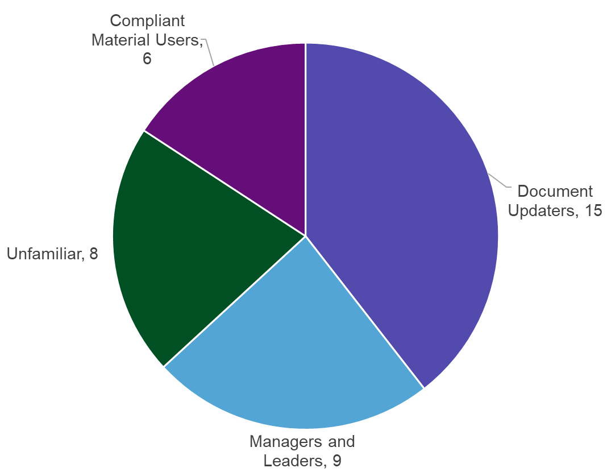

Accessibility is the foundation for inclusion, diversity, and equity within the federal government. The main way the government establishes accessibility requirements for information and communication technology is through [Section 508 of the Rehabilitation Act](https://www.access-board.gov/law/ra.html). Our team recently [documented](https://blog-nrrd.doi.gov/accessibility/) the steps we took to ensure all documents on onrr.gov are Section 508 compliant. This daunting task is now complete!

During the last few months of the onrr.gov document compliance project, we decided to interview our stakeholders to better understand (1) the current level of understanding ONRR employees have of 508 compliance, and (2) what we need to do to make all ONRR resources (not just onrr.gov) 508 compliant. This blog post discusses our interview findings and outlines our next steps to ensure ONRR continues to be at the forefront of Section 508 compliance. For further details, our study plan and a presentation of our findings can be found in [GitHub](https://github.com/ONRR/research/tree/master/onnr-dot-gov-research/09_508_Study).

## Stakeholder Types

For our stakeholder research, we interviewed employees across all levels and areas of ONRR. In total, we interviewed 31 ONRR employees for this study. Their roles covered multiple groups and both supervisory and non-supervisory roles. We further categorized our stakeholders based on their association with the onrr.gov document compliance project: those unfamiliar, managers and leaders, those who use/need compliant material, and those who actively worked to remediate documents. The pie graph below shows how many users fell into each stakeholder type (some participants fall into more than one stakeholder type).

## Familiarity with 508 compliance

The first question we asked interview participants was to describe their familiarity with ONRR’s 508 compliance project and 508 compliance in general. Those who described themselves as very familiar had largely participated in remediating documents or require compliant documents. Those only somewhat familiar tended to be managers who delegated remediation tasks or employees who were aware of efforts, but not tasked with remediating documents. Those not familiar were employees who had not participated in remediation tasks and were not aware of the efforts to make documents compliant.

As explained in our previous 508 compliance [blog post](https://blog-nrrd.doi.gov/accessibility/), each group within ONRR is responsible for remediating all the documents they own. This means all their existing documents on onrr.gov and all documents they produce in the future. So, there are many people within ONRR that are familiar with the document remediation process.

## Remediation

The next set of questions focused on discovering what document updaters need to be able to remediate documents. Overall, those tasked with remediating documents felt like they were thrown into the task without enough training or resources. Several participants noted that they would like to go back and revisit their remediated documents as they’ve since learned more about proper remediation. Once knowledgeable about document remediation, participants expressed concern about reliance on automated accessibility checkers.

The majority emphasized that it is important and easier to achieve compliance by incorporating accessibility from the creation of the document (for example, the original Word document instead of the resulting PDF) rather than revisiting after the fact. It’s easier and best practice to work with the source materials rather than the PDFs, but source materials weren’t always available. For example, there were historical documents from the 1980s – 2000s where the source document had been lost, and document remediators had to rely on the PDFs instead.

To address these shortcomings, participants expressed that they would like to see an established 508 remediation process. They also emphasized that some form of document review should take place annually.

##Training Resources

To make existing documents 508 compliant, most document remediators “learned by doing”. Remediators who were tasked with updating many documents attended training specific to the source material software as well as Adobe-specific training. They also utilized the Department of the Interior (DOI) level compliance officer for troubleshooting help. As several people within ONRR became well-versed in document remediation, they then helped new remediators learn the process.

Remediators noted that there was a lack of current resources within ONRR and DOI. Going forward, they noted the need for more advanced training resources, and clarity and consistency of best practices for remediating documents.

##Compliant Material Needs

We asked those who required 508 compliant documents specific questions to better understand what employees with disabilities need to fully and independently use materials. Out of everyone interviewed, 19% of participants required 508 compliant materials. Participants’ disabilities included degrees of colorblindness, low vision/blindness, and hearing impairment.

Participants noted that they must find their own external resources to help with accessibility, and that DOI-established software like Microsoft Teams, DOI Talent, and Quicktime are not 508 compliant.

There are some actions all ONRR employees can take to improve/increase accessibility for their disabled coworkers. Participants with low vision require visuals including charts and screenshots to be verbally described. Presenting data in Excel rather than a chart can greatly help accessibility because screen readers are better able to read data. During meetings, it’s a best practice to always describe what’s being shared on the PowerPoint to keep low vision participants involved. In addition, captioning needs to be available during all meetings and videos to assist hearing impaired employees. All employees should be trained on how to make sure that meetings are accessible to everyone including how to use captioning in meetings.

## ONRR needs a dedicated 508 compliance Subject Matter Expert

Out of all the participants interviewed, 87% said ONRR should have a person dedicated to 508 compliance. 27 participants (out of 31) said they want ONRR to have at least one full time Subject Matter Expert (SME) whose only job is 508 compliance. Participants want this person to provide training and serve as a resource. Participants that remediated documents felt it would be especially helpful to have someone to assist when troubleshooting specific errors. The few that didn’t want a SME were worried that having a SME would cause individuals to not contribute to this effort and not take individual responsibility for creating 508 compliant materials.

## Takeaways

This study helped us understand the progress we have made so far in incorporating 508 compliant accessibility as a daily focus for ONRR. It also was very eye-opening in showing us our shortcomings. Below is a list of action items we plan on using for our next steps at ensuring 508 compliance.

For document remediation:
-	Focus on remediating the source document rather than the PDF.
-	Remediation is a somewhat iterative process. Once users learned more about how to properly remediate, they want to revise document previously made compliant.
-	Establish a method for annual compliance checks.
-	Transition from posting PDFs on onrr.gov to locked Microsoft documents.
-	Basic 508 compliance training should be mandatory for all ONRR employees.
-	More advanced training is needed for ONRR employees who remediate documents.

For those who require 508 compliant material:
-	All employees should be trained on how to make day-to-day material accessible for their coworkers.

For a dedicated 508 compliance SME:
-	The majority of stakeholders want a dedicated 508 SME for ONRR.

We plan to share the outcome of this interview study with more stakeholders at ONRR, and determine an action plan for implementing the items listed above.
