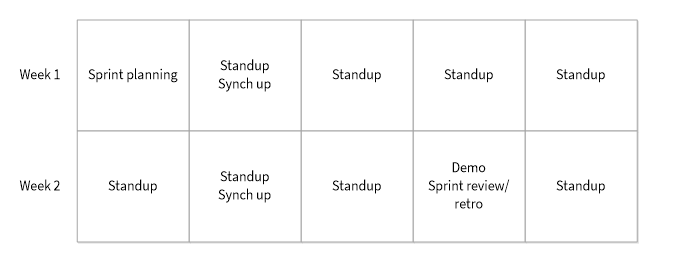
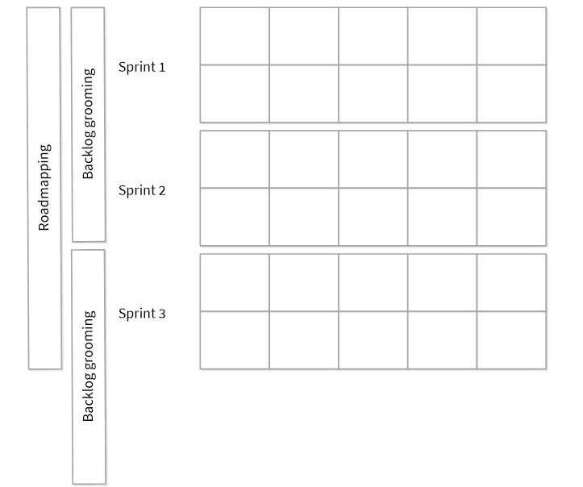

This year I had the opportunity to complete a four-month job rotation with the Office of Natural Resource Revenue’s (ONRR) Open Data, Design, & Development (ODDD) team.  I remained in my current position and 50 percent of my time was spent completing my normal work assignments while the other 50 percent was spent in my rotational position.  I learned a lot.  I grew a lot.  And I sincerely enjoyed every minute of it.

I applied for the rotation expecting to learn more about ONRR data, how it is used, and how it is communicated to the public.  Since college, I have enjoyed working with data.  My draw to this aspect of the team was rooted in my previous experience at ONRR:  I have worked in the Workforce Development Office, State and Indian Outreach, Data Mining, and currently I am in Reference and Reporting Management (RRM).  My positions have always centered around data: tracking data, verifying data, analyzing data, sharing data, explaining data, and so on.  In my current position, one of the roles I have as our internal control coordinator is to review the data that our analysts enter in our systems to ensure it is correct.  So, it seemed a no-brainer for me to experience how another team was interacting with our data.

### What do they do?

I quickly learned that the Open Data, Design, & Development team (formerly the Data Display team) does much more than just display the data we have (which is actually one reason I got to work with the team to come up with a new team name!).  On the daily, they maintain the Natural Resources Revenue Data (NRRD) Portal and ONRR.gov.  I learned how to review and validate data that was being posted to the [NRRD portal](https://www.revenuedata.doi.gov) and how to make changes to [ONRR.gov](https://www.onrr.gov).   

The team also manages [ONRR’s 508 compliance project](https://blog-nrrd.doi.gov/accessibility/), focuses on how to make the NRRD portal easier for our customers to understand (through user-centered design), and they are working to [redesign ONRR.gov](https://blog-nrrd.doi.gov/stakeholders/) and overhaul the process for creating and maintaining the website.  My explanation of the team’s charge does not do justice to the amount of work and coordination they perform.

My biggest take-away from my time with the ODDD team actually had nothing to do with data or website maintenance and design.  My biggest take away was how this team is stellar at communicating.  In my opinion, **this team is the model of what a high-functioning virtual team looks like**.  Not only do they collaborate effectively amongst themselves as a team; but they regularly coordinate with interns, other program areas, ONRR leadership, and other agencies.

How do they do this?  Agile project management.  Agile project management is a framework for working towards a common goal in a manner that focuses on what can be accomplished in a short time period, called sprints (for the team a sprint is 2 weeks long) and adjusting and making changes as necessary (an iterative approach).  The key to the agile methodology is constant communication.  If you want to learn more about agile project management, I found this [website](https://www.atlassian.com/agile/project-management) helpful.

### Meeting structure

When I first joined the team, the influx of meeting invitations I got was overwhelming.  Across the time period of our 2 week Sprints our meeting cadence consisted of the following:

 - Sprint planning - One meeting at the beginning of the sprint to discuss goals and what we would be working on for the next two weeks

 - Stand ups - Daily meetings where each person gives a brief explanation of what they have been working on

 - Synch ups - One meeting a week to show the rest of the team anything you would like and to get detailed input

 - Demo - One meeting towards the end of the sprint that is open for others to join to see a demonstration of what the team has been working on.

 - Sprint review - One meeting towards the end of the sprint to address any issues that are still open

 - Retro - One meeting towards the end of the sprint to discuss how the last sprint went and to bring up things that are working well or not working effectively

Week one of the two-week sprint contains sprint planning, one synch up and four stand ups.  Week two contains a synch up, a sprint review that can include a retro, and four stand ups.

### Two week sprints

Additionally, the team has long-term planning meetings:

 - Roadmapping - One meeting every 6 weeks to discuss the upcoming goals

 - Backlog grooming - One meeting a month to review any remaining issues, determine how they should be prioritized, figure estimates (a number that represents complexity and time), and assign them to team members

 - Ad-hoc design studios - One to two day meetings to discuss and [plan the aspects of large upcoming initiatives](https://blog-nrrd.doi.gov/remote-design-studio/)

Longer term planning includes three two-week sprints per six-week roadmap, as well as backlog grooming every four weeks.

### Longer term planning

I quickly began to look forward to our daily stand ups and to all of the various activities that happened during the sprint.  I found that since we were meeting daily, the meetings were efficient- we all shared what we had been working on the day before, what we were working on today, what our plan for tomorrow was, and any blockers.  Often, our meetings were less than 30 minutes.  I felt like the whole team was keeping each other “in the know”.  Through our daily discussion we were able to regularly address, and usually resolve, road blocks as well as figure out when it would be beneficial to collaborate directly with another team member.  These daily meetings also allowed us to get to know each other better. In fact, the team supported me through the death of my step-dad.  Their support during that time was invaluable.

### Workflow tracking tools

Another key to the team’s success was a tool they used to track their work.  [GitHub](https://github.com/ONRR/) is where they track workload in the form of individual issues (side note, this is also where they maintain the NRRD portal).  And ZenHub is the project management platform they use to facilitate workflow tracking and execute their agile methodology.

Learning about and actively engaging in an agile project management style has made a huge impact on me.  During my rotation I discussed ideas with the team about how I could implement agile project management in my own job.  They were enthusiastic about offering suggestions on how this methodology could help me personally and my program area.  I feel better able to manage my own workload and the workload of the efforts I lead.  My goal (or dare I say dream) is to bring what I have learned to RRM and implement it, starting with my own workload….who knows where it will go from there?

### More information

Did you know that the ODDD team has a [wiki page](https://github.com/ONRR/nrrd/wiki) where you can learn more about the team?   

 - To read about the team’s best practices for working as an efficient and high-performing remote team read the following:  [Working as a distributed team](https://github.com/ONRR/nrrd/wiki/Basics-for-making-distributed-work-work)

 - To read about the team’s agile project management meeting cadence look towards the bottom of this page:  [Joining the team](https://github.com/ONRR/nrrd/wiki/Joining-the-Natural-Resources-Revenue-Data-project-team)
