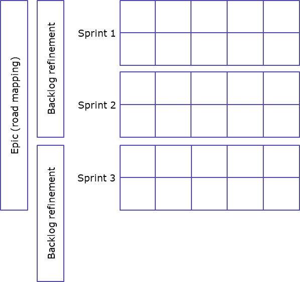

The [Agile Manifesto](https://agilemanifesto.org/) emphasizes valuing individuals and interactions, working software, customer collaboration, and responding to change over rigid processes and tools. 

Let’s look at how we’ve taken these practices and made them our own.

## Our team
We are a small, agile team that works on ONRR’s public-facing websites. The first is an open data site, the [Natural Resources Revenue Data website](https://revenuedata.doi.gov/). This site presents production, revenue, and disbursement data for oil, gas, and minerals produced on federal and Indian lands. The second is the agency’s main website, [ONRR.gov](https://www.onrr.gov/). Companies that lease federal and Indian lands use this site to report production and revenue of natural resources on leased lands.

## Product management
At ONRR, we’ve spent quite a bit of time working on product strategy. We’ve held workshops to define the problem statement and vision for both of our public websites. We continue to revise them over time as we learn more about the websites’ users. We've learned the importance of having a product strategy to ensure we know where we’re going. Agile is JUST a way of doing work, you still need to know what you're doing before you start.

### Natural Resources Revenue Data website
#### Problem statement
The people of the United States of America collectively own federal lands, waters, and the minerals beneath them. Those lands are administered by U.S. government agencies. The federal government is also the trustee for natural resource revenue from Native American and Alaska Native lands.

Transparency about how these resources are managed is crucial to public discourse and government accountability. However, data about public resources is underutilized because it’s often difficult to find, lacks contextual information, or is presented in ways that aren't readily accessible or understandable to users.

Because natural resources data can require specialized knowledge to interpret and understand, the public relies on intermediaries, such as NGOs, journalists, and elected representatives to contextualize, interpret, and communicate its meaning and implications. It’s critical these intermediaries are well informed with reliable and properly contextualized data.
#### Vision
We are informing policy debates and raising public awareness by building the definitive source of timely and useful data about how the government manages federal energy and mineral resources, revenue, and disbursements.

### ONRR.gov
#### Problem statement
Companies pay to produce natural resources on federal lands, Indian lands, and the Outer Continental Shelf. They need to access timely and accurate information to meet complex regulatory requirements. These requirements include reporting production and paying the required royalties and other revenues. The Office of Natural Resources Revenue collects, verifies, and disburses those revenues.

Native Americans and the public need to understand their revenues and ensure we meet our trust responsibilities. ONRR should provide access to resources and clear communication to help this understanding.
#### Vision
We communicate the role of the Office of Natural Resources Revenue. We deliver trusted and easy to use information and customer service. This enables companies who lease federal and Indian lands to accurately report production and pay revenue due.

### User-centered design

We base our website design for both of our websites on users. The user-centered design process is ongoing, it never ends. We start by understanding problems based on previous user research, data requests, or analytics. We then shape solutions by putting ourselves in the shoes of the users. Then we build and validate products using agile processes. We repeat and iterate as we learn more about users.

![We base our website design for both of our websites on users. The user-centered design process is ongoing, it never ends. It starts by understanding problems based on previous user research, data requests or analytics. We then shape solutions by putting ourselves in the shoes of the users. Then we build and validate products using agile processes. We repeat and iterate as we learn more about users. Circular diagram includes the following sections. Understand Problems, Shape Solutions, and Build & Validate Products. Under Understand Problems there are sections for Identify Problems and Define & Scope the Problem to Solve. Under Identify Problems there are bullets for sources of problems: previous user research, calls/emails requesting data, Freedom of Information Act (FOIA) requests, and analytics. Under Define & Scope the Problem to Solve there are bullets for: start with a raw idea, understand the current state process and problems, conduct exploratory user research, narrow the problem, and determine the appetite. Under Shape Solutions there are sections for Generate & Test Solutions and Select Final Solution. Under Generate & Test Solutions there are bullets for: sketch solutions, review sketches, narrow down the options, poke holes in the selected options, review hole-poking findings, choose the options with which to move forward, iterate sketches, and test with users. Under Select Final Solution there are bullets for choosing a final solution balancing: user needs, technical constraints, timeline, and other constraints. Under Build & Validate Products there are sections for Scope for Build, Build Solution, and Validate Built Product. Under Scope for build there are bullets for: break down the work into an initial list of scopes, create GitHub issues for each broken down piece of work, determine scope order & prioritize, factor scopes and tasks as we go, and decide what will be good enough to be considered done. Under Build Solution there are bullets for: flesh out design details and build using agile and iterate as necessary. Under Validate Built Product there are bullets for: usability testing and iterate design/build as needed or feed into future problem identification. We factor tasks in every phase into our agile backlog, sprints, and epics.](./UCD.png)

## Iterative software development
As part of the user-centered design process described above, we iterate the solutions as we learn more about the problems. The cycle never ends. We factor tasks in every phase of our iterative cycle into our agile backlog, sprints, and epics.

## DevOps: Agile execution
Dev ops and agile are crucial for fostering collaboration and flexibility in software development, enabling us to deliver high-quality products rapidly and respond effectively to the evolving needs of our users. 

### Two-week sprints
We work in two-week sprints. Each sprint includes daily standups, sprint planning, weekly synch up, sprint demo, and sprint review/retro. We decide what individuals are working on at the beginning of each sprint. We define sprint goals based on previous velocity estimates. Everything goes into the two-week sprints. This includes user research, design, content strategy, development, analysis, and quality reviews.

### Longer-term planning
Every 6 weeks (or 3 sprints) is an epic. These help us to keep sight of where we’re going in the longer term. We plan epics in a road mapping session (one-hour meeting) at the beginning of the epic to decide what goes into the epic.

We refine the backlog once a month. We remove old issues and prioritize and estimate ones we want to keep.

We conduct ad hoc design studios, as needed, to shape solutions for larger projects. These involve meetings over a few weeks. We define the problem, sketch solutions offline, poke holes in the solutions and decide on what approach we want to take.

### Agile team roles
These are the roles we currently have on our agile team. We all work together and respect each other’s expertise. We also often have interns and cross-trainers working with us to learn our processes and contribute to our team’s progress.

**Role**|**Responsibilities**
:-----:|:-----:
Product Owner|Defines the product vision and makes sure what we’re working on carries out that vision.
Developer|Writes the code, develops the technical strategy, and decides on technical tool sets.
UX Designer|Conducts user research to understand user needs and designs the site to meet those needs.
Program Analyst|Makes sure we have current and accurate data and interfaces with other groups within ONRR.
Content Strategist|Develops strategy for and maintains all content on the site.

## What we’ve learned along the way
### Positives
Agile has been an effective way to manage two different products with a small remote team. The regular meeting schedule keeps everyone aware of work status. Breaking down our work into concrete tasks creates shared ownership of our products and keeps us accountable.

We’ve been meticulous in documenting our work processes and procedures because our work methods are new to our organization. We want them to be sustainable and enable knowledge transfer as the team changes. This has been essential for training new team members, cross trainers, and interns. This documentation has allowed us to onboard new collaborators and get them contributing quickly.

Our agile mindset has also allowed us to pivot to accommodate requests from high-level stakeholders. And to do so without losing productivity.

### Negatives
There is a learning curve for collaborators who aren’t familiar with agile. We have been lucky to work with people who are curious and love to learn to think and behave in new ways. If you are stuck in your ways and hate learning, agile isn’t for you.

We have also encountered roadblocks when interacting with organizations or teams that don’t work using an agile method.

## Conclusion

Agile development is becoming more prevalent in the federal government. It has been used successfully for managing complex government products like ours. As a result, we’ve had interest from others within and outside of our organization in learning how we work. We look forward to continuing to share our evolution and hope to learn from others, as well.
