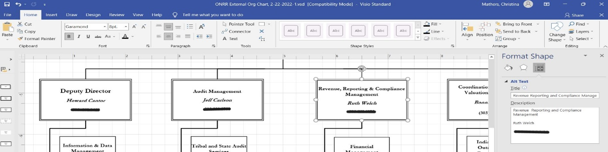

While doing some work on onrr.gov I, Shannon, noticed that the organization chart was over a year old and still included people who had retired. I reached out to the document owner, Christina, to get an updated version.

Christina updated the chart source document with the new names and then converted it to a PDF. When she checked the PDF for accessibility errors, there were over 300 nested alternative text errors. They were corrected in the PDF on the old version, but not in the source document. This is why it's important to correct errors in the source document.

Christina decided to fix the source document to ensure accessibility going forward. She added alt text, removed extra line spaces, and better formatted the phone numbers. She found that adding the alt text in the source document didn’t correct all the errors that resulted after converting it to a pdf. The process of converting generates new errors that must be remediated in the pdf, making pdfs more work to make accessible than source documents.

**Image: Visio org chart with alt text**

**Image: Errors in pdf conversion despite alt text in the source document.**

She reached out to me to discuss. We talked about the recommendation from the [accessibility stakeholder interviews](https://blog-nrrd.doi.gov/508-Study/) to use locked source docs instead of PDFs. We made this recommendation to avoid the extra errors that appear after converting to PDF. Since the source document was Visio, we decided to convert it to PowerPoint because few people have Visio installed on their machines.

I converted the chart to PowerPoint, did some research on alt text for the lines connecting boxes, and what the proper format for phone numbers is. As a result, I marked all the lines as decorative and added a “reports to” line to the alt text for each box to describe the hierarchy. I also formatted the phone numbers with spaces between each digit in the alt text. Then I sent a first version of the PowerPoint org chart to Sid, the Department of the Interior’s Section 508 Coordinator, to review and test with his screen reader.

**Image: PowerPoint org chart with alt text on the boxes**

Sid called me up and shared his screen to show what the screen reader reads. It ignored all the alt text I wrote and was reading what was on the boxes, including reading the titles of all the lines I had marked as decorative. And the phone numbers with the dashes read fine.

Sid gave me two options for making the organization chart accessible. The first option was to keep the chart in PowerPoint and put in some alt text at the beginning of the document telling screen reader users to find the alt text in the notes field. The second option would be to export to PDF and describe the entire diagram as a single image. We opted for the first option.

To create the final version of the org chart (PPT) using the first option, I added alt text to the logo that appears at the top of the page indicating that screen reader users should jump to the notes field. Then I described the structure of the diagram in detail within the notes field.

**Image: PowerPoint org chart with alt text indicating to jump to the notes field for detailed alt text.**

Here is the language I used for the alt text at the top of the page:

“For screen reader users, see the Notes field for a description of this diagram.”

Here is the alt text I put into the notes field:

“U.S. Department of the Interior Office of Natural Resources Revenue Organization Chart
*	Director, Kimbra Davis, 
* Information Management and Technology Modernization Senior Executive, Timothy Wight, Reports to Director
* Internal Review, Oversight and Compliance Senior Executive, Sharilyn Keeton, Reports to Director
* Deputy Director, Howard Cantor, Reports to Director

  * Information & Data Management Program Manager, Nathan Brannberg, Reports to Deputy Director
  * Strategic Resource Management Program Manager, Deborah Lloyd, Reports to Deputy Director
  * Information & Digital Services Program Manager, Joseph Manke, Reports to Deputy Director
  * Chief of Staff, Joseph Coleman, Reports to Deputy Director

* Audit Management Senior Executive, Jeff Carlson, Reports to Director

  * Tribal and State Audit Services Program Manager, Yvette Smith, Reports to Audit Management Senior Executive
  * Southern Audit Management Program Manager, Cheryl Johnson, Reports to Audit Management Senior Executive
  * Western Audit Management Program Manager, Dane Templin, Reports to Audit Management Senior Executive
  * Central Audit Management Program Manager, Shawna Schimke, Reports to Audit Management Senior Executive

* Revenue, Reporting & Compliance Management Senior Executive, Ruth Welch, Reports to Director

  * Financial Management Program Manager, Robert Winter, Reports to Revenue, Reporting & Compliance Management Senior Executive
  * Reference & Reporting Management Program Manager, April Lockler, Reports to Revenue, Reporting & Compliance Management Senior Executive
  * Compliance Management Program Manager, Jennifer Goldblatt, Reports to Revenue, Reporting & Compliance Management Senior Executive

* Coordination, Enforcement, Valuation, and Appeals Senior Executive, Bonnie Robson, Reports to Director

  * Indian Trust, Outreach  & Coordination Program Manager, Reports to Coordination, Enforcement, Valuation, and Appeals Senior Executive
  * Analytics & Risk Management Program Manager, Reports to Coordination, Enforcement, Valuation, and Appeals Senior Executive
  * Royalty Valuation Program Manager, Amy Lunt, Reports to Coordination, Enforcement, Valuation, and Appeals Senior Executive
  * Appeals & Regulations Program Manager, Matthew Collins, Reports to Coordination, Enforcement, Valuation, and Appeals Senior Executive
  * Enforcement Program Manager, Michael Marchetti, Reports to Coordination, Enforcement, Valuation, and Appeals Senior Executive”

## Why this works
Creating alt text for the organization chart and providing a detailed text description of the chart in the notes pane is a great strategy for ensuring the content is accessible to screen reader users. As the chart becomes more complicated, alt text for individual portions of the graphic may no longer provide useful information. In most situations, one alt text for the entire graphic may be the best solution.

Creators should think about how they would explain the chart over the phone to someone and then include that in the text description. Either summarize the relationships in the alt text or explain where the reader can find the full text description.

It's very easy to update the organization chart once you follow the process above. Just add alt text to the graphic and change the text in the description.

## Lessons learned
While we’ve made progress by resolving the automatic errors in all the documents on our external website, we still have a long way to go. As we update the documents on our site, we’re working towards doing more manual checks and improving the accessibility of all documents.

We have learned that document readers do not always pick up alternate text. We also learned that alt text doesn’t always work for individual pieces of a diagram and users benefit more from a more holistic and contextual explanation of what the diagram conveys.

In addition to making the document screen reader friendly, we met the applicable Section 508 requirements. We conducted manual checks to ensure we are using sufficient contrast, reviewed reading order, and ensured we’re using more than just color to convey meaning.

We’ll use the external org chart as a template for remediating our more detailed internal org charts and for other complex diagrams in presentations.  
