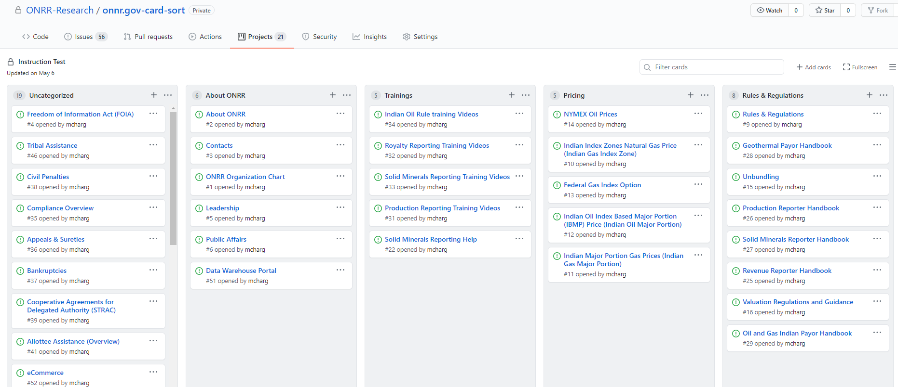
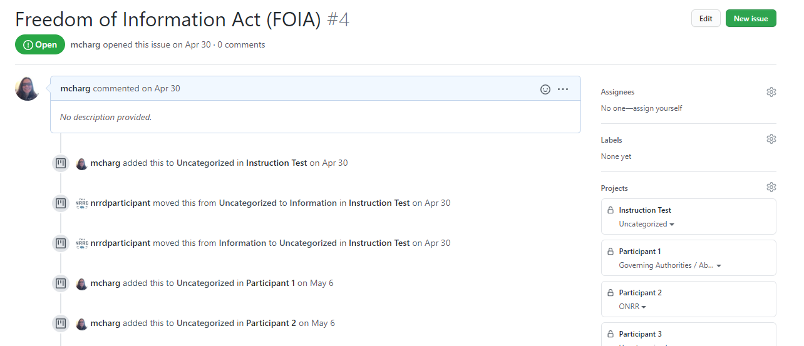
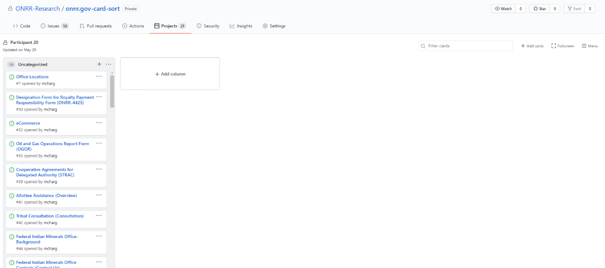
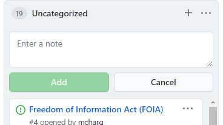
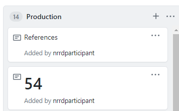

Card sorting is a very useful tool when it comes to organizing websites and finding out how your users view the information space. Unfortunately, the tool that has gobbled up all the competitors doesn’t have a government terms of service, and it’s difficult to get approval to use within a federal agency.  We didn’t let that stop us.

We recently took on a [new informational website](https://revenuedata.doi.gov/blog/adding-a-product/) that hadn’t had any user research done on it, and we wanted to understand how users think about the content and how they would organize the information presented, so a card sort was definitely in order.  We were hesitant to do a card sort because we had heard about the terms of service issues with the commercial software, so we were excited when one of our interns mentioned an article they had read about how someone used a [task management product to conduct a card sort](http://niawdeleon.com/how-to-use-trello-for-card-sorting/). This article got us thinking about how GitHub, which is [FedRAMP authorized](https://marketplace.fedramp.gov/#!/product/github-enterprise-cloud?sort=productName&productNameSearch=git), has some of the same functionality and we might be able to use it to conduct a card sort.

## Getting started
We started  by testing out whether we could add cards to a project and simulate the environment of dragging cards to categories. We were able to do that by using the project boards available in GitHub.

Image: Screenshot of our test organizing cards into categories using a GitHub project.

The next hurdle to get around was allowing users to log in to GitHub.  We initially thought about having each participant create an account but decided against that because it logs who categorized each card  and that seemed like a privacy risk. We also would have had to give each participant account access to the repo we set up for the study.  To mitigate these issues, we decided to create a single login for all the participants to use.

Image: Screenshot showing how participants moving the card is logged in the GitHub issue for the card.

With GitHub’s security features, we couldn’t completely get rid of the two-factor authentication and were required to input a code sent to the email address associated with the account each time a participant logged into GitHub, which prevented us from just sending out the link and having participants complete the study on their own time. As a result, we ended up moderating sessions, which gave us the ability to ask and answer questions and probe into why participants organized the information the way they did - something we haven’t done since the days when we conducted card sorts using index cards.  We forgot how valuable it was to get the contextual information from each participant.

## Planning the study
We created 56 cards using the issue function in GitHub.  We picked the cards based on analytics that show how often content was used over the last fiscal year, search terms that indicate content users have a difficult time finding, and balancing to make sure the cards were a good  representation of the content we have on the site.  We recruited participants from people who we know use the site with a mix of participants from industry and internal users from our agency. You can [read our study plan]( https://github.com/ONRR/research/blob/master/onnr-dot-gov-research/03_card_sort/plan.md) for more details.

## Conducting the study
We created a new GitHub project for each participant. They started out with a list of cards in an “Uncategorized” category, and we [explained]( https://github.com/ONRR/research/blob/master/onnr-dot-gov-research/03_card_sort/plan.md) how to add new columns for each category the participant wanted to create.

  
Image: Screenshot showing the default view participants saw in GitHub with a list of uncategorized cards and the ability to add a new column.

We figured out in the process of interacting with participants that we could allow them to add subcategories and new cards, and put cards in multiple places using the Add Note function to create cards on the fly.

   
Image: Screenshot showing the note function in GitHub.

The image below shows how participants used the Note function to add new cards. “References” is a card the participant thought was missing and “54” is to indicate that the card numbered 54 should go in this category in addition to the other category it was placed in.

   
Image: Screenshot of cards added using the note function.

As participants sorted, we had them think out loud and explain how they were organizing the content and ask questions if they didn’t understand what a card was.  We also had them tell us if cards were missing for things they use the site for and would like to add to a category. We also instructed them to leave any cards that they don’t understand in the Uncategorized category.

## Analysis
One thing that was missing that is now in commercial card sorting software is analysis.  We went back to this trusty old [Boxes and Arrows column](https://boxesandarrows.com/analyzing-card-sort-results-with-a-spreadsheet-template/) and created a modified version of their analysis spreadsheet to meet our analysis needs. You can download our [modified spreadsheet template (xls)]( https://github.com/ONRR/research/blob/master/onnr-dot-gov-research/03_card_sort/Card_Sort_Findings_Template.xlsx?raw=true).

We analyzed the findings by looking at the raw organization, normalizing the categories so that like things got counted as the same (e.g., About Us and About ONRR are the same), and then looking at how often participants agreed.  We also looked at the results for each user type (industry and internal ONRR people) separately to understand differences between how the two audiences think.  You can read our full [findings report (ppt)](https://github.com/ONRR/research/blob/master/onnr-dot-gov-research/03_card_sort/CardSortFindings.pptx?raw=true). Our next step is to do a closed card sort to make sure the organization scheme we go with works.

## Lessons learned
We only allocated 30 minutes per session for our participants, and we quickly learned that we should’ve given the participants more time.  It took close to 10-15 minutes for participants to log on and share their screen before they actually started sorting cards. A few participants were overwhelmed with all the card options and asked to finish the card sort on their own time.  We may also reduce the number of cards for the closed sort.

We had 11 participants across two audiences, and it would have been helpful to have more participants. Although our analysis revealed overlapping patterns for most of the cards to help us determine an organization scheme, there were some card items where there was not a strong pattern for us to determine where those items best belonged.

There were also some cards that users did not know where to place due to the labeling or title not being clear.  We should have better labeled those cards to avoid time lost for the user trying to make sense of its title and make it fit into a category. We will update the card labels to better match users’ expectations in the closed sort.

As we mentioned, we initially did not intend to moderate the card sorting session, but it turned out to be a valuable opportunity to help us gain insight into users’ rationale for their grouping decisions. It also gave us the chance to ask questions and further understand the users’ thought processes about the content. We were also able to discover user needs from the tool, such as using the note feature to add new cards, place cards in more than one place, and create subcategories.

Overall, GitHub worked well to help us learn what we wanted to learn, and we will continue to use it in the future.
