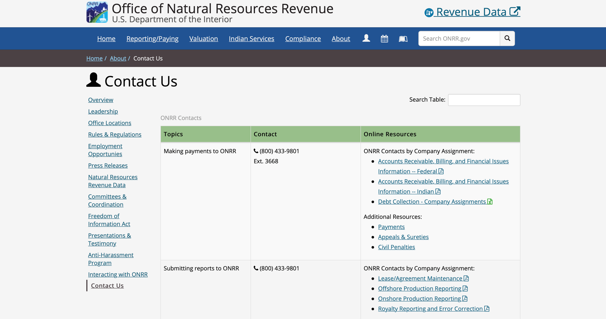
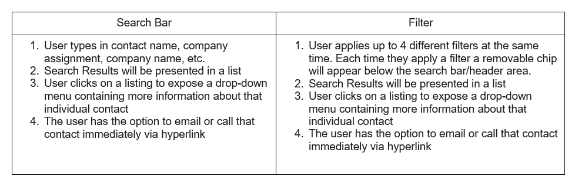
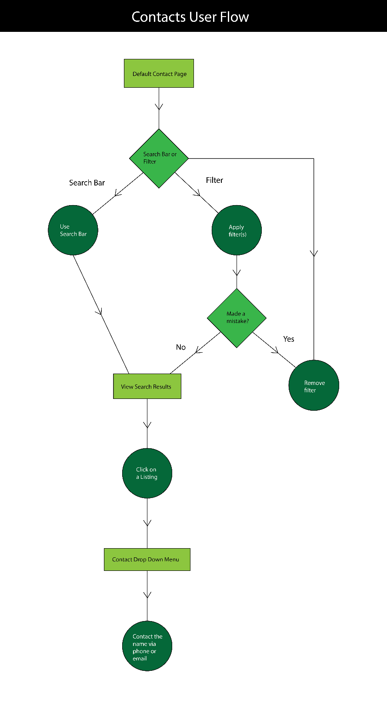
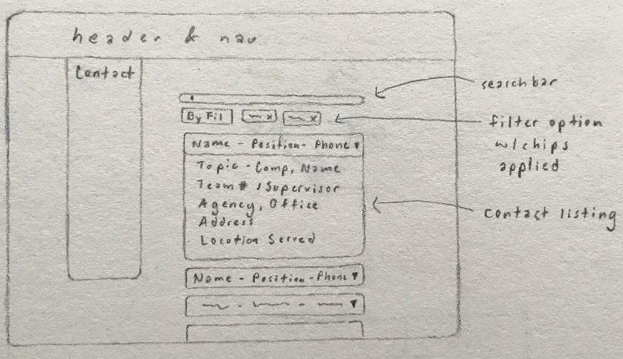
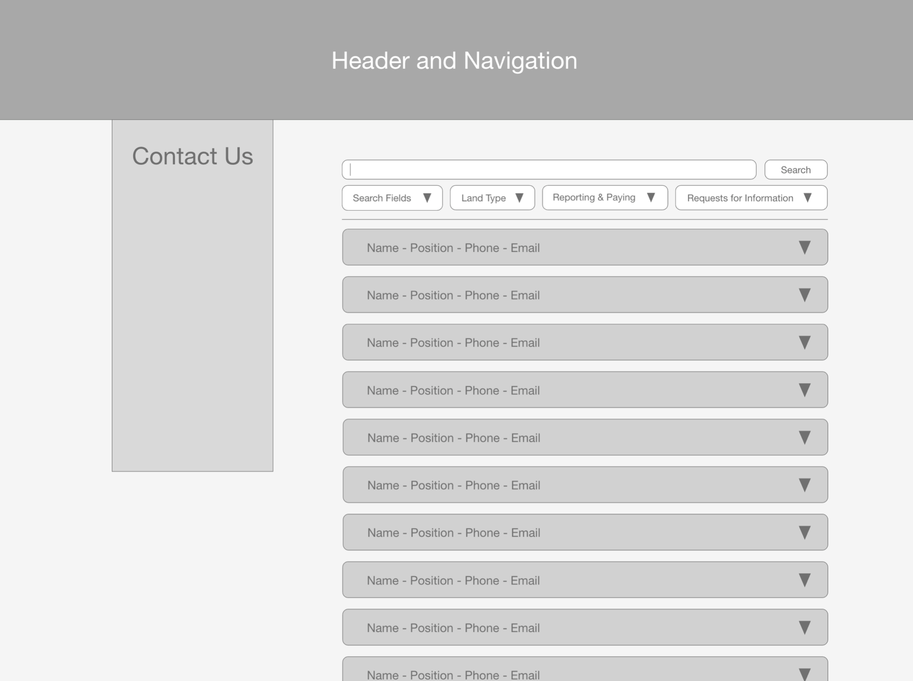

## Identifying the problem

One of the biggest user tasks for onrr.gov is finding contact information to answer questions. Industry users need to know who at the Office of Natural Resources Revenue (ONRR) can answer various types of questions. Today, the site includes 9 files with contact information, each organized differently.

Some are organized by company name or by the first letter of the company name and some by user task. The different organizations make it difficult to find the correct person to answer a given question. Users need an easier way to search and find the correct contact. ONRR’s teams also need an easier way to update contacts. They currently send a new copy of the contact file (either a PDF or spreadsheet) each time a contact changes.

User interviews showed that users found it difficult to sift through the current contact documents. Thus, I was tasked to come up with a design concept for contacts. I determined a search function would maximize the user’s ease of access and interactivity with the contact directory. Then I started to think about different ways to organize the contacts and create categories from patterns found. I decided to create a spreadsheet and some form of information architecture.

### Initial contact organization

First, I created a “stacked-box” information architecture within a document. Within each box I listed the categories that appeared in the original contact directory to see what fields there were. Then I viewed each category's information structure, but I was not familiar with some terminology which made me ask questions. After I clarified those spots in our meeting, I moved onto creating new categories that the contacts could be organized by.

I then entered the categories and some contacts into a spreadsheet to see how the information could be divided within the directory. Next, I started organizing the entire contact directory onto the spreadsheet. As I was doing this, I realized it would take me longer to complete and was thus inefficient. As a result, I decided to use the first contact listed as an example, then double checked to see if I was missing any areas.

After I felt confident, I proceeded to create information architecture (IA) for the search function and the filter. The IA for the search bar was to figure out how to display the search results, while the filter IA was to determine what filter options should be present. Then to see if they made sense, I created two user journeys detailing the actions to take in using the two functions, which are in the table below.

### User journeys

**Steps to find a contact**

I combined the user journeys to create a single user flow of the possibilities the user could take when using the contact directory.

### Information architecture

Below are the categories I decided on based on the user journeys.

I/A Bulleted List for filters
* General
   * Contact Name
   * Company Assignment
   * Company Name
   * ONRR Office Locations
* Onshore/Offshore
   * Onshore
   * Offshore
   * Submitting Reports to ONRR
* Production/Revenue
   * Production
   * Revenue
* State and Local Government Disbursements from ONRR
* Federal/Indian
   * Federal
   * Indian
   * Making Payments for ONRR
   * Valuation Determination and Guidance
   * Allotee of Individual Indian Mineral Owner Services
   * Tribal Services
* Inquiries/Requests
   * Press or Media Inquiries
   * Congressional Inquiries
   * Data Requests
   * Technical Assistance
   * ONRR.gov Content Corrections/Comments
   * Freedom of Information Act (FOIA)

### Design iterations

After I decided how to organize the information through the IA, I used the old contact directory as a foundation for designing the user interface. I expanded the search bar to span the entire contact directory to prompt the user to interact with the table through the search function. I then created a filter option with chips next to the filter for when the user adds filters to their search. Next, I added the search results under the search bar and the filter, so the user can interact with each one to find out more information about the results.

After meeting with the team, I knew that I needed to differentiate between the categories and test out the design with a sample company. I decided I could start mocking up my sketches and presented them to everyone during our next meeting. The team suggested that I remove the legend because the filter options would save room and make the directory less cluttered.

When I presented my updated wireframe in the next meeting, my mentor, Shannon, and others were confused about whether the user had to use the search function first or not. From this feedback, I decided to make the prototype more dynamic and less linear to make the functionality clearer to the user. Additional feedback I received was regarding the drop-down filters,: to  group everything by category and create a filter for each with its own drop-down menu.

From the feedback, I went back and updated the IA bulleted list for the filters. Then I ran into the problem of how to categorize the main categories, which I brought up at the next intern meeting.

### Revised filter categories

* Search fields
  * Contact name
  * Company Assignment
  * Company name
  * ONRR Office Locations
* Land type
   * Onshore
   * Offshore
   * Indian
* Reporting & paying
   * Submitting Reports to ONRR
   * Production Reporting
   * Revenue Reporting
   * Making Payments to ONRR
   * Valuation Determination and Guidance
   * Allottee or Individual Indian Mineral Owner Services
   * Tribal Services
   * Technical Assistance
* Requests for information
   * Press or media Inquiries
   * Congressional Inquiries
   * Data Requests
   * ONRR.gov Content Corrections/Comments
   * Freedom of Information Act (FOIA)
   * State and Local Government Disbursements from ONRR

### Final prototype design and next Steps

After the meeting, where Shannon helped me to revise the categories, I updated the wireframe based on the new IA. As a result of my work on redesigning the contact directory, I received positive feedback from ONRR’s leadership on its efficiency for the users. The next step is to pull in the existing contact information and get it into the prototype, so we can get stakeholder and user feedback. So far, the stakeholders who have reviewed it think it is much easier to find the correct contact. We plan on testing the design with users soon.

Working on the ONRR contact directory made me learn more about IA and usability through the IA bulleted list and creating the user journeys. These methods made me think critically about what information is and isn’t essential for the user. This was especially true when it came to the structure and deciding the filter options by identifying common themes.

From here, I plan to investigate more information architecture techniques that I could use for future projects. Additionally, I plan to read more about usability to get a better sense of how well different features serve the user’s needs in certain contexts.
