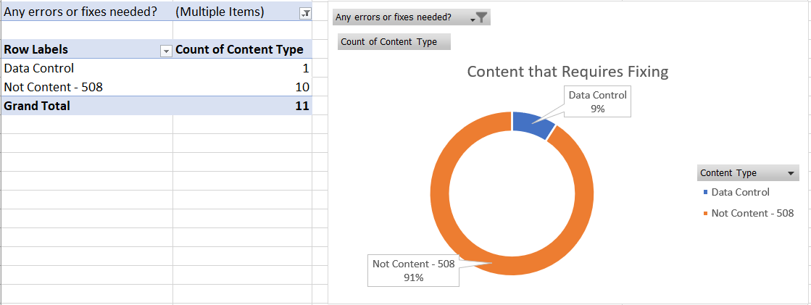

For the past two years, our Open Data, Design, and Development (ODDD) team focused on [redesigning onrr.gov](https://blog-nrrd.doi.gov/modernize-government-website/). While we focused on this redesign, we kept our data site – [revenuedata.doi.gov](https://revenuedata.doi.gov/), nicknamed “NRRD” – in maintenance mode. We continued to regularly update the data, but we did not have the capacity to innovate. 

Now that the [onrr.gov](https://www.onrr.gov/) redesign is live, we wanted to give NRRD some time and attention. One of our first tasks was to complete a content audit since one had not been done for a few years.

During the redesign of onrr.gov, we learned that developing detailed inventory tracking sheets helped us stay organized. We made tracking sheets for our first project of [making all the documents on onrr.gov Section 508 compliant](https://blog-nrrd.doi.gov/accessibility/), then for the [website redesign itself](https://blog-nrrd.doi.gov/modernize-government-website/). We also applied the redesign tracking sheet to [coordinate with Subject Matter Experts](https://blog-nrrd.doi.gov/plain-language/) for their approvals on their respective webpages. Even though these projects are complete, we still revisit these tracking sheets when we get questions about a specific document or about a decision made during the redesign. 

Because we had so much success with creating detailed tracking sheets for other projects, I wanted to apply this concept to the NRRD content inventory and audit. In addition, much of my previous work experience includes creating, managing, and interpreting large geoscience datasets. I wanted to integrate my experience with data management and expand the typical content inventory sheet to be more like a database.  

## Developing the content inventory database  

One of our UX designers, Erin Elzi, had already made a detailed site map for NRRD. I applied the sitemap hierarchy as the outline for my inventory database. Making sure that the content database and sitemap matched in terms of hierarchy identification was a great way for us all to stay organized and easily understand each other’s work. 
Instead of limiting each URL as a single line item, I wanted to break down the information on each webpage to a more granular level. Cataloging the HTML heading   levels within a webpage helped provide more navigation structure for the database as I drilled down to catalog more detail. For each heading level, I cataloged every content type within it. Each instance of content got its own line item in the database. I detailed the content type and a short description of the content in separate columns. 

*The first section of the content database includes columns for URL, page title, page type, site map hierarchy ID, and heading levels. There are multiple line items per an individual URL location, which indicates multiple types of content cataloged.*

This cataloging method is particularly useful for NRRD because we have similar information on multiple pages. This way, I’m able to quickly filter and track down these locations. I can easily make sure any updates are consistently made across all locations.

Content types I cataloged included: data cards, data controls, downloads (organized by document type), email hyperlinks, graphs, images, links (organized by internal, external, or to onrr.gov), tables, and text. 

I also cataloged two types of non-content: Section 508 compliance and page views. For Section 508 compliance, I completed an automated Lighthouse accessibility check on each URL and integrated the results into the database. For page views, I downloaded annual views from Google Analytics for each URL and integrated them into the database. 

*The second part of the content database includes cataloging the content type and a description of the content. Each instance of a content type is cataloged as an individual line item.*

### Auditing content

The next (and final) section of the database includes auditing all the individual content line items I cataloged in the inventory section. As I cataloged the content, I simultaneously conducted an audit of it. 

This audit had a wide scope since we were coming out of a maintenance period. Touching on each content type was also crucial to building a complete database. 

The table below shows every content type I cataloged in the inventory, what I checked during the audit of each content type, and what I noted if there were issues discovered.

**Content type**|**What to check**|**What to note in the Audit tab**
:-----:|:-----:|:-----:
Data - Card|In Explore Data - Select location options for all 4 cards. Check to make sure the data within the cards are correct.|If something is wrong, detail the issue(s).
Data Control|Toggle between the data control options to make sure they function correctly.|If something is wrong, detail the issue(s).
Download - CSV|NRRD csv file. Download the file, make sure it is the correct file, and test accessibility.|If something is wrong, detail the issue(s).
Download - Excel|NRRD excel file. Download the file, make sure it is the correct file, and test accessibility.|If something is wrong, detail the issue(s).
Download - PDF|NRRD PDF. Download the PDF and make sure it passes the Adobe accessibility checker.|Note the accessibility status, and what (if any) fixes are needed.
Email|Check to make sure the "mailto" hyperlink is working, and directing to the correct email address.|If something is wrong, detail the issue(s).
Graph|Make sure all cursor-hover tool tips and data are correct. If applicable, cross check the graph with the associated table.|If something is wrong, detail the issue(s).
Image|Make sure image has alt text.|Note if alt text is absent.
Link - External|Links outside of NRRD. Test the link, make sure the site we're linking to is maintained.|Detail if the link is broken, or if link needs to be updated.
Link - Internal|Links internal to NRRD. Make sure the link works, and directs to the correct webpage.|Detail if the link is broken, or if link needs to be updated.
Link - onrr.gov|All onrr.gov links. Make sure the link is redirecting to the proper new onrr.gov webpage.|Note the redirect status, and note the new link to update in the html.
Not Content - 508|Do a Lighthouse accessibility check on the webpage. Save the extended PDF in the same folder as this content audit. |Note the Lighthouse score and what improvements could be made.
Not Content - Page Views|FY 22 pageviews are in this spreadsheet on a separate tab.|List the number of pageviews.
Table|Make sure all cursor-hover tool tips and data are correct. If applicable, cross check the table with the associated graph.|If something is wrong, detail the issue(s).
Text|Do a reading level check using Hemingway Editor or Microsoft Editor. |Note the grade level, and if any edits are needed .

As I cataloged content, I audited it, then noted my findings in the database. I included columns to indicate if any errors were found, then detailed what updates are needed to fix the errors.

*The third part of the content database includes the audit. I notated if any errors were found and detailed what needed to be addressed.*

The processes of building a database while auditing was time-consuming but worth it! NRRD is a relatively small website and I ended up cataloging about 1,000 individual content items in my database. Of that, I identified about 160 content items that needed some form of fix or update.

## Pivot tables and visualizations

Now that I had my database and audit complete, it was time to update the approximately 160 content items that needed attention. I integrated annual page view analytics into the database as well, so I first prioritized updates based on page views.

As I corrected issues found in the audit, I also updated the database to indicate that the issue was fixed. In addition, I notated what fixes were made in the audit section of the database.

Because I cataloged my content into a functional database, I was able to create pivot tables and charts from the resulting pivots. I used these to visualize the amount of content that needed updating, which content types required updating, and to track my progress.

These visualizations helped me inform management of my progress. It also helped me justify my work, illustrating that making these content fixes was worth my time. I used these prioritization and visualization methods to break up the audit findings and fixes into [multiple issues](https://github.com/DOI-ONRR/nrrd/issues?q=is%3Aissue+is%3Aclosed+content+audit) that spread across several sprints. 

During our [sprint demos](https://github.com/DOI-ONRR/nrrd/wiki/Joining-the-Open-Data,-Design,-and-Development-(ODDD)-project-team#meetings), I routinely presented the following pivot tables and visualizations to management.

The first visualization I presented was a simple status update that showed overall how many issues were fixed as of the current sprint and how many still needed attention.

*Overall status of making the needed updates discovered by the content audit.*

The next visualization I showed was the content that still required fixing/updates. In addition, I also showed a pivot table breaking down the page location of the content that needed fixing and the associated page views for prioritization.

*Of the content that requires fixing, what content is included.*

The last visualization I showed was the breakdown of my progress. I liked to end with showing how much content I had currently updated. I also regularly showed a page-level status that listed which webpages were completely updated. Visualizing progress this way kept me motivated and helped me maintain buy-in from management.

*Content that has been updated since the audit.*

## Future of the database

Since building a detailed content inventory database and completing an initial audit, I still use the database as a daily reference. I’m continually enhancing the content on NRRD and regularly consult the database to make sure I’m consistently implementing content across the site. 

As I make content enhancements and as new webpages are added to the site, I try to keep the databased updated as well. Even though I try to update as enhancements are made, I also plan to review the entire database on an annual basis. This way, I know it’s ready for our next content audit.

Since this year’s content audit was so wide in scope, in the future I will use this database to review individual content types more deeply for the next set of audits.

### Key takeaways

This method of creating a content inventory database is highly effective for our ODDD team. Here are some steps you can take to develop a similar database and apply your findings to inform management: 

1. Create a detailed inventory that incorporates information architecture.
2. Perform a detailed audit using the inventory. 
3. Include quantitative metrics while performing the audit (google analytics, accessibility score, etc.).
4. Develop a measurable action plan to fix issues found in the content audit. 
5. Develop visual charts to report progress on content fixes/enhancements. 
6. Make a future plan to maintain and enhance the developed content inventory.