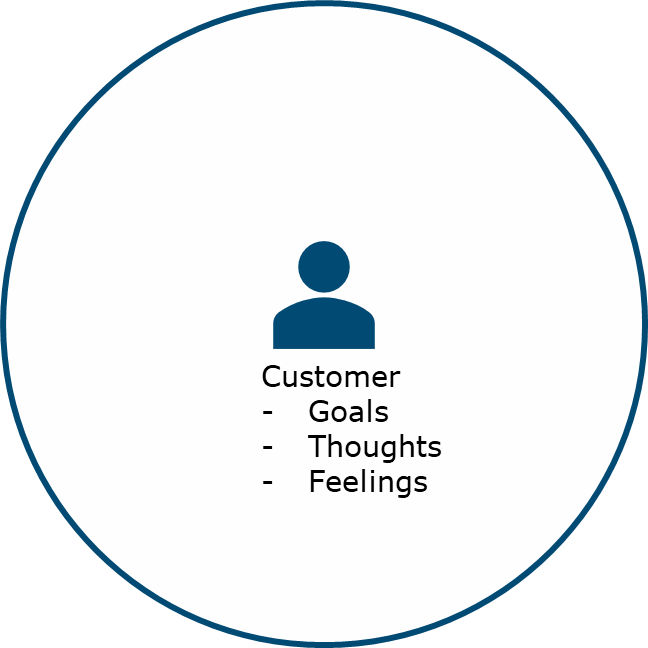
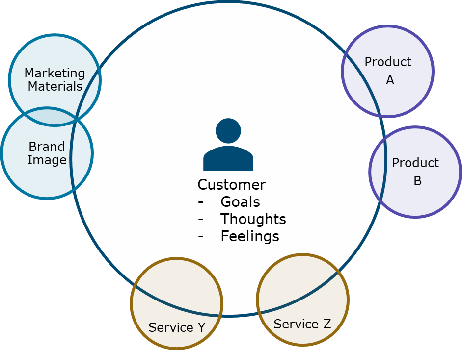

With the new [Executive Order on Transforming Federal Customer Experience and Service Delivery to Rebuild Trust in Government (Executive Order 14058)](https://www.whitehouse.gov/briefing-room/presidential-actions/2021/12/13/executive-order-on-transforming-federal-customer-experience-and-service-delivery-to-rebuild-trust-in-government), Customer Experience (CX) has become a buzzword in the federal government. Let’s take a look at what it is.

Listening to customers is not only good for citizens, it’s [the law](https://digital.gov/resources/government-customer-service-policies-requirements-1993-to-present/).

## Customer focus
CX is about the customer. The customer is the center of the experience. It requires looking at everything from the customer’s perspective. Customers can be anyone who uses a product or service within your agency. They are not just people who are making a financial transaction.

## Goals, thoughts, and feelings
Customers have goals, thoughts, and feelings about an experience. CX focuses on those goals, thoughts, and feelings. Those elements allow us to gauge how well the experience allows the customer to achieve their goal.

## Products and services
Customers interact with many products and services to accomplish their goals. CX looks at all the touchpoints along the way towards accomplishing the customer’s goal.

## Design
How products and services are designed impacts the experience. User experience looks at the experience with individual products in the process. Service design looks at the experience of services, and brand and marketing design look at the experience with marketing materials and branding.

![Giant circle with a customer in the center and the words: Goals, Thoughts, Feelings. Smaller circles on the sides intersecting with the Customer circle for Product A, Product B, Service Y, Service Z, Brand Image, and Marketing Materials. Product A and Product B have smaller circles within the Customer circle for User Experience. Service Y & Service C have smaller circles within the Customer circle for Service Design. Brand Image and Marketing Materials have a smaller circle within the Customer circle for Branding & Marketing Design.](./Design.png)

## Product management and marketing
Product managers and marketers tie the customer’s experience to everything else. They ensure other factors are taken into account, like business goals and other stakeholder needs.    

![Giant circle with a customer in the center and the words: Goals, Thoughts, Feelings. Smaller circles on the sides intersecting with the Customer circle for Product A, Product B, Service Y, Service Z, Brand Image, and Marketing Materials. Product A and Product B have smaller circles within the Customer circle for User Experience and a circle that crosses the edge of the Customer circle for Product Management. Service Y & Service C have smaller circles within the Customer circle for Service Design and a circle that crosses the edge of the Customer circle for Product Management. Brand Image and Marketing Materials have a smaller circle within the Customer circle for Branding & Marketing Design and a circle outside the Customer circle for Marketing.](./Whole.png)

## The whole experience
CX looks at the customer's whole experience. It's important to look at all the touchpoints the customer has and their experience with them. For example, when we wanted to look at the customer experience for adding lease level data to the Natural Resources Revenue Data website, we looked at the whole [customer journey]( https://blog-nrrd.doi.gov/journey-mapping/). We looked at the path the customer takes & their pain points along the way. We then added in important context, like if they’re dealing with wells, leases, or agreements. Then we added in the ONRR teams who customers interact with and looked at how other agencies are part of the process. Throughout this process, we looked at all the systems involved and then put it all together.

[View the full journey map (PDF)](https://blog-nrrd.doi.gov/82fd9ae2a90fe9d067be6d5cb232a8df/LeaseLevelJourneyMap_040519.pdf)

We needed to understand the full picture. This allowed us to understand how people would use the new data, narrow down the problems to solve, and understand important context for solving those problems.

## How we use CX on our websites
Our websites, [revenuedata.doi.gov](https://revenuedata.doi.gov/) and [onrr.gov](https://www.onrr.gov/index.htm), are often our first point of contact with our customers. We have a duty to provide those customers with an excellent experience. Understanding the whole picture of how they use those websites is the best way to do so.

### Natural Resources Revenue Data (NRRD)

![Giant circle with the words Journalist Experience and a customer in the center. Goals, thoughts, and feelings are in the center of the circle. Goals: Get data for an article about natural resource production, understand the source of the data, and publish data in an article. Thoughts: I want to get accurate data for this article, how am I going to consolidate it all?, and how do I cite the data? Feelings: Curious, wants to get the facts right. Smaller circles on the sides intersecting with the Customer circle for Natural Resources Revenue Data (production data), ONRR.gov (press releases, about ONRR), Other article sources, article, and spreadsheet with consolidated data.  Natural Resources Revenue Data and ONRR.gov have smaller circles within the Customer circle for User Experience and a circle that crosses the edge of the Customer circle for Product Management. Article and spreadsheet with consolidated data have a smaller circle within the Customer circle for Service Design. Article has a circle that crosses the edge of the article circle for article reader.](./Journalist.png)

We’ve been working with our public facing data website for several years now. Our customer experience approach is fully baked into our process. The [Natural Resources Revenue Data website’s]( https://revenuedata.doi.gov/) goal is to provide timely and transparent resource revenue data to the public. Our customers come to the website to get information rather than input information or request help. We’ve streamlined this process by continuously checking in with our customers. We conduct regular user research and proactively provide data and information to our customers when we determine a need.

### ONRR.gov

![Giant circle with the words Industry Reporter Experience and a customer in the center. Goals, thoughts, and feelings are in the center of the circle. Goals: Report oil & gas production & revenue, pay royalties due, and get help troubleshooting issues that come up. Thoughts: I have to do these reports and I don’t know how and I need help with this. Feelings: Overwhelmed, unsure about process. Smaller circles on the sides intersecting with the Customer circle for reporting systems (eCommerce, WebCenter Portal, LAB, others), ONRR.gov (system access, handbooks, contact info), Training Videos, Training Classes, Information from Colleagues, and Sister Agency Systems (BLM, BSEE, BOEM, BIA).  Reporting Systems, ONRR.gov, and Sister Agency Systems have smaller circles within the Customer circle for User Experience and a circle that crosses the edge of the Customer circle for Product Management. Reporting Systems and ONRR.gov have an ONRR Service Rep circle that intersects with both those circles along with the Customer circle. Training Classes and Training Videos overlap with each other and have a smaller circle within the Customer circle for Service Design. Training Classes has a circle that crosses the edge of the Training Classes circle and the Customer circle for ONRR Service Rep. ](./Industry.png)

We  have been fully redesigning our second website, [onrr.gov](https://www.onrr.gov/index.htm), which serves as our liaison between industry and ONRR. Our external customers use this website to report production of natural resources and pay required royalties. Our internal customer service providers also use this website as a reference and to assist customers. Customer Experience has been integral from the beginning of the redesign process. We’ve involved all our stakeholders many times along this journey and have designed the site to meet their needs. We've streamlined [contact information]( https://blog-nrrd.doi.gov/contacts/) and added a new [troubleshooting guide]( https://blog-nrrd.doi.gov/troubleshooting/) to cut down on redirected calls to internal customer service providers. We've also enhanced the new reporter checklist to make it easier for new reporters to get started. We've also redesigned the reporting handbooks to make the reporting and paying process easier. We’ve also committed to making our website and linked documents [accessible]( https://blog-nrrd.doi.gov/accessibility/) to all.

## Conclusion

Customer Experience may be a new buzzword in the federal government but it’s not a new concept within our organization. We've made it part of our vision for the future.

Office of Natural Resources Revenue’s vision statement:
> "To deliver **excellence in public service** as the nation's most trusted steward of natural resources revenue."
