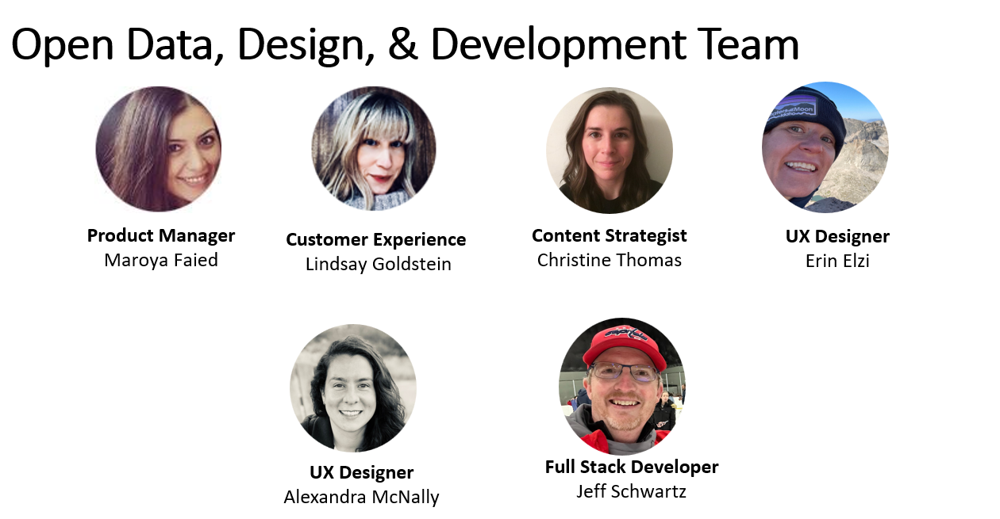
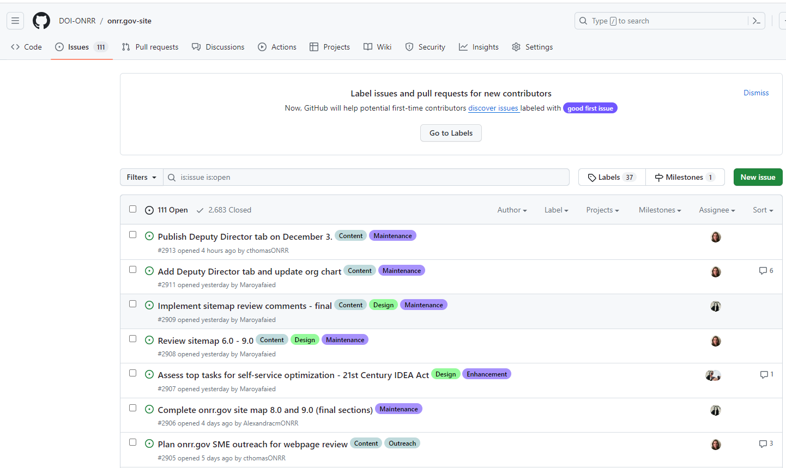
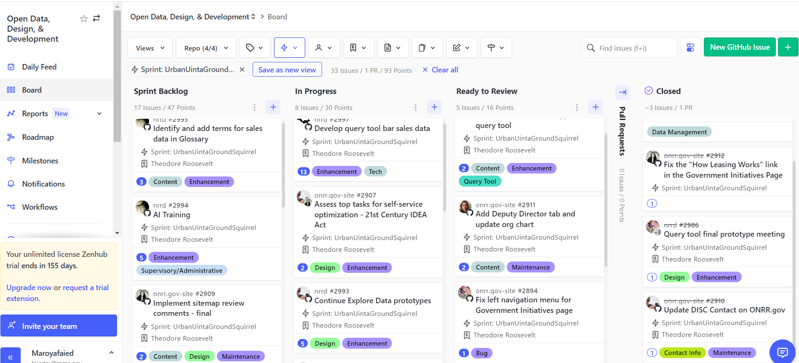

---
title: "Managing a high-performing dream team in the federal government"
authors:
- Maroya Faied
excerpt: "Agile management has not only streamlined our project execution but has also transformed our team culture. This blog discusses how following a consistent agile schedule and utilizing project management tools on the Open Data, Design, and Development (ODDD) team at the Office of Natural Resources Revenue (ONRR) fosters a culture of shared ownership and ensures accountability."
tags:
- GitHub
- ZenHub
- agile
- agile management
- ONRR
- ODDD
- Office of Natural Resources Revenue
date: "2023-11-27"
--- 

Agile management has not only streamlined our project implementation but has also transformed our team culture. This blog discusses how following a consistent agile schedule and utilizing project management tools on the Open Data, Design, and Development (ODDD) team at the Office of Natural Resources Revenue (ONRR) fosters a culture of shared ownership and ensures accountability. 

The ODDD team manages two public websites for the ONRR. The [revenuedata.doi.gov](https://revenuedata.doi.gov/) website provides open and transparent data on how the United States manages natural resources produced on federal and Native American lands. The [onrr.gov](https://onrr.gov/) website is the agency’s main website used mainly by industry to report production and pay royalties. 

The ODDD team is composed of just six members. We all have diverse skillsets and backgrounds.  Several team members, including myself, had no prior experience in digital services before joining this team with educational backgrounds in economics, geology, and natural resources policy.  The common characteristic we all share is that we aspire to be innovative leaders in government.  

We operate as a cross-functional team, respecting each other’s expertise and frequently requesting each other’s involvement. This creates a culture of shared responsibility and ensures that we're all aligned with a clear vision to achieve our goals. We also welcome student [interns](https://openopps.usajobs.gov/communities/17), [volunteers](https://openopps.usajobs.gov/), and internal cross-trainers to contribute to learn our processes and actively contribute to our team's progress.  

## Culture and values 

Our team culture is all about fostering collaboration and innovation, promoting accountability, sharing responsibility, and making data-driven decisions. We prioritize the use of free and open-source products and follow the human-centered design process for the development of both websites. Our decision-making and work are heavily influenced by user feedback and analytics. Prioritization of tasks is based on a careful balance between the value a task brings and its complexity to implement.  

We also value a fun work environment, and we are committed to keeping traditions alive and creating new ones! Some traditions we've created over the years are sharing vacation pictures, sharing monthly personal and professional goals, and giving each other kudos for a job well done.   

## Agile management 
 We adopted Agile methodologies to build and validate products, allowing us to iterate and refine as we gather more insights about our users. 
 Agile methodology is a project management approach that involves breaking projects into manageable phases and emphasizes continuous collaboration and improvement. Agile management has not only streamlined our project execution but has also created a culture that focuses on the people doing the work and how they work together. Agile has been an effective way to keep ourselves accountable. It allows us to constantly evaluate the current environment, identify uncertainties, and figure out how we can adapt without losing productivity.  

 ### Short-term planning schedule 
Agile methodology relies on a structured meeting schedule to ensure everyone is aware of work status and maintain accountability. Our team operates in two-week sprints. During each sprint we conduct sprint planning, daily stand-ups, weekly sync-ups, demo, sprint review and retrospective, and weekly one on one check-ins.  

**Sprint planning**: At the start of each sprint, we conduct a sprint planning meeting. In sprint planning, we discuss sprint goals, break down these goals into concrete tasks, and ensure that a wide range of work is incorporated into the two-week period. This includes activities such as user research, design, content strategy, development, analysis, and quality reviews.   

**Stand- up**: Every day we have a stand-up meeting where we share our progress on assigned tasks. This is a short meeting where we report on what was worked on yesterday, what's being worked on today, and report any blockers they may be facing. 

**Sync-up**: Once a week, we gather for a sync-up meeting. During this meeting, any team member can bring up obstacles they're encountering, seeking feedback and support from the team.   

**Demo**: At the end of the sprint, we host a demo meeting. This meeting is an opportunity for the team to showcase completed work to stakeholders and provides an opportunity for stakeholders to ask clarifying questions about the work done.  

**Sprint review and retrospective**: We end the sprint by holding a sprint review and retrospective meeting. The first half of this meeting, we review any tasks that need to be carried over to the next sprint. In the second half of the meeting we reflect on the sprint by noting and celebrating our successes as well as discussing any frustrations or roadblocks we encountered. 

**Weekly check-ins**: I value one-on-one check-ins with each team member. In these 30-minute meetings we catch-up on personal matters as well as talk through tasks assigned. These meetings help me as a manager to stay connected to my employees especially since we are a remote team. 

### Long–term planning schedule 
Agile management requires strategic long-term planning and on-going refinement. Long-term planning includes meetings for roadmap, backlog grooming, and ad hoc design studios. 

**Roadmap**: For long-term planning in our Agile framework, we operate on a cycle of every 6 weeks, equivalent to 3 sprints. We refer to this as an "epic”. Every epic, we hold a road mapping meeting, where we collectively define our high-level goals for the next six weeks.  

**Backlog grooming**: On a monthly basis, we conduct a thorough review and refinement of our backlog. This process involves the removal of outdated issues that are no longer relevant. We prioritize and estimate tasks that still hold value and align with our goals.  

**Ad hoc design studios**: For more substantial projects, we have the flexibility to organize ad hoc design studios. These sessions are tailored to the specific project's needs and can extend over several weeks. Within these studios, we define the problem at hand, sketch solutions offline, engage in critical discussions to identify weaknesses in the proposed solutions, and ultimately decide on the approach to take.  

## Project management tools 

The project management tools utilized by our team enables us to track our work, maintain comprehensive records, and ensure seamless collaboration.

We utilize GitHub to host our code and manage version control. We use labels for every issue we open or submitted to us through GitHub. For example, if someone submits an issue of a bug found on one of the websites that prevents them from effectively using the website then that issue will have the labels “bug”, “tech”, and “high priority”. These labels indicate that this issue requires a developer, and it needs immediate attention. 

Some of our labels are an indication of the type of work such as “accessibility”, “user research”, content “enhancements”, “outreach”, etc.  Some of our labels are an indication of the priority level for the task, such as “showstopper”, “high”, “medium”, and “low”. Some of our labels are an indication of whether the task is an “enhancement” for the website or regular “maintenance”. Using a combination of the labels is a great way to keep record of our work as well as for metrics measurements. 
  

The ODDD team uses ZenHub for project management which  integrates with GitHub. We utilize the milestone feature to document our sprint goals. In keeping with our team's tradition of creativity and fun, we modify the sprint names by using an adjective and an animal name that both start with the same letter. We vote on these names at the beginning of each sprint, following alphabetical order. We utilize the Epic feature within ZenHub,  for roadmap meetings. In line with our naming tradition, we modify the Epic names by choosing the name of a national park or national forest, again in alphabetical order.

Project management tools are crucial for sprint planning and sprint review meetings. We ensure that each assigned issue is given an estimate based on an approximation of the task's complexity. As issues progress, the assigned person moves them from the “sprint backlog” column to “in-progress” or “ready to review” columns, and eventually to the “closed” column.

In summary, project management tools assist us in  managing our sprints, tracking progress, and fostering a culture of transparency and accountability within our team.

## Knowledge sharing 

Although we are a small team, we take the time to document our work processes and share knowledge with other innovative leaders.  Our dedication to share, inspire, and learn is a cornerstone of our success and adaptability. 	 

### Wiki 

The ODDD team developed a habit to consistently document our work processes and procedures. We do this by maintaining [a wiki page](https://github.com/DOI-ONRR/nrrd/wiki) within each GitHub repository for both websites. The wiki pages contain detailed information and documentation on all our work processes and procedures.  We are constantly updating our wiki pages as we learn or adopt a new process or procedure. This diligence is essential because some of our work methods are relatively new to our organization and by documenting every aspect of our work, our aim is to make our processes sustainable and facilitate knowledge transfer. 

Within our wiki, we also document [monthly analytics](https://github.com/DOI-ONRR/nrrd/wiki/Analytics) for each website which we use during our demo meetings to keep our stakeholders updated on pageviews, search terms, and other relevant data. Our commitment to documentation has proven invaluable to our stakeholders, management, and new members joining our team.  

### Blog 

The ODDD team uses our [blog site](https://blog-nrrd.doi.gov/) to disseminate the knowledge we've gained while working on new projects or mastering new tools. This commitment to sharing insights and expertise is integral to our culture of openness and collaboration. 

## Takeaways to create your own dream team 

Foster a culture of collaboration, accountability, and openness. 

* Maintain a consistent Agile schedule that includes short and long-term planning.  

* Utilize free project management tools to facilitate work planning and tracking tasks. 

* Make data-driven decisions, make goals together as a team, and get involved in each other’s work. 

* Make your own fun traditions to create connections and learn more about each other. 

* Share knowledge, make room to mentor, and learn from others outside of your team. 