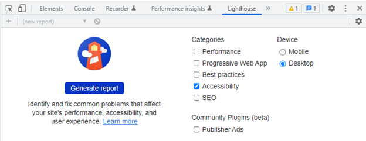
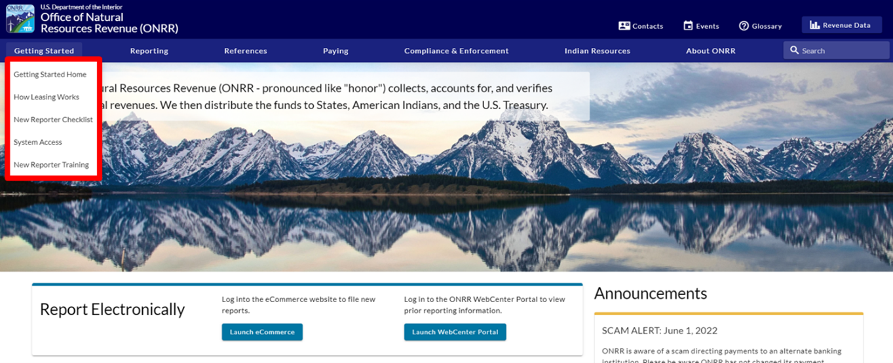
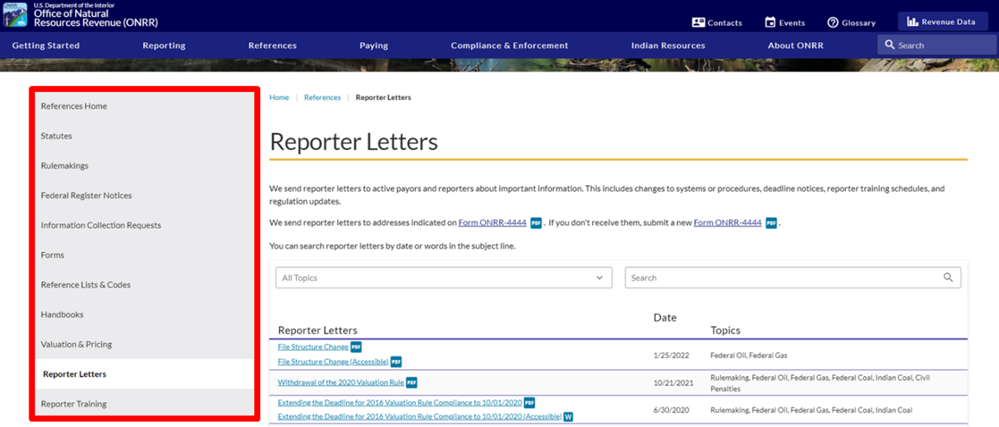
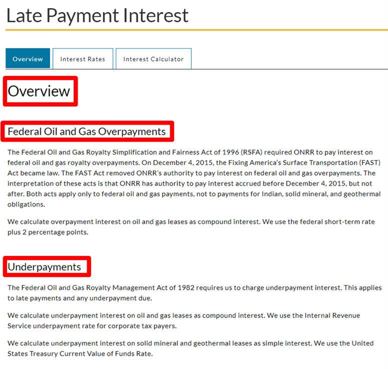
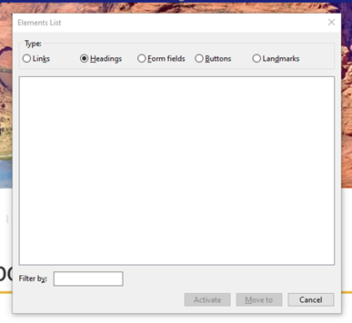
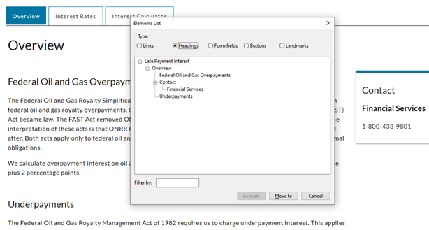

Before launching the newly redesigned [onrr.gov](https://onrr.gov), we wanted to make sure this website was as accessible as possible for all users. We previously chronicled our efforts to make all documents on onrr.gov [accessible](https://blog-nrrd.doi.gov/accessibility/), and developed [next steps](https://blog-nrrd.doi.gov/508-Study/) for [508 compliance](https://www.section508.gov/manage/laws-and-policies/) within ONRR. Part of these next steps was to extend accessibility beyond linked documents to the entire website.

During the prototyping and design process, we made sure that the new redesign was meeting [WCAG requirements](https://www.w3.org/WAI/WCAG21/quickref/) and was in compliance with [Section 508](https://www.section508.gov/manage/laws-and-policies/). We incorporated these accessibility fundamentals from the very beginning of this redesign.

Even though accessibility was incorporated “from the ground up”, we still needed to make sure that all the accessible functionality within our prototypes and wireframes translated into our final product – the public-facing [onrr.gov](https://onrr.gov).

So how do you make sure a website is accessible? This blog post outlines the four steps we took to verify accessibility. This is our version of [four-point hybrid testing]( https://www.boia.org/blog/a-look-at-our-four-point-hybrid-testing). We hope that other agencies can apply what we learned here to their own websites.

## Step 1: automated Lighthouse accessibility reports

The first step we took was to run Lighthouse accessibility reports on every webpage on [onrr.gov](https://onrr.gov). You can access Lighthouse in Google Chrome by navigating to the “customize and control Google Chrome” drop-down on the right side of your window (the 3 vertical dots below the close window button). Within this option list, navigate to “more tools” then click on “developer tools”. Within the developer tools window, you can select “Lighthouse” in the headings.

Within Lighthouse, we generated the report for accessibility. We generated reports for every webpage within [onrr.gov](https://onrr.gov). The reports highlighted areas where accessibility can be improved.

When we first generated the Lighthouse reports, we learned that some of the alt text we had for images and icons were not detected. We observed this issue across all webpages, and made it our priority to fix.

We discovered a better method for adding in alt text within our new content management system (CMS), and that resolved the majority of the alt text issues.

We learned that for the [material icons](https://mui.com/material-ui/material-icons/) we use, alt text and labeling needed to be embedded within the code. This task is on our developer’s to-do list.

There were also a few other outstanding issues discovered by the Lighthouse reports that need developer attention. We only have one developer working on both [onrr.gov](https://onrr.gov) and our [Natural Resources Revenue Data (NRRD)](https://revenuedata.doi.gov/) website. We had to prioritize tasks, so we created issues within [GitHub](https://github.com/ONRR/onrr.gov-site/labels/accessibility) for all the Lighthouse findings. Our developer will work on those issues now that the more demanding tasks involving launching the website are complete. We then moved onward with the next steps of accessibility testing.

## Step 2: manual screen reader testing

While the automated Lighthouse reports give you an idea of potential accessibility issues, we wanted to test our website manually with a screen reader. We were interested in understanding which issues truly impacted screen readers. Our goal was to elevate those issues as high priority. These high priority issues needed to be resolved before the website launched.

We downloaded the [NVDA](https://www.nvaccess.org/) screen reader, which is free and open source. I have never used a screen reader before, so I needed some time to learn how to use it. I found this consolidated list of [keyboard shortcut commands](https://dequeuniversity.com/screenreaders/nvda-keyboard-shortcuts) and NVDA’s [online user guide](https://www.nvaccess.org/files/nvda/documentation/userGuide.html) very helpful for my initial learning phase.

Once we were able to correctly operate the screen reader, we tested every webpage with it. The issues we identified occurred across all webpages. The issues we discovered were:

1. The screen reader was not reading the content within the drop-down menus on the top menu bar.

2. The screen reader was not identifying or reading the left-hand navigation menu.

3. The screen reader was not identifying headings, even though content was specifically formatted as headings within our CMS.

We learned that checking the elements list (the NVDA keyboard shortcut is “Insert+F7”) was a great addition to listening to the screen reader. We saw that all our links, form fields, buttons, and landmarks were detected, and that only the headings were missing.

We suspected that those three issues were major flaws that needed to be addressed immediately for the new website to meet accessibility requirements. Before elevating as high priority and creating GitHub issues for our developer, we wanted to verify our testing results with someone who uses assistive technology daily.

## Step 3: assistive technology user reviews the website

In the initial prototyping and wireframing process, we incorporated several assistive technology users to test functionality such as: color contrast, text size, alt text, readability, and navigability. For this test of our final product, we wanted to specifically focus on screen reader functionality. We are lucky to have a screen reader user who is also a subject matter expert within ONRR, Samuel Herbert. We asked Sam if he had time to review the site with us. We let him know about all the errors we discovered. We asked him to confirm if the issues we identified were indeed serious accessibility errors, and asked him to let us know if he found any additional errors that we missed.

We had a meeting where Sam demonstrated how he used the screen reader. It was very enlightening for us! Sam confirmed that the three issues we found with the screen reader needed to be fixed before we could say our new site was accessible. Without these fixes, he could not navigate the website easily. Once these errors were fixed, our site could accurately be classified as accessible.

We elevated these three issues as high priority, and our developer did an amazing job at fixing these errors within the back-end coding.

We did a second round of testing and confirmed that:
1. you could now use “Alt+Down Arrow” to access the drop-down menus,
2. the screen reader was accurately identifying and reading the left-hand navigation menu, and
3. the screen reader was identifying the headings and you can use the “H” key to navigate through the headings.

After this second round of testing, we let Sam know these issues were fixed. We set up another meeting with him to confirm. Sam tested the site again and was happy with its usability.

There are still minor issues indicated by Lighthouse that we need to fix, but the major navigation and alt text issues are resolved. We know that we are not done! Now that the site is live, our developer will have time to tackle the minor issues in our [product backlog](https://github.com/ONRR/onrr.gov-site/labels/accessibility). Accessibility is an ongoing process for us.

>"I am so thankful for the Open Data, Design, and Development team’s dedication to meeting the legal requirements of 508 compliance. I appreciate the improvements being incorporated prior to a full launch." – Sam Herbert

## Step 4: iterative fixes with our developer

Clear communication and iteration with our developer was essential in this project. In every step outlined above, we included our developer. We presented our findings to him and outlined our concerns. He helped us prioritize which issues should be fixed before launch by detailing the level of difficulty each fix was for him.

When we believed an issue was high priority and need resolving before launch, we demonstrated the issue on the screen reader for him. Our developer even took it upon himself to download a screen reader. He did his own testing before releasing the changes to us.

Making sure everyone understood the accessibility errors helped ensure that the appropriate errors got resolved before launch. Also, promoting a culture where every employee values accessibility helps projects like this get completed in a timely manner.

## Next steps

Everyone on our team would have loved for all accessibility issues to be resolved before launch. That was our goal. Because we are short-staffed with only one developer, we had to refocus and reprioritize our goals.

While the site is considered accessible in its current state, we are not done with accessibility! In addition to resolving the minor accessibility errors in our [product backlog](https://github.com/ONRR/onrr.gov-site/labels/accessibility), we plan to regularly check our site for accessibility issues.

Ensuring that our websites are accessible is an ongoing and iterative process. We are proud of the steps we take to integrate accessibility into our work culture, and we are continuously learning how to improve.
