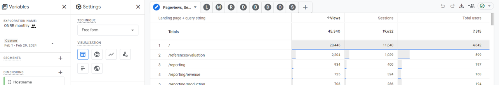
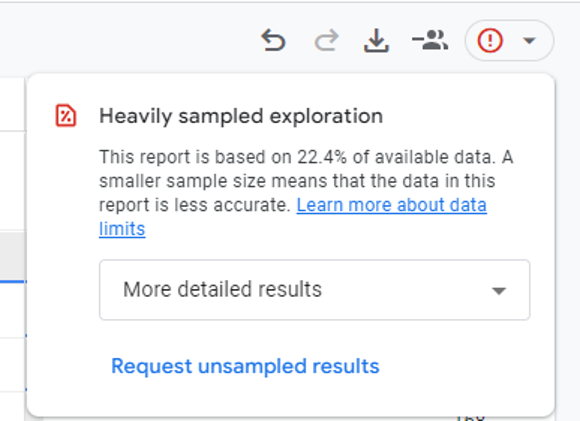
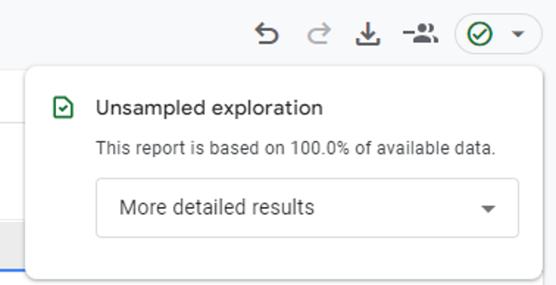
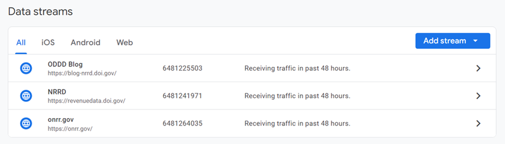
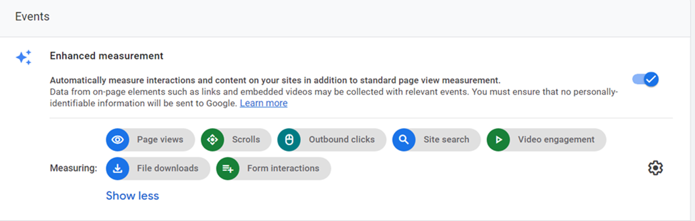
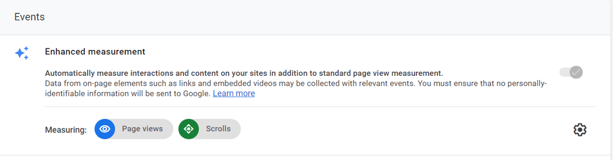

If you are involved in collecting website analytics for a federal agency, you probably already know that the [General Service Administration’s Digital Analytics Program (DAP)](https://digital.gov/guides/dap/) is transitioning from Google Analytics - Universal Analytics (UA) to Google Analytics 4 (GA4). DAP migrated to GA4 back in August 2023, and announced that agencies must migrate their local Google Analytics account from UA to GA4 by July 1, 2024. After this date, UA properties will be permanently deleted. 

This blog post outlines the Open Data, Design, and Development (ODDD) team’s efforts to transition to GA4. Here are our main takeaways:
- Communicate with DAP!
- Check the DAP code within all your websites.
- Utilize the explorations feature to create custom, personalized reports.
- Collect UA and GA4 data simultaneously while you still can.
- Cross-check data and be prepared to make iterative fixes as DAP implements updates.
- Setting up your own GA4 account and property allows for customizations but lacks DAP tech support.

Now let’s dive into the details!

## Transition to GA4 

In June 2023, DAP notified users of their plans to migrate to GA4. The emails sent gave detailed instructions and deadlines, which included that DAP was preparing to launch their new GA4 code in August 2023.

The ODDD team is responsible for three websites: [onrr.gov](https://www.onrr.gov/), [revenuedata.doi.gov, nicknamed “NRRD”](https://revenuedata.doi.gov/), and [our blog](https://blog-nrrd.doi.gov/). The programming languages differ across these three sites, so we wanted to verify that DAP’s code was implemented correctly everywhere. We were especially concerned because at that time our team was without a full-time developer to help us.

In July 2023, we reached out to DAP and asked to have a virtual meeting to discuss our GA4 transition. In that initial email, we let DAP know our concerns about verifying code within all three websites and our lack of developer help. DAP began collecting GA4 analytics on August 1, so we set up a meeting in early August to discuss.

During this August meeting, we met our DAP contact and started to build rapport. We discussed the code and made sure it was implemented properly across all three sites. Before this initial meeting, we were able to access the GA4 landing pages and start familiarizing ourselves with the new layouts. We were initially confused about how to create customized reports, but our DAP contact pointed out the exploration feature as a way to do so. We ended this meeting feeling more confident that we were properly collecting GA4 analytics and inspired to  create reports within the explorations section. 

## Explorations as the new custom report

One of the (many) major changes between UA and GA4 is the way you create custom reports. Within GA4, our team decided to create reports within the exploration section. In explorations, you can create, save, and modify reports (or “explorations” as they are called in GA4). Our primary goal was to recreate the monthly analytics reports we had in UA within GA4’s exploration section. We wanted to have several months where we could collect monthly analytics in both UA and GA4 to better understand how the data and trends compared/contrasted between the two.

Thanks to that initial help from DAP, we figured out how to replicate our monthly analytics! Within our wikis for each website, we detail how exactly we set up each metric. You can access our GA4 wiki sections to learn more: [onrr.gov wiki](https://github.com/DOI-ONRR/onrr.gov-site/wiki/GA4-Reports), [NRRD wiki](https://github.com/DOI-ONRR/nrrd/wiki/GA4-Reports), and [blog wiki](https://github.com/DOI-ONRR/blog-nrrd/wiki/Analytics-Templates-&-Instructions). 

The following table is an example of the onrr.gov exploration for our monthly analytics (as of March 2024).

**Metric**|**Rows**|**Values**|**Filters**
:-----:|:-----:|:-----:|:-----:
Pageviews, Sessions, Users|Landing page + query string|Views, Sessions, Total users|Hostname contains onrr.gov
Landing Page|Landing page + query string|Sessions|Hostname contains onrr.gov
Most Viewed Pages|Landing page + query string|Views|Hostname contains onrr.gov
Referring Pages|Page Referrer|Sessions, Entrances|Hostname contains onrr.gov
Devices|Device Category|Total Users|Hostname contains onrr.gov
Browsers|Browser + Device Category|Sessions|Hostname contains onrr.gov
Downloads|Event Name & File Name|Event Count|Hostname contains onrr.gov; Event name contains file_download
Outbound Links|Event Name & Outbound & Link URL|Event Count|Hostname contains onrr.gov; Event name exactly matches click
Site Searches|Event Name & Search Term|Event Count|Page path + query string contains affiliate=onrr.gov; Event name exactly matches view/_search_results

This table shows the specific dimensions, values, and filters used to get data for each metric. This table might look simple, but it took us several iterations to get the details within it.

The image below shows the resulting exploration. Each metric has its own tab within the exploration.

*The onrr.gov monthly exploration, with each metric in its own tab.*

We hope that sharing these exploration templates will ease the learning curve for other agencies!

Since GA4 is still in beta and constantly improving, our team is constantly iterating. Our exploration details live on our wiki pages where they can be easily updated.

## Monthly iterations

Once we set up our explorations and had a few months of data within them, we noticed that some of our metrics were yielding data that were very different than what we were collecting in UA. We set up a second virtual meeting with DAP in October to go over our questions about these data variations. 

In this meeting we learned that specific metrics (including downloads, outbound links, and site searches) were part of ongoing DAP developer issues. DAP is constantly improving the GA4 property and through the months, we observed that many of the data discrepancies got resolved. We still have a few questions on specific metrics that are outlined in our wiki pages. 

Being able to simultaneously collect monthly data in UA and GA4 greatly helped us identify issues within the GA4 data. Since starting monthly comparisons in August 2023, the major discrepancies we observed between the two analytics systems disappeared. The data between the two are not exact but are very similar and now clearly show the same trends.

## Agency properties

As [DAP explains](https://digital.gov/guides/dap/common-questions-about-dap/), your agency’s GA4 account uses sub-properties (which was previously called “profiles”) to categorize and report an agency’s website traffic. These sub-properties are assigned at the federal cabinet agency level, and the traffic for a sub-agency website is reported under that main agency sub-property.

### Department of the Interior (DOI) agency property

Originally our team created explorations within the DAP - GA4 - DOI agency property, with a filter set to our specific sub-agency website. Because DOI is such a large agency and our sub-agency is such a small fraction of it, we would get a caution saying that our data was heavily sampled. 

*Heavily sampled explorations have less accurate data.*

We would have to constantly select “More detailed results” to make sure our report was an unsampled exploration and based on 100% of the available data. 

*Unsampled explorations have 100% of available data.*

Sometimes, this “More detailed results” selection does not work, and we must use the “Request unsampled results” link which takes several minutes to receive. While somewhat time-consuming, the main struggle was that we had to do this for every metric on every tab of the exploration. If we forgot, the data we pulled would not be the most accurate. We are still working with DAP about our struggles to get 100% of the available data within the DOI agency property.

### Open Data, Design, and Development (ODDD) property

As we learned more about GA4, we found some potentially useful configuration settings that DAP did not have turned on. We also wanted to see if we could get granular data if we were not having to filter the large amount of DOI data just to be able to view our own. Finally, we wondered if not having to wait for our reports to run against all of the DOI data might also allow our reports to run faster.

For these reasons, we opted to set up our own GA4 account. We learned from DAP that this is recommended – many agencies use their own Google Analytics properties in addition to DAP’s. DAP gave us the option to run parallel tracking, but we chose not to do that. Instead, we set up the property in GA4 and our developer (who was now with us full-time)  added the tags for the data streams to our websites, along with the DAP code we already used. This way our analytics are tracked in both DAP and our own properties – allowing us to compare how configuration differences affect the analytics. One drawback is that we do not receive DAP support for our ODDD-managed property, but we have enough developer and Google Analytics knowledge on our team that we can troubleshoot on our own.

We set up our property with each website as a separate data stream. This differs from DAP, which has DOI as a sub-property and [analytics.usa.gov](https://analytics.usa.gov/) as a single data stream. We use three data streams instead of a single data stream for two reasons: 
1) We are not concerned with tracking usage across our three sites, as our sites have three very different use cases. 
2) Since we have to filter by each domain in the DAP configuration (DAP collects data from thousands of websites across the U.S. federal government), we wanted to  see what we could do in an environment where we don’t have to do that high level of filtering. 

*Our data stream configurations.*

Within each data stream, we’re able to add more events to the enhanced measurement options. With these options added, we find it easier and more accurate to track events that were not turned on as enhanced measurement in DAP, such as file downloads.

*Our enhanced measurement settings.*

*DAP’s enhanced measurement settings.*

Note that even though they are not turned on in enhanced measurement, some of the events are still measured in DAP’s properties. The reports and explorations just need to be filtered differently to track such events.

Once our property was working our developer set up Google Tag Manager. Not only does this aid in our developer’s management of the multiple data streams and properties within our site’s code, but it can also help us gather more specific information about events, such as exactly which link is used to navigate to another page on our site. After we are more comfortable with our explorations and reports, we plan to further look into this possibility.

## We’re still learning!   

Transitioning to GA4 has been a very interesting and rewarding challenge. Our team has substantially increased our knowledge of GA4 and DAP, but we are still learning! 

Since we now have our ODDD property, we are currently experimenting with [Looker Studio]( https://lookerstudio.google.com/) for developing analytics reports for each website. So far, we find that Looker Studio offers more options for visual representation of the data. The resulting reports are cleaner and more professional-looking than what we currently see within GA4’s explorations. We plan to use these reports to help inform management and prioritize modernization efforts in accordance with [M-23-22 “Delivering a Digital First Public Experience.”](https://www.whitehouse.gov/wp-content/uploads/2023/09/M-23-22-Delivering-a-Digital-First-Public-Experience.pdf)

*Looker Studio monthly analytics report for onrr.gov.*

We would love input from others as we continue to learn and grow our analytics program! Please contact us at [nrrd@onrr.gov](mailto:nrrd@onrr.gov) if you would like to discuss. Thanks!
