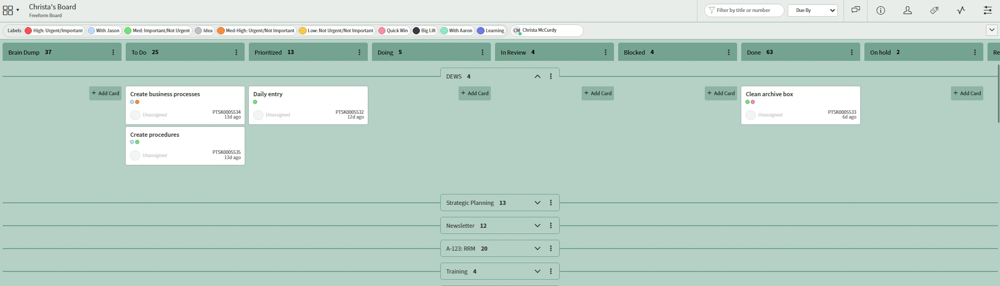

Last summer I completed a job rotation with the Open Data, Design, and Development (ODDD) team within the Office of Natural Resources Revenue (ONRR).  I wrote a [blog post](https://blog-nrrd.doi.gov/agile-methodology/) for them and I’d like to encourage you to read it to get my initial reflections on my experience and my excitement around Agile Management.

Today, I’d like to share with you how I have incorporated some of the things I learned during my rotation.  First, I made some changes to how I manage my workload.                                                                                                 

## Organization

For the past two years I’ve been trying to become better at tracking tasks and prioritizing them.  I began using sticky notes to represent tasks on a Kanban Board on my wall.  The ODDD team tracks every item of work as an issue in a platform called [GitHub](https://github.com/ONRR/nrrd/issues).  During their sprint review they discuss the status of each remaining open issue on [ZenHub](https://www.zenhub.com), using a Kanban layout.  After my rotation, I created a digital Kanban board using [Service Now’s Visual Task Board](https://docs.servicenow.com/bundle/rome-servicenow-platform/page/use/visual-task-boards/concept/c_VisualTaskBoards.html).

A digital and shareable board has many benefits.  One can share a board with colleagues, assign contributors to individual tasks, add due dates, and create checklists.  There are a variety of alternative digital task board options on the web, including [Microsoft Planner](https://tasks.office.com), [Asana](https://www.asana.com), [Trello](https://www.trello.com), and others (while we find these tools useful, ONRR does not endorse any specific product).

## Communication

Another take-away for me was how to be more effective in my communication as a remote worker.  The ODDD team has a list of [best practices](https://github.com/ONRR/onrr.gov-site/wiki/Basics-for-making-distributed-work-work) on their wiki.  Some things that have resonated with me are defaulting to video for meetings (there are times this is not ideal- such as ONRR All Hands meetings); setting aside time for meeting prep (and time after for finishing notes or entering to-do items into my Visual Task Board); and treating everyone as remote- this last piece will be critical once we have folks transition back into the office.

Beyond these two areas where I’ve already begun to make personal changes in how I operate every day, I’ve taken my observations from the Open Data, Design, and Development team and thought about how Reference and Reporting Management (RRM) could use some of their methodologies to improve internal communication and knowledge sharing.

## Culture

I gained a lot of knowledge, experience, and perspective during my job rotation.  But the most valuable thing I gained was new friends.  I remain in contact with the team.  I’ve popped into team meetings to bounce ideas off of them, asked individuals for help with things I can’t figure out, and chatted them up.

This is my way of trying to break down silos at ONRR. It certainly helps that ONRR's leadership and management teams are supportive of cross training opportunities.  The personal growth, networking, and learning opportunities are a win-win-win for employees, teams, and the organization as a whole.

I highly encourage every ONRR employee to [participate in a job rotation](https://onrresource/Cross-Training/) (connect to VPN to access).  These opportunities provide a great way to get familiar with the work that other parts of our organization perform, context for how they use our services and products, relationships across the organization, and knowledge of how different teams are run.

Expanding your knowledge and skill set is always beneficial.  If you'd like more information, email [JobRotation-CrossT@onrr.gov](mailto:JobRotation-CrossT@onrr.gov).
