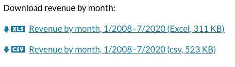

Our site currently relies on Markdown to allow non-developers to write/update content, however we also needed a way to easily inject React components in the Markdown for complex interactions and layouts. We initially used various libraries including [rehype-remark](https://github.com/rehypejs/rehype-react) to enable us to import components into the Markdown. Then we discovered Gatsby, our static site generator, added support for [MDX](https://mdxjs.com/), which provided us an industry standard and cleaner way of using React components in our Markdown.

This article will not delve into the already well documented way of setting up and using MDX with Gatsby but focus on our unique implementation and features we thought others might find useful. The goals of our implementation were simple:

 1. Make it easy to use components in Markdown
 - All content is in Markdown, not embedded in ReactJS components
 - Seamless integration with our application

## Knowledge prep
 - [Markdown](https://www.Markdownguide.org/)
 - [MDX](https://mdxjs.com/)
 - [Gatsby](https://www.gatsbyjs.com/)

## Accessing components in Markdown
When I reviewed the Gatsby documentation about, [how to add components to Markdown using MDX](https://www.gatsbyjs.com/docs/mdx/writing-pages/), I found the syntax was not exactly friendly to non-developers. I wanted to use as much pure Markdown syntax as possible with a few added pieces to enable injecting interactive and stylized components. Here is an example for Gatsby on importing components:

```
import { Chart } from "../components/chart"
import FAQ from "../components/faq.mdx"

# Here’s a chart

The chart is rendered inside our MDX document.

<Chart />
<FAQ />
```
Although this Markdown is not that bad I didn't like the import statements and wanted to get rid of that "developer syntax", but how? Well I remembered using Gatsby's pattern library example project and somehow it was able to show components in Markdown without any import statements, so how did that magic occur? The answer was simple, **cache**.

Gatsby's build process and its ability to leverage GraphQL to find all the components was the key. From there it was easy to write a simple components file to the cache directory that then allowed MDX to use that file to import all the components magically. So what are the deets?

#### Step 1: Using Gatsby's GraphQL to get your components
Using the createPages method from the Gatsby API we query our components to get all the information needed to create a components.js file to use for our MDX Provider.
```
  GraphQL(`
  {  
    allComponentMetadata {
      nodes {
        displayName
        parent {
          ... on File {
            absolutePath
          }
        }
      }
    }
  }`
```
#### Step 2: Process the results to create components.js file
```
// Get the file path
const allComponents = result.data.allComponentMetadata.nodes.map(
  (node, i) =>
    Object.assign({}, node, {
      filePath: node.parent.absolutePath,
    })
)

// Create the export
let exportFileContents =
    allComponents
      .reduce((accumulator, { displayName, filePath }) => (
          accumulator.push(
            `export { default as ${ displayName } } from "${ filePath }"`
          )
      ), [])
      .join('\n') + '\n'

// Write the file to .cache
fs.writeFileSync(
  path.join(appRootDir, '.cache/components.js'),
  exportFileContents
)
```
#### Step 3: Import the components into the MDXProvider
The [MDXProvider](https://www.gatsbyjs.com/plugins/gatsby-plugin-mdx/#mdxprovider) has a property called 'components' and this how you provide the components to the MDX renderer. For Gatsby, we use the [wrapRootElement API](https://www.gatsbyjs.com/docs/browser-apis/#wrapRootElement) to add the MDXProvider to our application.
```
import * as CustomComponents from './.cache/components'

export const wrapRootElement = ({ element }) => (
  <ErrorBoundary>
    <MDXProvider components={ mdxComponents }>
      {element}
    </MDXProvider>
  </ErrorBoundary>
)
```
And now our components are provided to the MDX renderer and we no longer need to specify an import statement. It will also be automatically updated as we add new components. This simplifies the process for developers as well as the content writers. So now instead of writing import statements for our components directly in our Markdown files we can just do this:
```
# Here’s a chart

The chart is rendered inside our MDX document.

<Chart />
<FAQ />
```


## Using content partials
In React applications, components typically contain content, such as descriptions or commentary on a subject. We want to make sure our content managers can edit all content without having to edit a ReactJS component. Most of this is accomplished by having Markdown for all our pages which can be easily updated by our content managers. The issue that we needed to fix was the content that was repeated on multiple pages or needed to be actually embedded in a React component, for example a layout component.

We will use the "Contact Us" as our example. Since this appears on multiple pages throughout our website we didn't want to repeat this content on all our pages. We wanted to make sure we were following the [DRY principle](https://en.wikipedia.org/wiki/Don%27t_repeat_yourself). Our solution was **content partials**. These are typical Markdown files but are not pages and can be reused just like React components. We placed these files in our components directory so that our automated components.js file could export them and we can then easily use them in our Markdown files or in ReactJS components.

#### ContactUs.mdx file
```
## Contact us
Do you have questions about the data or need data that isn't here? Contact our data specialists at <onrrdatarequests@onrr.gov>
```
#### Used in our Page Layout Component
```
import ContactUs from '../../content-partials/ContactUs'

const PageLayoutManager = ({ children, location, pageContext, ...props }) => {
  return (
    <DefaultLayout
      includeToc={pageContext.frontmatter && pageContext.frontmatter.includeToc}
      title={pageContext.frontmatter && pageContext.frontmatter.title}>
      {children}
      <ContactUs />
    </DefaultLayout>
  )
}

PageLayoutManager.propTypes = {
  children: PropTypes.node.isRequired,
}

export default PageLayoutManager
```
#### Used in a Markdown file (No import!)
```
# Here’s a chart

The contact us content is rendered inside our MDX document.

<Chart />
<FAQ />
<ContactUs />
```
Now we have a simple way for developers to use this content in their components and for our content managers to add, update and remove content .

## Integrating relative links into our application
Another issue we wanted to resolve is how do we leverage the [Gatsby Link](https://www.gatsbyjs.com/docs/gatsby-link/) component that provides routing and preloading capabilities with our links in Markdown. Our seamless solution was to leverage [component mappings](https://www.gatsbyjs.com/docs/mdx/customizing-components/). Since we know that the Markdown link will be rendered as an HTML anchor tag we could then map that HTML tag to our Link component.

#### Mapping our components
```
import * as CustomComponents from './.cache/components'

/**
 * Custom components comes from the cache file we create when gatsby runs its build process
 */
const mdxComponents = {
  a: CustomComponents.Link,
  ...CustomComponents,
}

export const wrapRootElement = ({ element }) => (
  <ErrorBoundary>
    <MDXProvider components={ mdxComponents }>
      {element}
    </MDXProvider>
  </ErrorBoundary>
)
```
#### Markdown with a relative link that will automatically get mapped to our custom link component
```
** Understand natural resource management on federal land**

 * [Land ownership](/how-revenue-works/ownership/)
 * [Laws and regulations](/how-revenue-works/#what-laws-regulations-govern-natural-resource-extraction-in-the-us)
 * [Oil, gas, minerals, and renewable energy](/how-revenue-works/#the-production-process)
 * [Audits and assurances](/how-revenue-works/audits-and-assurances/)
```
We do not have to do anything special to our links in Markdown and instead the MDXProvider will know exactly how to handle the links created in our Markdown. We also added styling and some logic to provide additional styling to our excel download file links.
#### Markdown on our download page
```
Download revenue by month:

[Revenue by month, 1/2008–7/2020 (Excel, 311 KB)](/downloads/revenue/monthly_revenue.xlsx)
[Revenue by month, 1/2008–7/2020 (csv, 523 KB)](/downloads/csv/revenue/monthly_revenue.csv)
```
#### How it is rendered using the custom link component


## Our goals have been achieved
We now have a site that can be maintained and updated by non-developers in a relatively easy way. The Markdown is a simple format that can be easily learned and we still have the ability to provide advanced styling, interaction and integration with our application.
