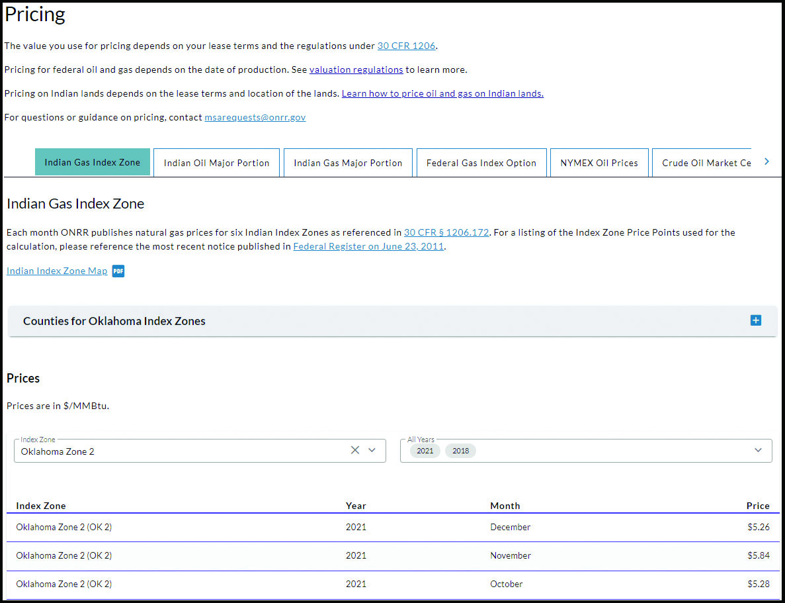
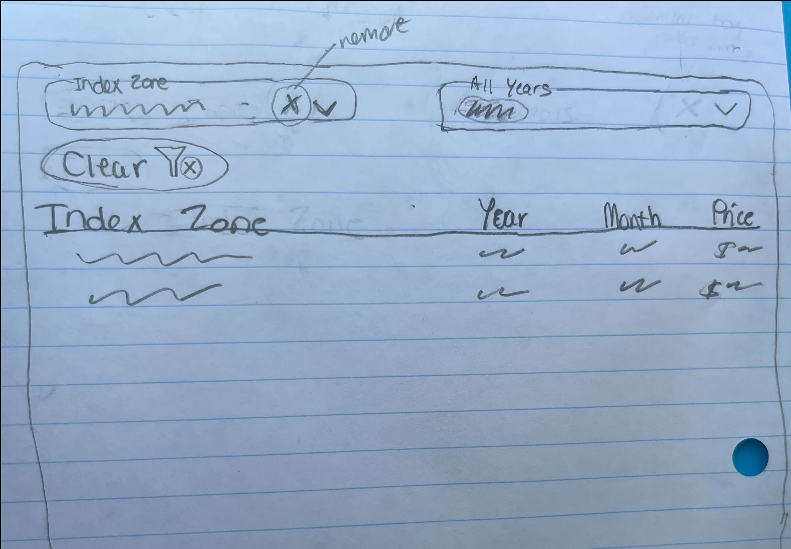
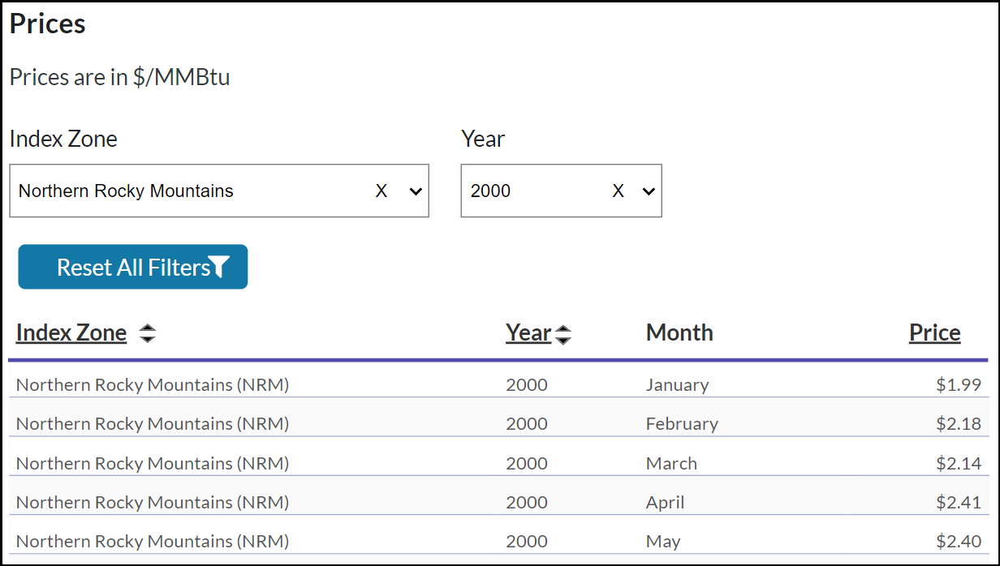

To inform the redesign of [onrr.gov](https://onrr.gov/), the Open Data, Design, and Development team (ODDD) conducted [12 user research studies](https://github.com/DOI-ONRR/research/tree/main/onnr-dot-gov-research) that built upon each other. These studies shaped the design and organization of the new site. Since we work in an [iterative and user-centered design cycle](https://blog-nrrd.doi.gov/modernize-government-website/), we were ready to continue our user research with our new website!

In those first few months after launching the new site, users reported the [Pricing page](https://onrr.gov/references/valuation?tabs=pricing,indian-gas-index-zone) as difficult to use. We identified a bug on the page and our part-time, Open Opportunities developer, Jeff Schwartz, was able to fix it. This alleviated some of the reported frustration with the page, but did not address all user reported problems. The team determined that user research would be necessary to identify specific problems and explore solutions. We also thought this would be a great opportunity for our intern Isabel Hernandez. Isabel started working with ODDD in January of 2022. She had received some UX training in her coursework and in previous ODDD studies, but had not yet been involved in an entire research study.

We gave Isabel guidance and support while allowing her to take the lead on certain parts of the study. Our UX researcher, Lindsay Goldstein, and one of our UX designers, Erin Elzi helped design and implement the study. They made sure Isabel had all the resources she needed, provided feedback, and led aspects of the study that required more experience or agency knowledge.

This user research study was a first in multiple ways. It was the first study we’ve done post launch of the new website. It was the first study that one of our new Digital Services Specialists (UX designer) collaborated on since joining the Office of Natural Resources Revenue (ONRR) and ODDD in Fall 2022. It was also the first time that our intern Isabel had the opportunity to participate in every step of the research study process. We learned methods of data analysis that were new to our team. To highlight Isabel’s experience as an intern, each section of this post includes her commentary on the process and what she learned.

**Isabel:** When I first saw the [Virtual Service Federal Service (VSFS)](https://careers.state.gov/interns-fellows/virtual-student-federal-service/) posting for the “2021/2022 UX Apprenticeship” at ONRR, I immediately wanted to apply. I had been looking for a professional internship that could help me break into the tech and UX that was remote due to the COVID-19 pandemic. This internship would teach me new skills such as learning a content management system (CMS), the stages of UX designs, note taking during user interviews, developing data dashboards, professional presentation skills, and exposure to an agile work environment.

##Planning the research study

The first step was meeting with the rest of ODDD to gather details on the problems reported by Pricing page users, as well as any pain points our team experienced in using the page. From the notes gathered in this meeting, Isabel was tasked with drafting the research plan. She was also provided with our [guide to planning user research](https://github.com/DOI-ONRR/nrrd/wiki/Research-norms-and-processes#plan-your-research), ONRR’s UX Strategy document that details the steps of problem identification through final solution building, example plans from [previous ODDD user studies](https://github.com/DOI-ONRR/research/tree/main/onnr-dot-gov-research), and online resources on writing and conducting user interviews.

Once Isabel had drafted the plan and interview, we went back and forth with suggestions for improvement. After doing this a few times, we rewrote the plan and interview guide, keeping as much of Isabel’s content as possible. This was really effective for two reasons: 1) Lindsay and Erin would be the ones leading the interviews; 2) Isabel found this to be a good learning experience - seeing how her plan compared to the rewritten one. 

As the person with the most experience conducting user research at ONRR, Lindsay took the lead on recruitment and scheduling. She has the most knowledge on our user types and how to best communicate with both internal and external users. 

Isabel acted as a notetaker in the actual interviews, but we wanted her to get experience with conducting them. We also needed to practice our interview questions. Practice interviews ensure our questions are clear, we’re getting the data we need, and we have an appropriate time estimate to give participants. Isabel conducted the practice interview so that she could gain experience with interviewing and with the process of revising the script based on the practice session.

**Isabel:** To prepare, I reviewed various ODDD wikis but starting with the [User Centered Design Process](https://github.com/DOI-ONRR/nrrd/wiki/User-Centered-Design-Process) helped give me an overview on what to expect. I’m fond of diagrams that capture processes or diagrams that summarize essential steps that can help me complete tasks on time. The interview template under the Usability Testing Process wiki helped me craft the first draft. However, I noticed this study was missing a “Context” section. Reviewing past plans helped gain insight into details included in a typical background information. It can be easy to get distracted with findings or data that is not the primary objective of a study. I found it helpful to review the scope and objectives.  

I learned that interviewers have the guide open during a user interview. A clear writing style and orderly sections make the guide easy to reference during interviews. Keeping this in mind helps ensure that the interviewer can easily reference information such as URLs or follow-up questions.

For this study, we had both external users that might be experts and internal interviewees that might not use the pricing page at all. This helped us write task-based questions based on user type.

To prepare for my practice interview, I went over a few videos sent by Erin on user testing facilitation techniques and reviewed resources in the [Research norms and processes wiki](https://github.com/DOI-ONRR/nrrd/wiki/Research-norms-and-processes#debrief-after-each-session).

 ##Conducting the Study

On ODDD, all team members are trained to conduct user interviews. This allows us to share interview duties, making it easier to be flexible and meet the scheduling needs of participants. For each of these interviews, we had at least three team members present: the interviewer, one to two notetakers, and any additional team members were there to observe. Notetakers are given space during the interview to ask follow-up or clarifying questions, but otherwise the interview is conducted by the interviewer.

We interviewed seven participants over three weeks. All interviews were held virtually, lasting twenty to thirty minutes. Notetakers were provided a spreadsheet that listed the required input we were seeking from participants, as well as space for additional, unexpected information that might come from the interviews. Debrief meetings occurred after each interview to discuss unexpected findings and make sure all important information was documented.

**Isabel:** An interview can contain a lot of information from a user at once. After taking notes, it is easy to feel overwhelmed. The opportunity to ask the user questions at the end of an interview is a useful way to catch anything that might have slipped by. 

I learned that asking users to “think out loud” is a great style to gather information from users during an interview. It’s important to be time-conscious and to pace yourself with questions so you can understand as much as possible. 

Prepare to go off script for unexpected moments. Sometimes, modifying the original question’s wording or asking new follow-up questions can help in unscripted moments. 

I learned that communication is crucial in an Agile environment for capturing accurate information and to meet deadlines. I found post-interview debrief meetings with the team really helps to capture any information that noteakers may have missed.

##Analysis and Recommendations 

Isabel and Erin consolidated the notetaking documents into a single spreadsheet. They coded the notes as facts (what the participant said or did) or observations (what the notetaker interpreted based on those facts). Erin coded the facts as positive experiences, pain points, surprises, or suggested improvements. The color-coded facts were moved to an online board where Lindsay and Erin used [affinity mapping](https://methods.18f.gov/decide/affinity-mapping/) techniques to create groupings. The resulting groupings, along with the observations from earlier in the analysis process, were then used to create recommendations and opportunities.

Isabel then took the results of the groupings and entered them into a sheet according to how many users demonstrated or stated each fact. These collated facts are used to both justify the recommendations, and also to link facts back to the original questions and goals of the research plan. This helps us determine if we have enough data to answer our research problem. 

At the end of this process, the rest of ODDD reviewed all documents produced during analysis and provided input on the recommendations. This is a crucial step, as it helps to pick up on any recommendations that might have been missed. Waiting to involve the rest of the team until the analysis was near complete helped streamline the process. Affinity mapping was new to many on the team, so it was important to create opportunities for participation when and where each member felt most comfortable doing so. 

The stages of analysis and the final recommendations and summary are available on [our wiki](https://github.com/DOI-ONRR/research/tree/main/onnr-dot-gov-research/13_Pricing%20Tables).

**Isabel:** To prepare for analysis, I reviewed the [Usability Testing Process wiki](https://github.com/DOI-ONRR/nrrd/wiki/Usability-Testing-Process) and the “Synthesize the round of research” section from the [Research norms and processes wiki](https://github.com/DOI-ONRR/nrrd/wiki/Research-norms-and-processes#synthesize-the-round-of-research).

Completing analysis tasks was easy because everything I needed was in one place. We used a comprehensive workbook that had all notes, deduped findings, research questions & goals, facts, analysis, groupings & trends, and recommendations. I enjoyed learning how to identify outlier or duplicate facts by checking in about user findings with Erin.

During an ODDD analysis meeting, I provided the team with additional reading on affinity mapping. I learned about affinity mapping in one of my business courses and became familiar with human-centered design methods, specifically [LUMA design methods](https://www.luma-institute.com/about-luma/luma-system-explore-methods/). Also known as affinity clustering, LUMA defines this method as a graphic technique for sorting items according to similarity. This technique helped us derive information from the user feedback acquired in the interviews. 

For the affinity mapping, we used an online whiteboarding tool that allowed multiple users to collaborate in real time and have interactive feedback sessions. I had not previously used this tool and it was great to learn something new. 

##Prototyping

The first recommendation we chose to address was “explore options for clearing filters” because it was a primary question that initiated this study. Based on the research findings, we decided to use the same participant poll, and gather their input on a few high-fidelity (hi-fi) prototype options for clearing the pricing table filters.

To let Isabel lead this process, we gave her links to our wiki instructions for the [shaping](https://github.com/DOI-ONRR/nrrd/wiki/Shaping-Process). To prepare for the shaping meeting with the rest of ODDD, both Erin and Isabel came up with three to four rough sketches (low-fidelity prototypes). They ended up with seven sketches, six of which were unique in concept and design. Isabel led the meeting, which included our part-time developer. His participation was important so that he could let us know which of the designs would be technically possible. The session resulted in combining some aspects of the various sketches to produce three concepts for improving the filter options. Using these concepts, Erin produced three hi-fi, interactive prototypes to share with users.

We emailed the hi-fi prototypes to five users, four of which had participated in the previous interviews. The fifth participant is a known user of the pricing tables. They were asked to rank the three options. Four users responded, providing enough feedback for ODDD to feel comfortable in selecting a final design and moving forward.

**Isabel:** The [Shaping Process wiki](https://github.com/DOI-ONRR/nrrd/wiki/Shaping-Process) involves five phases. I learned a lot from phases two and three: generate ideas and ground in reality. These phases helped me understand how design ties in with objectives and the agile environment. For phase two, I initially researched live components from other websites that would help me brainstorm ideas for my pencil sketches. Phase three allowed me to present my sketches made on paper and receive feedback from the ODDD team. 

This was the first time I led a professional meeting. I learned that providing a brief summary at the beginning of meetings is a great habit to carry in the workplace. Not all team members may have been involved in every step of the project. Providing context at the beginning of your meeting can help answer questions or remind everyone of the meeting’s purpose.

During this meeting, I was introduced to the U.S Website Design System (USWDS) and Material UI (MUI) component library. These tools are used by designers and developers to help ensure website components are consistent and accessible.

You can make prototypes via pencil sketches or on prototyping software. For this study, I created pencil sketches, which I found to be quick and easy to make. In previous projects with ODDD, I was exposed to prototyping software and how to use existing component libraries.

###Examples of Prototypes - Low to High

**Low-Fidelity Prototype/Sketch by Erin**

**Low-Fidelity Prototype/Sketch by Isabel**

**High-Fidelity Prototype**

##Conclusion

Even though it had only been a couple months since the launch of the redesigned site, it was apparent that the pricing tables were causing problems for some users. ODDD was looking forward to continuing user research for the new site, and it was perfect timing to give our intern more experience with UX research and design in her final months with the team. The previous projects Isabel worked on for ODDD provided the foundation for her to take a more significant role in this research. The initial interviews revealed that clearing the pricing filters was a problem for users, but did not reveal a solid solution. Since this led to the shaping process, prototyping, and a quick hallway study to get prototype feedback, it was a great opportunity for Isabel to get experience with many aspects of UX research and all phases of the iterative design process. It was also helpful for Erin, as a new member of ODDD, to learn from Lindsay the ONRR-specific methods of recruitment and research. Understanding how best to communicate with your user groups is important, and Lindsay’s expertise in this area was invaluable to the study.

In addition to developing a user-driven solution to clearing the pricing table filters, the study revealed a number of other recommendations. Some of these were unexpected, but we’re already planning our next user research study to help address one of them, which seeks to understand questions regarding the homepage and various levels of navigation. Even though Isabel will not be around to help us with these studies, the work she provided during the pricing research will continue to inform future projects. We are grateful for her contributions and wish her the best in her next role!

**Isabel:** My overall intern experience at ONRR was a great experience that helped me to develop a basic understanding of UX design and research. I will continue to build on this experience through my education and career. This experience allowed me to learn and try new applications for prototyping, help with monthly data comparisons, update the content management system, review the backlog for issues with intern tags, and collaborate with other interns - all while being a full-time student. I absolutely recommend this internship to other students who are ready to learn new skills and make an impact. A special shoutout goes to all the wonderful individuals such as my mentors, the team, and fellow interns because this opportunity was truly out of this world. 
