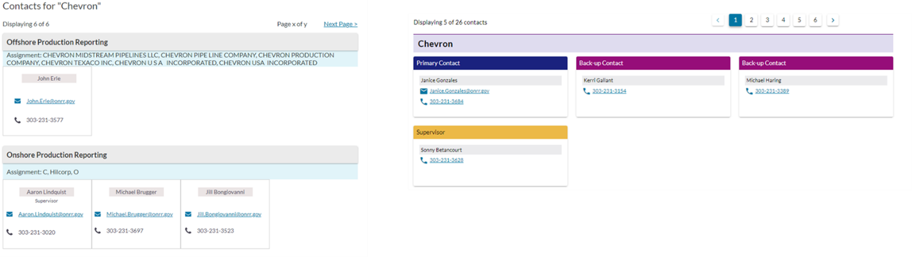

Kaitlyn Tran was one of our UX interns for the 2021-2022 school year. She just finished up her second year at UC Santa Cruz and is working on a degree in Cognitive Science. Our former UX designer, Shannon McHarg, was her mentor for the year. We decided to do a conversation style blog post because I wanted to learn more about her and her experience. I had a few leading questions and then we chatted. We worked together afterwards to summarize her responses. We hope you enjoy reading this!

## What was your favorite thing about working with our team?

I really liked the team dynamic. I liked that it was collaborative across disciplines and how I was able to work with such a diverse team. I worked on projects with developers and the development intern. It was eye opening to see things from other perspectives outside of UX. It was a real point of growth for me to learn about everything throughout the workflow from so many different perspectives on the team.

I just loved how everyone shared their lives even though everyone is remote. From family lives to pictures of pets, everyone was always happy to support one another, even outside of the work environment.

During my check-ins with Shannon, she gave me advice about professional development, school, and outside life. It was really comforting. She was really responsive as a mentor. It was nice to have her help with everything including learning a wireframe software for a project, talking about design assignments in school, and opportunities for growth within and outside ONRR.

## What was your favorite project?

I worked on the new contacts design for the updated onrr.gov. It was such a big project. There are a lot of contacts and I learned how to use a wireframing software that was completely new to me. Although it was a little overwhelming at first, diving right into the project was a great learning experience. I had to figure out how to use a new design interface. It was really rewarding to learn something new by myself (with some tips and tricks from Shannon) and put it into practice to create a design that will adapt with onrr.gov.

## Were there any big surprises?

I was surprised that the internship was very flexible due to our school schedule, which isn’t a bad thing. It took off a lot of pressure to balance both classes and being with ONRR. I didn’t have a lot of expectations going into it because it was my first internship and I had a lot to learn as an aspiring UX designer. I can confidently say that it was a good one to start off with.

## What are you going to do next?
I’m currently working with NASA doing service design. I’m still using human centered design but applying it to designing services. It’s a rewarding process to look at customer and employee journeys and to work on enhancing their experiences. It has been enjoyable as it has a similar chill environment to the ONRR team. I’m growing a lot, seeing service design applied to such a big organization and how to it applies to science. I didn’t see myself working in a STEM centered organization before so it’s insightful to see design applied on a much wider perspective. Other than that, I have another year of undergrad and I’m involved in student organizations. No other plans yet but I might work towards a master’s degree.

## Do you have any advice for future interns?

Be open with your mentor about opportunities you’re curious about. Take it as a chance to allow them to help you grow your skills.

It’s important to take the initiative to take on new projects. Be proactive about joining projects that interest you and in areas where you want to grow.
