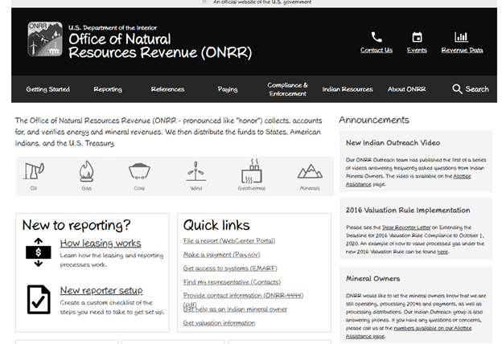
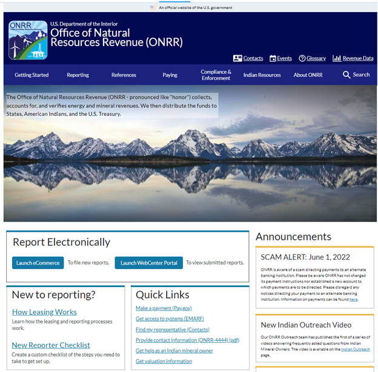
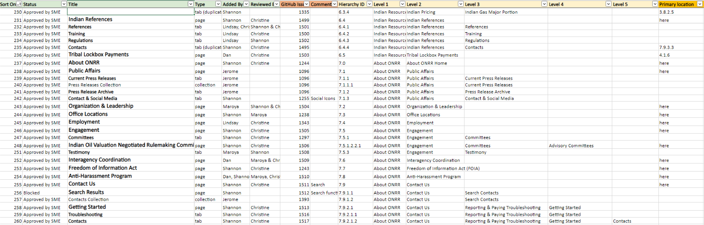
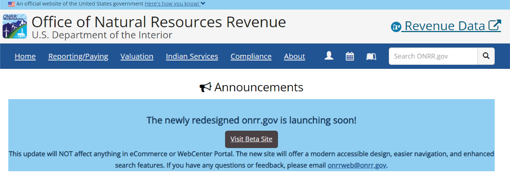

Now that our Open Data, Design, and Development (ODDD) team’s redesign of [onrr.gov](https://onrr.gov/) is live, we wanted to outline our process for updating this website. In this blog post, we break up our process into six sections: 1) understand current state, 2) user research, 3) design and prototype, 4) build webpages, 5) launch the beta site, and 6) launch the live site. Because we broke down our work into a multi-step process, we did not get overwhelmed with this redesign task. We utilized our version of [agile](https://blog-nrrd.doi.gov/agile/) to subdivide tasks into attainable goals. This blog post serves as a helpful guide for other agencies looking to do a major website redesign. 

## 1. Understand current state  

When the Office of Natural Resources Revenue’s (ONRR) leaders transferred the management of [onrr.gov](https://onrr.gov/) to our team, our first goal was to understand the website’s current state. We found that the website was built using a closed source software called Dreamweaver. To maintain the website at its current state, it required manually editing html files and using Dreamweaver to edit global components. This suggested to us that we needed to redesign the website with user-friendly open-source tools and better conform with newer regulations and digital best practices. 

We dug further into the site’s needs by performing a [formative study](https://blog-nrrd.doi.gov/intern-onrr-dot-gov/), conducting a [content audit  ](https://blog-nrrd.doi.gov/intern-experience/), reviewing [previous survey results](https://github.com/DOI-ONRR/research/tree/main/onnr-dot-gov-research), and reviewing [analytics data](https://github.com/DOI-ONRR/onrr.gov-site/wiki/Analytics). Understanding the current state helped us with [framing a vision and a problem statement](https://github.com/DOI-ONRR/onrr.gov-site/wiki/Product-framing) for the site.

## 2. Discover user needs 

The goals of the [initial studies](https://github.com/DOI-ONRR/research/tree/main/onnr-dot-gov-research) were to validate our [product vision](https://github.com/DOI-ONRR/onrr.gov-site/wiki/Product-framing#our-vision) and ensure it reflects user needs. These initial studies helped us understand the tasks users need to complete on our site, organize content based on what information users value the most, and helped us focus our redesign efforts to resolve pain points users articulated with the current website.

### How we conduct user research

All studies done during this redesign process were moderated user interviews. We found that we get better feedback when we can observe users perform a task and ask questions throughout the process. We have our [research process](https://github.com/DOI-ONRR/nrrd/wiki/Research-norms-and-processes) and [usability testing process](https://github.com/DOI-ONRR/nrrd/wiki/Usability-Testing-Process) outlined in our GitHub wiki. We used analytics to prioritize major projects that were part of our redesign such as the project to remediate over [5,ooo documents to be Section 508 compliant](https://blog-nrrd.doi.gov/accessibility/).

Our user research participants included: ONRR employees, other federal employees, and industry users. We built up our participant pool using several methods. We reached out to ONRR employees who we knew interacted with industry users. We interviewed our in-house employees and then asked them for industry contacts that may be responsive to sharing feedback. Once we had industry contacts, we also asked them at the end of the interview if they could recommend other participants to us. We also worked closely with other federal agencies and built up our government contact list using the same method. We recently wrote a blog on our [onrr.gov user types](https://blog-nrrd.doi.gov/onrr-user-types/), which explains how we classify participants as personas.

In our [research repo](https://github.com/DOI-ONRR/research/tree/main/onnr-dot-gov-research) on GitHub, we have summaries of the usability research we did throughout the redesign. Below are summaries of our experiences with card sorting and tree testing. These two discovery studies greatly contributed to the development of our initial prototype.

### Card sorting 
Some of the first discovery studies we conducted were [open](https://github.com/DOI-ONRR/research/tree/main/onnr-dot-gov-research/03_card_sort) and [closed](https://github.com/DOI-ONRR/research/tree/main/onnr-dot-gov-research/05_closed_card_sort) card sorting studies. The goals of these studies were to understand how to organize the website and to understand how users view the information space. These studies helped us determine the categories and subcategories users expect to see on the website. You can read more about our experience in our previous [card sorting blog post](https://blog-nrrd.doi.gov/card-sort/).

### Tree testing 
The goal of this [tree testing research](https://github.com/DOI-ONRR/research/tree/main/onnr-dot-gov-research/06_tree_test) was to validate the structure that came out of the card sorting findings. This study helped us confirm that we were placing subcategories into the correct main categories and users can find the information they need. You can read more about our experience in our previous [tree testing blog post](https://blog-nrrd.doi.gov/treetest/).

## 3. Design & prototype solutions
Our ODDD team does not own, and   is not responsible for, the content on the website. During the prototype process, we worked with the content owners, or subject matter experts (SMEs), to test the usability of the prototype and to get their approval of our proposed changes to their respective webpages.

### Wireframe study
Our UX designer at the time, Shannon McHarg, applied the results of the discovery user research into her initial wireframe prototypes. These prototypes were kept in a “sketchy” visual style to make sure our SMEs knew that these were a draft and major modifications could be made. 

We used this initial prototype in our [wireframe study](https://github.com/DOI-ONRR/research/tree/main/onnr-dot-gov-research/08_WireframeStudy). Our goal for this study was to gauge whether this new design was effective at allowing users to complete their tasks. 

The overall results of this study were positive, but we found areas we could improve upon. We conducted a study just on contacts and held a [contacts design studio](https://blog-nrrd.doi.gov/contacts/). Revisions to the [contact pages](https://github.com/DOI-ONRR/research/tree/main/onnr-dot-gov-research/10_contacts_survey) and the addition of [troubleshooting pages](https://blog-nrrd.doi.gov/troubleshooting/) were a result of this user research.

### Finalized design
We used the results of our wireframe research, as well as the discovery research, to determine the final design. We used the data we collected to justify when and why we changed the site in a specific way. We let the research results make the decisions for us, and we worked through the redesign in the most unbiased way possible. During the research, if we noticed multiple users struggling with something, we would make design changes to resolve that issue and seek feedback on the changes.

Since Shannon was our only designer at the time and her background is focused on information architecture and interaction design, we needed help with the visual design aspect of the website redesign. We posted a project on [Open Opportunities](https://openopps.usajobs.gov/) seeking a candidate with visual design skills, and selected Alex Budz. We provided Alex with the wireframes, agency logo, and other information to help us give the redesigned website visual appeal. Alex presented her ideas and iteratively developed a style tile template. We also worked with [Virtual Student Federal Service](https://careers.state.gov/interns-fellows/virtual-student-federal-service/) interns for several of the other redesign projects mentioned throughout this blog post. 

Once Shannon applied all the user research-based changes to the wireframes, she applied the visual design to the prototypes be more reflective of what the live site will look like. The SMEs had another round of reviewing and approving this revised prototype design.

## 4. Build webpages in Content Management System (CMS)

Before pursing the decision to redesign the website, our previous web developer, Jerome Louis, did extensive research on which CMS would meet the needs for the website. We also did user interviews to better understand the requirements for the CMS. The team chose Directus as our CMS because we value free, open-source products. Directus is a headless CMS which gives us the ability to manage content in one place while allowing our applications to be built upon that data. 

Once we got SME approval of the finalized design, we started building the webpages within our new CMS. We developed a thorough content tracking sheet, using our original content audit as its base, to make sure all content was correctly incorporated into our CMS. 

Within our content tracking sheet, we detailed who on our team was responsible for building each webpage. Our team had never used a CMS before, so we had a learning curve when starting this task. As CMS functionality was added by our developer, we would detail how to use it in our [CMS user guide wiki](https://github.com/DOI-ONRR/onrr.gov-site/wiki/CMS-user-guide). Developing a user guide helped newcomers to our team quickly onboard and contribute. 

Once we completed a webpage, another person from our team would review. This internal review was important because we were still learning our CMS, and it made sure all team members knew how to use all the tools within it. We wanted to make sure all functionality and content within a webpage was included before sharing it outside of our team.

### Stakeholders final review of development website

After a webpage was finalized and approved by our team, we would then send it to the SMEs for their final approval. We made sure we had SME approval before marking a webpage as complete within our content tracking sheet.

These SME reviews were an iterative process. There was a significant amount of coordination we had to do with our [SMEs](https://blog-nrrd.doi.gov/stakeholders/) to make this process run smoothly. This coordination and communication process was detailed in a previous blog post about the [implementation of plain language](https://blog-nrrd.doi.gov/plain-language/) during this redesign. 

The main challenge we encountered was making sure the SMEs were communicating with each other. For most webpages, there was usually more than one SME reviewing and approving the content. We had to facilitate communication between all SMEs to make sure everyone involved in the process agreed with a decision. There were times when a specific webpage would go through several rounds of review and edits before it was finally approved.

### Final development site study

It took us about five months to create all the webpages in the CMS and to get final SME approval. Once our development site had all approvals we required, we wanted to do one [last round of user testing](https://github.com/DOI-ONRR/research/tree/main/onnr-dot-gov-research/12_DevSite) before going live. The goal of this final-stage testing was to learn about any usability issues that might have arisen in the built site. Based on findings from this study, we made several minor navigation updates that did not require approval from SMEs. 

This study closed out our pre-launch user research. With all pre-launch studies mentioned above combined, we conducted approximately 150 interviews. Now that the redesign is live, we are starting a new phase of research to optimize our existing designs. User research is an iterative process, and we are continuously finding areas where we can improve.

## 5. Launch beta site

After we had every webpage finalized on our development site, we proceeded with the launch of our beta site. This involved coordination with our sister agency and our web developer to route the Domain Name Server (DNS) to the appropriate IP address.  

### Communication plan

To inform our stakeholders that the new redesign was coming soon, we posted a banner at the top of the former site homepage. The banner let everyone know that the new redesign was launching soon and included a link to the beta site for preview. We also included our email in case any users had feedback for us. We posted this banner about three months ahead of the hard launch. This gave our users time to prepare for the change and to get used to the new design.

In addition to this banner, we emailed every person who participated in our user research pool. It was important to us to make sure that those who helped create this new design got to see the final product.

## 6. Launch live site
Before launching the live site, we became severely short-staffed. We did not have a developer to get us over the hurdle of going live, and this delayed our launch by about two months. We are very thankful that we were able to advertise a developer project through [Open Opportunities](https://openopps.usajobs.gov/). Through this resource, we were able to take on an amazing federal developer on a part-time and volunteer basis. Thanks to the incredible help and enthusiasm of Jeff Schwartz, we were able to finally get the site live!

Just because we are now live does not mean we stop innovating! Since going live, we encountered minor issues including: finding bugs within our redirects, discovering new methods to enhance accessibility, and needed improvements to table functionality. We are currently tackling these issues and constantly finding improvements to make.

## Conclusions
Over the span of just two years, our team was able to take ownership of and completely redesign onrr.gov. Here are our main takeaways:
* Taking the time to understand onrr.gov’s current state was an important first step for us, especially since we had just taken ownership of the site.
* Conducting initial discovery user research helped us understand how to better organize the site and resolve pain points. 
* We let the results of our user research determine the wireframe prototype design. 
* We used the data we collected during our iterative research and review process to justify when and why we changed the prototypes in a specific way. 
* Building webpages with our new CMS was a learning experience for us all, and we documented what we learned in a user guide. 
* We kept ourselves organized by utilizing a content tracking sheet and documented our approval process there. 
* Coordinating and communicating with SMEs can be a difficult task, and we needed to make sure we got every SME approval before completing a webpage.
* Launching both the beta and live site required technical developer expertise. When we were short-staffed, we got creative with resources to find the help we needed.

We are proud of all that we accomplished during this project, and we are so excited to start our next stage of iterative improvements!

