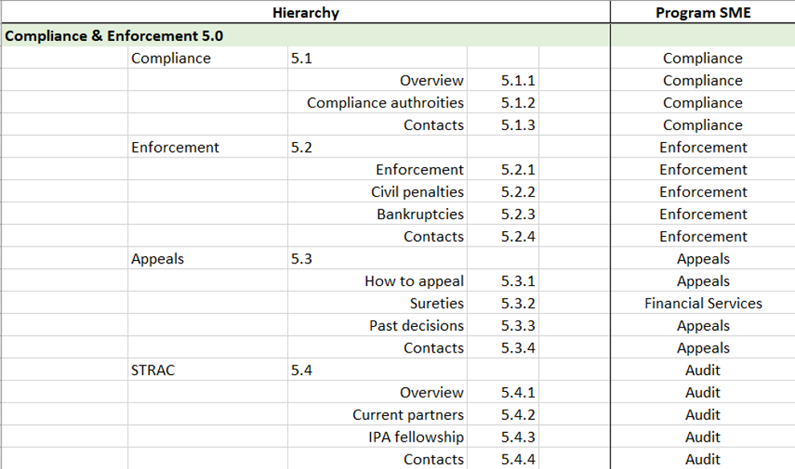
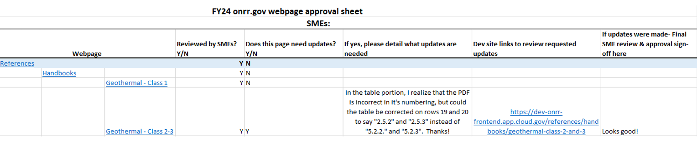
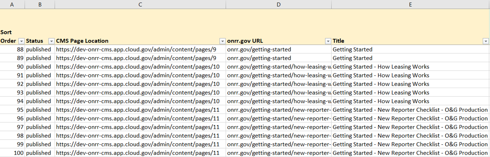
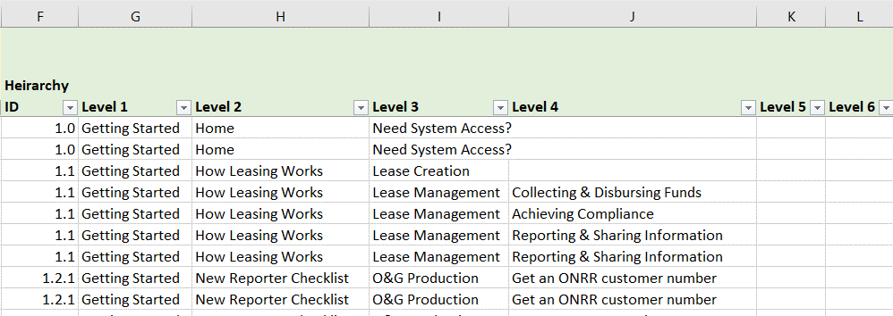
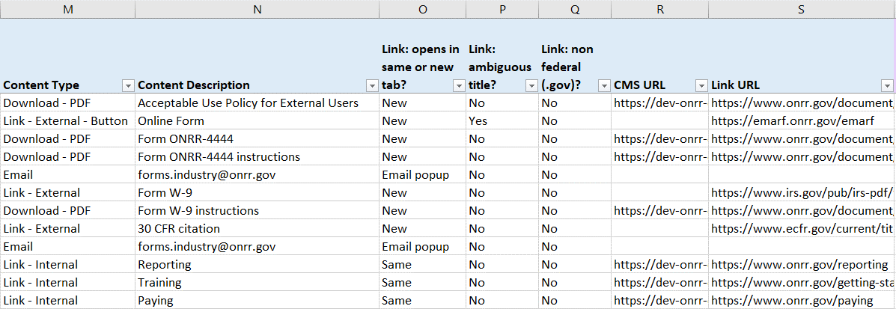
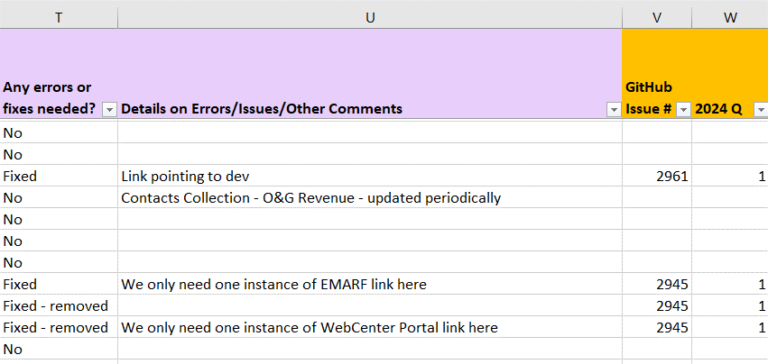
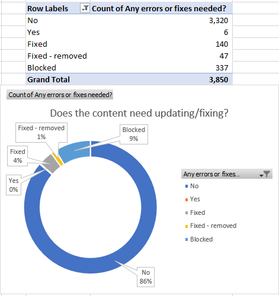
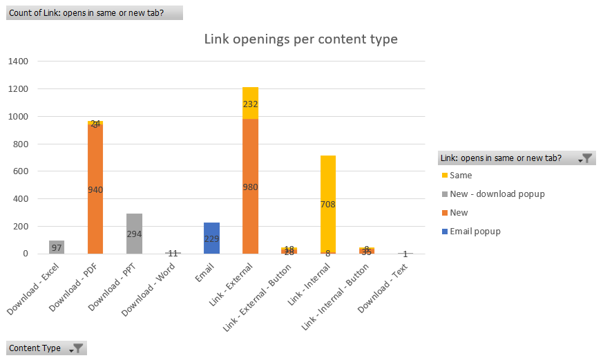
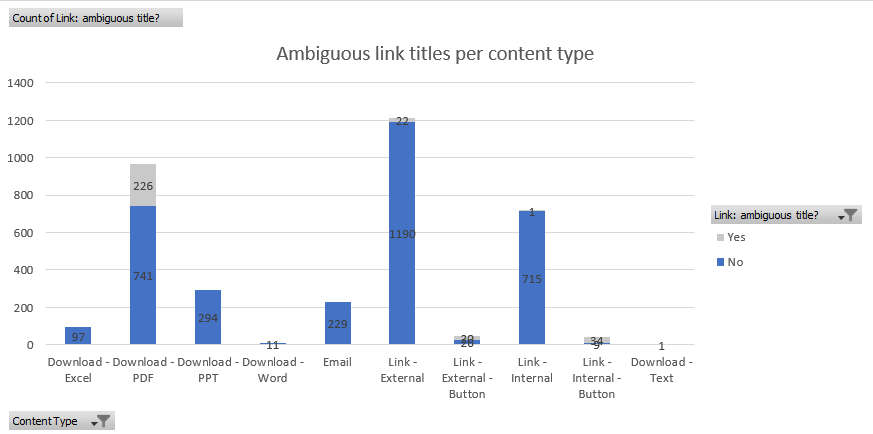
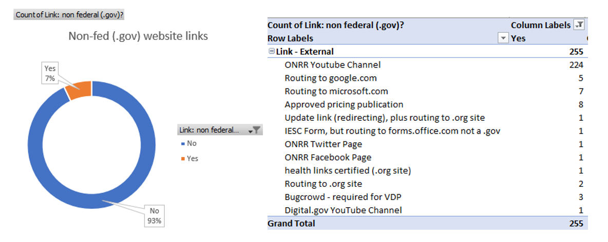

Fall 2023 marked one year since our Open, Data, Design, and Development (ODDD) team launched the new redesign of [onrr.gov](https://www.onrr.gov/). During this year, the ODDD team continued to innovate, improve, and add new content to the website. After so much change, I wanted to create a [content database and audit](https://blog-nrrd.doi.gov/content-audit/) similar to the one I created for [revenuedata.doi.gov](https://revenuedata.doi.gov/). This blog post covers how I coordinated with our web content owners – or subject matter experts (SMEs) – and how I developed a content database and audit for [onrr.gov](https://www.onrr.gov/). 

In accordance with [M-23-22 “Delivering a Digital First Public”](https://www.whitehouse.gov/wp-content/uploads/2023/09/M-23-22-Delivering-a-Digital-First-Public-Experience.pdf), I established a content internal control process that involves SMEs to annually review their public-facing webpages.
  
Steps I took to coordinate with SMEs include: 
•	Create a website hierarchy and identify the program responsible for each webpage. 
•	Engage with program managers to assign SMEs to specific webpages.
•	Create easy spreadsheets for SMEs to request updates and document approvals.
•	Set reasonable deadlines to ensure timely reviews.

During the SME content review, I started building a detailed content database while simultaneously auditing the content as I cataloged it.

Steps I took to develop this content database include:
•	Incorporate SME updates to the website.
•	Create a detailed inventory that incorporates our content management system (CMS) and information architecture. 
•	Customize the inventory to assess questions about links to meet accessibility and privacy guidelines.
•	Perform a detailed audit using the inventory.
•	Develop a measurable action plan to fix issues found in the content audit.
•	Develop visual charts to report progress on the identified content issues.

Let’s dive into the details!

## SME coordination 

We incorporated SMEs during every step of our [redesign](https://blog-nrrd.doi.gov/modernize-government-website/) of [onrr.gov](https://www.onrr.gov/) and previously outlined how we [coordinated with SMEs](https://blog-nrrd.doi.gov/plain-language/) during this process. In accordance with [M-23-22 “Delivering a Digital First Public”](https://www.whitehouse.gov/wp-content/uploads/2023/09/M-23-22-Delivering-a-Digital-First-Public-Experience.pdf), I established a content internal control process that involves SMEs to annually review and approve their public-facing content. 

My first step of our new content internal control process was to create a hierarchy of onrr.gov. I cataloged the first three levels because there are several webpages where different program areas are responsible for different tabs within same webpage. By creating this detailed hierarchy, I made sure each section of the website had a program area assigned to it.

*An excerpt of the ONRR hierarchy sheet, showing which program areas are responsible for each section of a webpage.*

The Office of Natural Resources Revenue (ONRR) has ten clearly defined programs and program managers (PMs). In order to identify SMEs, I individually contacted each PM with a spreadsheet that included the list of SMEs who previously participated in the onrr.gov redesign. I asked the PMs to either re-approve their SME list or appoint new SMEs. I gave the PMs a one-week deadline. Because I gave the PMs background information and provided previous lists, everyone got back to me in a timely manner.

Once I got the PM-approved SME lists, I contacted each SME group individually. For each SME group, I developed a simple spreadsheet for them to facilitate their review of respective webpages. In the first columns of the spreadsheet, I included the hierarchy of webpages with hyperlinks that brought them directly to each page they needed to review. The other columns were designated for SMEs to mark that each page has been reviewed, note necessary updates, and provide details for each update. After the SMEs completed their review, I incorporated their update requests in the development site, obtained their final approval, and then published the updates to the live site.

*An example of the SME approval sheet.*

## Building a content database

Because I had success with building – and frequently referencing  – a [content database and audit](https://blog-nrrd.doi.gov/content-audit/) for [revenuedata.doi.gov](https://revenuedata.doi.gov/), I wanted to create a similar database for [onrr.gov](https://www.onrr.gov/). Onrr.gov is a more complex and larger website than revenuedata.doi.gov, so my first task was to establish the scope of this database and audit.

### Setting the scope with accessibility and privacy questions

When starting to plan this database and audit, I realized that my team had three major questions we needed answers to. All three related to either accessibility or privacy of links. We are still innovating within our CMS and because of our CMS limitations, we needed to better quantify these specific questions.

Our first question was: **how do our links open – in a new tab or the same tab?** Answering this question will help us meet the [WCAG technique G200 “Opening new windows and tabs from a link only when necessary”](https://www.w3.org/TR/WCAG20-TECHS/G200.html). I cataloged and tested every type of link on our site (internal, external, email, and all document type links) and recorded if these links opened in the same tab or a new tab.

Our second question was: **is the title description of each link ambiguous?** Answering this question will help us meet [WCAG’s success criterion 2.4.4 “Link purpose (in context)”](https://www.w3.org/TR/UNDERSTANDING-WCAG20/navigation-mechanisms-refs.html). I cataloged and evaluated all link text on our site (internal, external, email, and all document type links) and recorded if more descriptive text was needed.

Our third question was: **how many external links on our site go to non-federal websites?** Answering this question will help us protect privacy when using third party websites when engaging with the public, as described in [M-10-23 “Guidance for Agency Use of Third-Party Websites and Applications”](https://www.whitehouse.gov/wp-content/uploads/legacy_drupal_files/omb/memoranda/2010/m10-23.pdf). For all external links, I noted if the link was navigating to a non-federal webpage.

### Content catalog

In addition to the link questions, I also wanted to make sure this database was comprehensive of all types of content. This comprehensive approach allows my team to use the database to ask new accessibility questions that may come up in the future. It also helps allows me to easily identify locations of specific content when we get future CMS improvement. For example, by cataloging the location of every table, I can quickly update them when new CMS functionality is added. 

Content types I cataloged in this database include: Download – PDF, Download – PPT, Download – Text, Download – Word, Image, Link – Email, Link – External, Link - External – Button, Link – Internal, Link - Internal – Button, Table, and CMS Collection.

### Building the database while simultaneously auditing content

Once I determined the scope and content types, I started creating my database by incorporating the CMS and information architecture. Using the CMS, I was able to export all the CMS page location URLs with their corresponding URLs to the live site. This automated export functionality helped me make sure I captured every location/URL of the website and formed the foundation for building the database.

The first section of my database spreadsheet includes webpage location information. I correlated the CMS page location with the live onrr.gov location. I also created a detailed title field to facilitate easier filtering.

*The first section of the content database includes columns for the CMS page location, onrr.gov URL, and page title. There are multiple line items per an individual URL location, which indicates multiple types of content cataloged.*

The second section of the spreadsheet contains more detailed hierarchy information for each webpage. Instead of limiting each URL as a single line item, I wanted to break down the information on each webpage to a more granular level. Cataloging the heading levels within a webpage helped provide more navigation structure for the database as I drilled down to catalog more detail. For each heading level, I cataloged every content type within it. 

*The second section contains more detailed hierarchy information for each webpage. There are multiple line items per an individual location, which indicates multiple types of content cataloged.*

The third section includes cataloging each instance of content, addressing our questions about accessibility and privacy, and documenting URL localities for the links. Each instance of content got its own line item in the database, with detailed columns specifying the content type and a short description. I created separate columns for each of our three questions about links. For links (internal, external, and all document types), I included both the CMS (if applicable) and live URL localities. 

This cataloging method is particularly useful for ONRR because we have similar information across multiple pages. This allows us to quickly track down these locations, identify points of duplication, and ensure consistent updates across all instances.

*The third section includes cataloging the content type, a description of the content, addressing our questions about accessibility/privacy, and documenting URL localities for the links. Each instance of a content type is cataloged as an individual line item.*

The last part of the database includes a more traditional audit. As I cataloged each instance of content, I noted errors that need to be fixed, and detailed what exactly needs attention. As I made fixes, I detailed the corresponding [GitHub issue number](https://github.com/DOI-ONRR/onrr.gov-site/issues) and noted which quarter it was completed for our [metrics]( https://blog-nrrd.doi.gov/metrics-and-policy/).

*The fourth section includes the audit. I noted if any errors were found and detailed what needed to be addressed. I also noted the GitHub issue for each update and what quarter it was completed.*

In total, I cataloged and audited 3,850 content items to create this database. Of that, I identified 530 content items that needed some form of update. It took me three weeks to build the database and complete the audit.

## Action plan for audit-identified updates

Having identified 530 content items in need of updating, I made a plan to help prioritize these updates. Using all my filtering and pivot table options within the database, I realized that about 30% of the content that required updates were duplicated across multiple webpages. Because of this, I decided to prioritize my updates based on the severity of the issue instead of by pageview analytics. 

My first priority was to fix broken links. We had several internal, external, and document links that needed replacement. I was able to quickly update the ONRR-owned links and spent some time making sure that new external links were routing to the appropriate location.

My second priority was to fix missing links and links that were incorrectly redirecting. As we added content this past year, I noticed locations where an ONRR document or internal link would be beneficial and added those. I also noticed several external links that needed a better redirect and updated those as well.

While I gathered the quantitative data for our three link questions, my ability to make those updates in the CMS is currently blocked. Once we improve our CMS link and text editor functionality, I will be able to easily make those updates.

I was able to quickly address my first and second level priority updates, and I already incorporated those updates in the database. As we continue to update the website, I incorporate those updates to the database as they occur.

## Using pivot tables to visualize audit results

Because I cataloged my content into a functional database, I was able to create pivot tables and charts from the resulting pivots. I used these to visualize the amount of content that needed updating, which content types required updating, and to track my progress.

These visualizations helped me inform management of my progress. It also helped me justify my work, illustrating that making these content fixes was worth my time. I used these prioritization and visualization methods to break up the audit findings and fixes into multiple issues that spread across several sprints.

The first visualization I use is a simple status update that showed overall how many issues were fixed as of the current sprint and how many still needed attention. So far, I completed the majority of updates that are not blocked. I plan to finish the remaining six issues and brainstorm how to approach the issues that are currently blocked. This is a work in progress!

*Overall status showing how many issues were fixed and how many still needed attention.*

I also used pivot tables and pivot charts to quantify our three link questions. For our first question – how do links open? – I visualized the results by content type. The chart below shows the variation we have throughout the website. Once we improve our CMS, I will work to make sure there is consistency with how our links open.

*Bar chart showing the counts of how links open by content type.*

For identifying ambiguous link titles, most ambiguity was with PDF documents. Once we improve our CMS, I plan to manually update these links to have more descriptive text.

*Bar chart showing the counts of ambiguous links by content type.*

All the non-federal links were classified as external links. Of those external links, I identified 255 that were directing to a non-federal website. Once we improve our CMS, I plan to implement proper indicators for these links.

*The percentage of external links that are non-federal, and descriptions of each non-federal link.*

## Conclusions
Creating a content database and audit is very technical and detailed work! But I find this method of content tracking to be absolutely critical to my [team’s success](https://blog-nrrd.doi.gov/federal-team/). Incorporating all the updates identified during this audit is a work-in -progress, but I am able to quantify and track this work because of the database I built.

This database is a daily reference for my team and myself. It helps us make sure we are incorporating our updates to the website in the most consistent way possible. I update the database regularly as change occurs, but also plan to do a full audit annually. Now that the hard work of building the database is complete, it will allow me to audit at a deeper level in future years. As we look ahead, the content database will support our ongoing commitment to enhancing user experience and ensuring the quality of our public content.