We’ve been through a few iterations of our personas for onrr.gov. We started with a [rough cut](https://blog-nrrd.doi.gov/intern-onrr-dot-gov/) based on the initial interviews we conducted with users. Then after a few rounds, we adjusted. Now that we’ve conducted several studies where we’ve noticed gaps in our personas, we decided to revisit them.

## Personas going in

We organized industry users by what they report, had one internal user type, one user who was exploring the site to learn about the Office of Natural Resources Revenue (ONRR), and one who was a resource owner. Here are the personas and scenarios we had.

### New reporter

-	A new reporter comes to the site for the first time looking for how to get set up to start filing reports. They find a checklist of steps to take and the forms they need to fill out to gain system access. They also find a training class to sign up for and some videos to watch to get started.

### Production reporter

-	The reporter has a OGOR report that is due next Friday and needs to file, so they go to onrr.gov to file the report. They have a question about the report, so they look for the contact information of the production representative at ONRR to call them.
-	The reporter needs to enter inventory adjustments to a past OGOR. They log onto the ONRR eCommerce portal to make these changes. The reporter refers to the production handbook to review how to report correctly.
-	The reporter receives a data request or an order to report and looks for procedures to respond to the letter and look at handbooks, well assignment lists, and their reports in Data Warehouse to determine whether they reported correctly.

### Royalty reporter/payor

-	The reporter has a 2014 report that is due next Friday and needs to file, so they go to onrr.gov to file the report. They have a question about the report, so they look for the contact information of the royalty representative at ONRR to call them.
-	The reporter needs to enter adjustments to a past 2014 for a different sales volume and sales value. They log onto the ONRR ecommerce portal to make these changes. The reporter refers to the reporting handbook and valuation guidance to review what the value should be and how to report correctly.
-	A royalty reporter is looking for an Indian Major Portion Oil Price for last month, so they go to onrr.gov to find a table. They need the most up-to-date price to calculate the royalty owed for the month.

### Solids reporter/payor

-	The reporter has a P&R report that is due next Friday and needs to file, so they go to onrr.gov to file the report. They have a question about the report, so they look for the contact information of the royalty representative at ONRR to call them.
-	The reporter needs to enter adjustments to a past P&R. They log onto the ONRR ecommerce portal to make these changes. The reporter refers to the reporting handbook to review how to report correctly.

### ONRR customer service rep

-	An internal employee from the Reference and Reporting Management (RRM) Production Team would like to prepare and conduct training for first time reporters. They use onrr.gov as a resource to guide reporters with instruction and other information.
-	A royalty team member gets a question from an industry reporter about how to report. The royalty team member goes to onrr.gov to find the answer and sends the reporter a link to the information.
-	A compliance representative notices an issue when conducting a review and notifies the reporter. Reporter contacts the rep and asks questions. Rep points the reporter to onrr.gov to information to answer the question.

### Inquisitor

-	Potential employee goes to onrr.gov to learn about the agency.
-	Journalist goes to onrr.gov to find out who is the contact for public relations to get a quote for an article.

### Resource owner (tribe, IIMO)

-	An allottee wants to attend an event or learn about what ONRR does for them.
-	A tribal leader wants to find out who to call with a problem they're having with one of their lessees.

## Thinking in terms of behavior

The more users we interviewed, the more gaps we found in this model. We started to find that industry users have the same needs regardless of what they report. The internal users are more nuanced than just one type. There are also users from other federal agencies, like the Bureau of Land Management, that use the contact information in similar ways to our internal users.

To consolidate all the knowledge we had about users, we went back through all of the notes from previous user interviews and put them in a spreadsheet with behaviors. I then took the contents of that spreadsheet to distill the behaviors of the typical onrr.gov user.

### Primary tasks for industry users

-	File reports (for own company or a third party)
-	Access previous reports (for own company or a third party)
-	Make a payment (for own company or a third party)
-	Understand how to get started
-	Learn about ONRR

### Secondary tasks for industry users

-	Get system access (EMARF, 4444, login issues)
-	Get help filing reports (handbooks, training, regs, reference lists & codes, valuation, contact someone)
-	Troubleshoot errors or compliance/enforcement actions after filing
-	Understand how much to pay (access other systems like LAB)

### Tasks for people who help industry users

-	Help industry get answers to questions
-	Send a link to onrr.gov
-	Call the customer
-	Email the customer

## Design studio

We took all of the information we had about users and the problems we were having placing user interview participants into the persona groups and conducted a design studio.

In the first design studio session, we reviewed everything we know about users and discussed it. We also identified additional gaps – disbursements recipients (the people who get the money that ONRR collects from leaseholders) and outside auditors (state and tribal entities who conduct audits).

We also reviewed several examples of how others have broken up and visualized persona dimensions. We then went offline to come up with ideas for what dimensions were most important and how we should visualize the personas.

## Sketches

Here are some of the initial ideas we came up with.

### Concept A

This first concept incorporated the user types previously established and utilized the triangle layout used for our other website, [Natural Resources Revenue data](https://github.com/ONRR/research/blob/main/nrrd-research/00_UserTypes/00_UserTypes.md). This was a good exercise in applying an already-established visualization method on a different set of user types. The corners of the triangle were set to three different reasons for why people use onrr.gov. In order to be able to put all user types on this triangle, the use descriptions had to be very generalized. We learned that the groupings we had set with this triangle meant that most user types were all clustered to one corner. We decided that this concept was not the most effective method for showing differences between user types.

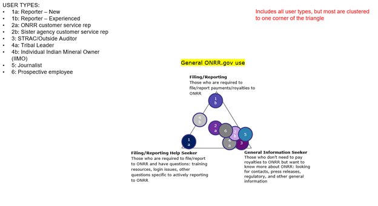

We then applied the same user types to an example from H&R Block. This concept allowed us to be more detailed in describing how people use onrr.gov by listing multiple user tasks instead of three general ones like in the triangle above. This concept was more useful because it allowed us to broaden our ideas on how to organize and categorize user tasks. We made progress with this concept, but ultimately saw similar clustering of user types. We decided that this concept was an improvement, but still felt like we could develop something more effective.

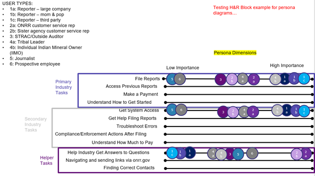

### Concept B

I thought a lot about natural ways to categorize onrr.gov users and how they use the site. I found a natural break between internal and external users and whether users were coming to the site for information or to complete a task. In the first sketch I’m starting to look for overlap between internal and external users based on tasks completed.

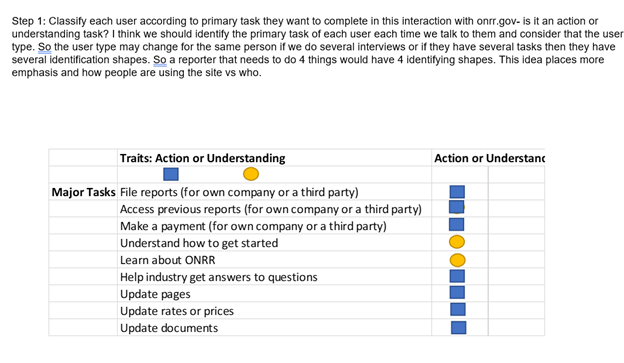

I didn’t find a lot of overlap in the first categorization so I thought it would be valuable to see the users on a chart like this below.

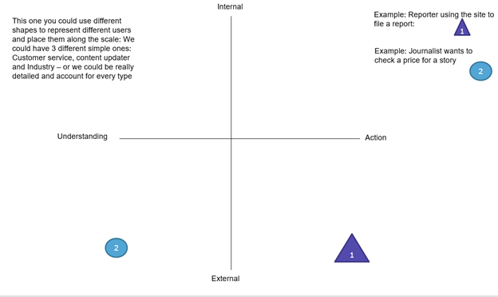

### Concept C

This concept used different dimensions for each type of user. This image shows the dimensions for industry users in squares where you could place users in any quadrant within the square. It also has checkboxes for other attributes, so we could track which attributes are important over time.

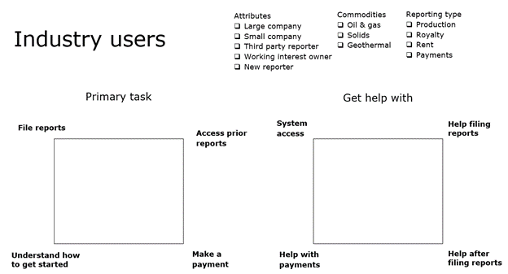

### Concept D

When coming up with this sketch, I wanted to mimic the concept we have already developed for the NRRD site. To do so, I thought about how I can generalize the user types into 4 categories without excluding any users. To help generalize the user types, I focused on the purpose or the mission each user has when visiting the site and the task they perform to accomplish that mission. To my surprise, I was able to find 3 main reasons users have when visiting the site and 3 main tasks performed.  I sketched the triangle on the left to represent the usage of the site and sketched the triangle on the right to represent the tasks performed when using the site.

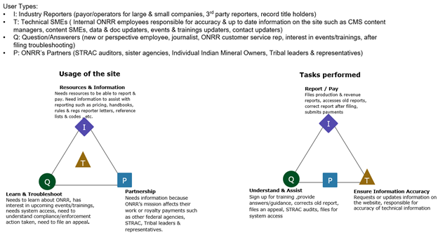

Focusing on the usage and tasks performed helped me realize that several of the user types previously listed were focused on the role of the user rather than what the user is trying to accomplish on the site. For example, instead of thinking of perspective employee and journalists as two different types of users, I categorized them in the same user type of “Question/Answerers” since they both use the website to learn and troubleshoot. The picture below shows how I generalized the user types into 4 categories by focusing on the usage and tasks.

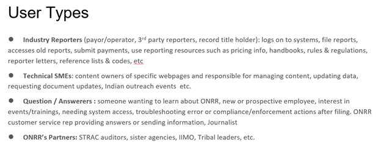

### Selected concept

Concept D combined many of the features we liked about the other concepts, so we decided to run with this one.

## Poking holes in the chosen option

We all went off with the task to attempt to place the user types on the triangles from the last concept and point out where it needed to change.

### Hole poking A

For this first hole poking, we wanted to see if we could apply the original user types into these four more generalized user types. We were able to easily categorize all previous user types into these four generalized types, but noticed that there could be some overlap. For example, someone at a sister agency would usually be categorized as an ONRR Partner. But, if that person at the sister agency has a lot of expertise with specific ONRR tasks (say if they previously worked at ONRR), they might be better categorized as a Technical SME.

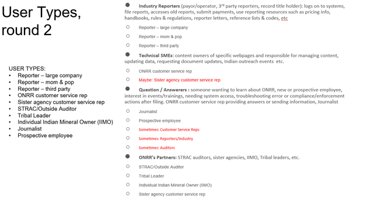

We also looked more closely at the dimension descriptions for each corner of each triangle. Some of these descriptions were edited for clarity.

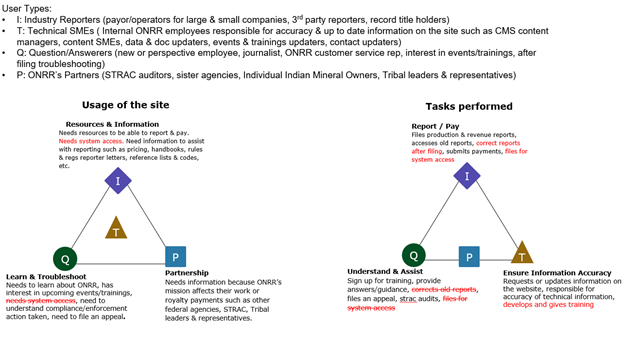

### Hole poking B

I had a difficult time placing actual participants on the triangles.

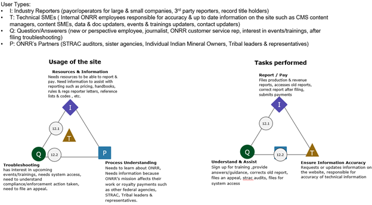

So, I tried placing them on a different option that I had liked and had just as much trouble.

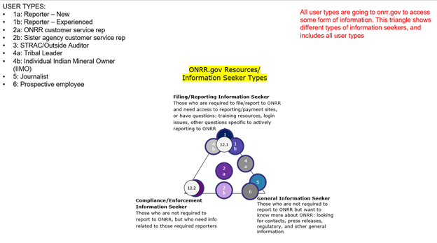

This led me to revisit and base the corners of the triangles more closely aligned with the ones we have for the [Natural Resources Revenue data website](https://github.com/ONRR/research/blob/main/nrrd-research/00_UserTypes/00_UserTypes.md).

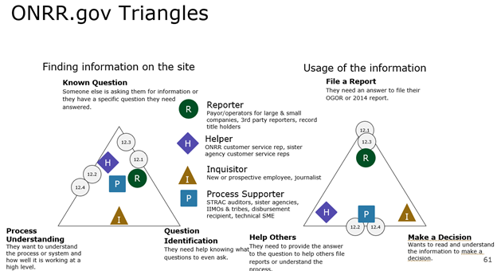

### Hole poking C

I was able to place several participants on the triangle with the constraints as we had discussed but I felt dissatisfied with the results.

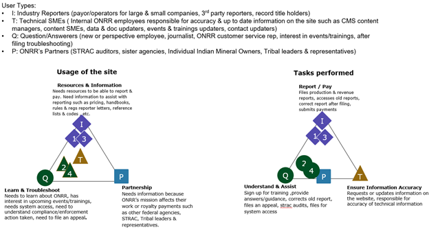

### Analysis

As we reviewed the hole poking, it became clear that the two triangles were pretty similar. We decided to revisit and do one more round of sketches.

## Sketching round 2

### Option A

To consolidate the two triangles into one, I again focused on the user’s purpose of visiting the website. This round, I decided to identify which sections or webpages each user type would typically visit or click on to find what they need. This exercise helped to ensure that each section/webpage on the website was covered by the 4 generalized user types we decided on.

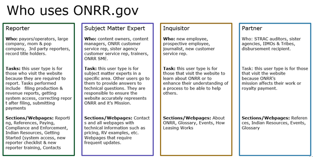

After confirming the four generalized user types cover the entire website, I then focused on each user type and identifying their main purpose in a way that also covers the tasks they perform. The reporter user type utilizes many sections of the website but their main purpose of visiting the website is to report & pay which is also a task they are required to do. The subject matter expert users are specialized in different specific sections on the website but their main purpose of using the website is to provide mission support.  The inquisitor user type includes users with many different roles but they have a common purpose of visiting the website which is to understand the process. The partner user type could have multiple purposes of visiting the website but they mainly visit the website because ONRR’s mission affects their work and/or they need to consult with a subject matter expert to get a better understanding of the process.

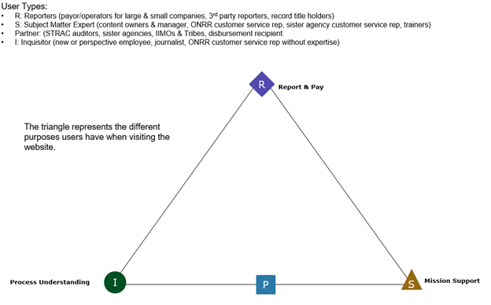

### Option B

This option puts the dimensions for each user type on an axis of how much the user type knows what they’re doing.

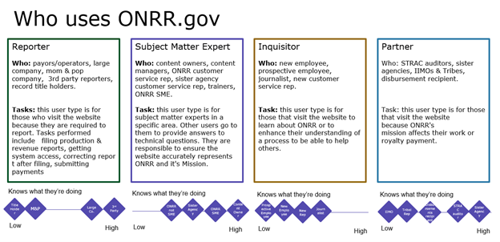

### Analysis

We only had two options in this round, but liked the triangle from the first round and the ability to plot on an axis from the second option. We also revisited the quadrant from the first round of sketching concept B. This is the consolidated option we landed on.

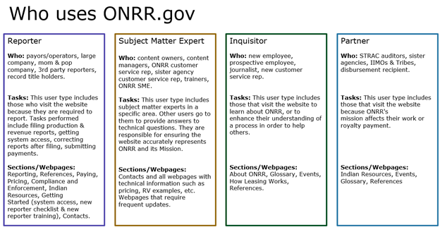

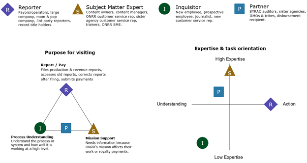

## Validating the concept

The next step was to go back through all the old interview notes and plot each participant on the triangle and quadrant.

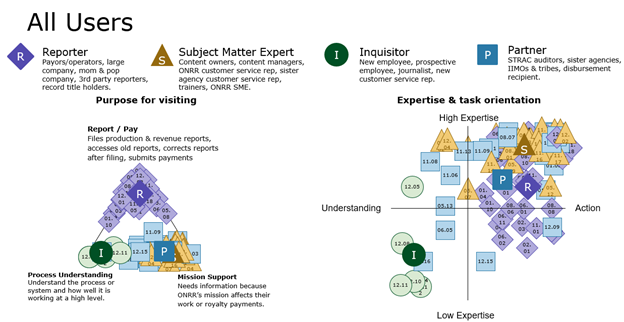

After looking at all the participants on the dimensions, we still see some overlap between user groups. In the purpose for visiting triangle, there is significant overlap between SME and Partner. But when we view the expertise & task orientation chart, we see clear differences between these two user types. After plotting all participants, we also see that we might want to eventually split reporters into two groups – one with high expertise and one with low expertise. Once we get more partner user types in future user studies, we might decide to split those out based on expertise as well.

## Lessons learned

We learned that we need to continuously revisit who is using our site and revisit the best way to communicate that with others. It came up in our first design studio meeting that the [user type triangles](https://github.com/ONRR/research/blob/main/nrrd-research/00_UserTypes/00_UserTypes.md) we use for NRRD are difficult for people who have been using them for years to understand. There is always value in reevaluating processes to make sure they are working for the people using them.
