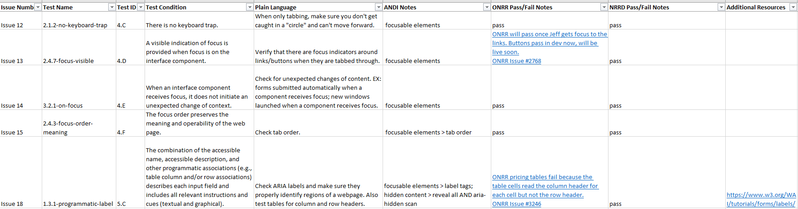

Accessibility is one of the foundational pillars for inclusion, diversity, and equity within the federal government. The main way the government establishes accessibility requirements for information and communication technology is through [Section 508 of the Rehabilitation Act](https://www.access-board.gov/about/law/ra.html). The Office of Natural Resources Revenue (ONRR) is committed to making its digital products accessible. Our Open Data, Design, and Development (ODDD) team has previously chronicled ONRR’s efforts to [implement accessibility policy](https://blog-nrrd.doi.gov/accessibility/), [create accessible products](https://blog-nrrd.doi.gov/beyond-auto/), and [evaluate what accessibility resources are needed](https://blog-nrrd.doi.gov/508-Study/). 

This blog details how we strive to manually test all our digital products by providing plain language instructions for all testers to follow. Developing these instructions ensures that manual testing methodology is uniform across our agency. It also eases testers’ burden by reducing the amount of time needed to understand each accessibility requirement.

Here are our best practices and main takeaways from this blog post:
- **Clarity through plain language**: Writing instructions in plain language improves understanding and compliance, making complex accessibility requirements more approachable for all.
- **Balance detail with usability**: While comprehensive instructions are valuable, it’s important to balance detail with usability. This ensures that instructions are thorough enough to be effective but not so detailed that they become difficult to follow.
- **Tailor instructions to audience needs**: By focusing on common issues specific to our agency’s documents and websites, the instructions become more relevant and practical for the intended users.
- **Iterative improvement**: Writing and updating instructions is an ongoing process. As our team learns new methods or encounters new challenges, the instructions will be revised to reflect the latest best practices.

## Why are plain language instructions needed?

The [ODDD team](https://github.com/DOI-ONRR/nrrd/wiki/Joining-the-Open-Data,-Design,-and-Development-(ODDD)-project-team#project-team) is currently responsible for ensuring that [onrr.gov](https://www.onrr.gov/), [revenuedata.doi.gov](https://revenuedata.doi.gov/), and the documents within these websites are accessible. We are a very small team (as of this blog publication, we are a team of 4) and even though we do not have a designated Section 508 lead, we take our accessibility responsibilities very seriously. 

Since our team is small, everyone needs to contribute to accessibility work to meet project deadlines. Even though I am the content strategist, I also spend a significant amount of time ensuring public-facing documents are accessible. I remediate documents when document owners - subject matter experts (SMEs) - struggle, educate these SMEs on the importance of accessible content, and help test webpages for accessibility issues.  

The ODDD team focuses on the resources we have, including: 
- supportive leadership endorse our accessibility efforts,
- receptive SMEs participate in document accessibility remediation,
- our amazing team of 4 high performing and motivated individuals, 
- our collaborative nature and [Agile structure](https://github.com/DOI-ONRR/nrrd/wiki/Joining-the-Open-Data,-Design,-and-Development-(ODDD)-project-team#meetings) allows us to formulate innovative solutions to our accessibility needs,    
- a high level of organization allows us to break down projects into achievable tasks, 
- and of course, our ability to communicate our needs in plain language.

For documents, it’s the SME’s responsibility to make sure their products are accessible, but the ODDD team often collaborates with SMEs to ensure everyone is properly educated. For webpages, everyone on the ODDD team participates in accessibility testing and some testing is only done on an annual basis. When we include SMEs, the majority of ONRR has some level of responsibility for Section 508 compliance. 

While accessibility is an important part of everyone’s job at ONRR, it’s only a fraction of the workload. It can be hard for employees to remember all the accessibility requirements when they might only need to test periodically.

It’s the ODDD team’s job to ensure that everyone within our agency is following the same testing standards and methodologies. We do this by incorporating plain language instructions into our accessibility policy. 

## Document accessibility

When the ODDD team first took over onrr.gov, we created an [accessibility policy](https://github.com/DOI-ONRR/onrr.gov-site/wiki/Accessibility-guidance#onrrgov-document-accessibility-policy) which established that it is the SME’s responsibility to make sure their documents are accessible. The SMEs use GitHub to submit document update requests to our team. The ODDD team checks to make sure the document is Section 508 compliant before publishing the document to the live site. Providing instructions for [using GitHub](https://github.com/DOI-ONRR/onrr.gov-site/wiki/Using-GitHub) and creating [templates for new GitHub issues](https://github.com/DOI-ONRR/onrr.gov-site/issues/new/choose) helps our SMEs understand the accessibility policy and the publication process.

Because we observed significant improvements in our SME’s level of understanding after providing clear instructions, I wanted to write similar instructions for how to manually test a document for accessibility. SMEs are responsible for testing their documents, but many SMEs do not have the enough time in their workload to fully understand the manual testing requirements.

### Manual accessibility testing instructions for documents

In order to help SMEs understand the criteria required, I wrote a [manual accessibility testing of documents checklist](https://github.com/DOI-ONRR/onrr.gov-site/wiki/Accessibility-guidance#manual-accessibility-testing-of-documents-checklist) and housed it in our wiki. In the first section of the checklist, I explain our goal (to ease the document owner's burden of manual testing and ensure that manual testing methodology is uniform across the agency) and how the checklist is organized (by WCAG requirement). I bolded the most important information to make sure our SMEs read it. I wanted to emphasize that SMEs should take time to read about each WCAG requirement. 

This checklist is structured and focused on the [WCAG requirements](https://www.w3.org/WAI/WCAG21/Understanding/) applicable to onrr.gov documents; it is not a comprehensive WCAG instruction manual. 

Each applicable WCAG requirement includes:
- a link to the WCAG explanation page, 
- a plain language summary of the WCAG requirement,
- a list of common issues found in onrr.gov documents, and 
- the issues organized by document type. 

The focus of this checklist (bolded in the instructions) are common issues found in onrr.gov documents and it is not meant to be a comprehensive list.

This checklist is a key tool for ensuring consistency in accessibility efforts across ONRR. By simplifying complex WCAG requirements into plain language and focusing on common issues, we made the manual testing process more approachable for our SMEs. These instructions help ensure that all documents meet the necessary accessibility standards, which ultimately contributes to a more inclusive digital environment. Though not exhaustive, this checklist equips our team and SMEs with the knowledge and structure needed to perform thorough and consistent manual accessibility testing.

## Website accessibility

Over the past two years, our ODDD team made significant accessibility improvements to onrr.gov and revenuedata.doi.gov. We transitioned from using [Lighthouse for automated testing and screen readers for manual testing](https://blog-nrrd.doi.gov/four-part-hybrid-testing/) to the [Trusted Tester process](https://www.dhs.gov/trusted-tester). Two of our team members – Lindsay Goldstein and Erin Elzi – took training to become certified Trusted Testers and [detailed the process in a blog post](https://blog-nrrd.doi.gov/trusted-tester/). 

As Trusted Testers, Erin and Lindsay took on large projects like our annual Section 508 assessment. They also shared new skills like using the [Accessible Name and Description Inspector tool (ANDI)](https://www.ssa.gov/accessibility/andi/help/install.html) and creating [Accessibility Conformance Reporting Tool (ACRT) reports](https://www.webaccess.pro/acrt/) with the rest of the ODDD team. While Erin took the lead over the past two years, she recently left the team. I wanted to make sure her knowledge was not lost to us. I also wanted to take a deep dive into the ACRT reports so I can take on a larger role in the next annual Section 508 assessment. 

### Manual accessibility testing instructions for websites

Because manual accessibility testing of websites is only one of my team’s many tasks, I wanted to write instructions that remind us of all the testing requirements and ensure that people new to our team can easily learn the process. 

Instead of a wiki page (like I did for document testing), I created an [instructional spreadsheet focused on ACRT](https://github.com/DOI-ONRR/research/blob/main/accessibility/2024_ACRT_Instructions.xlsx) to help us with the annual Section 508 assessment. Within the spreadsheet I included:  

- the ACRT test condition and corresponding WCAG identifier,
- a plain language explanation of the ACRT test condition,
- notes about how to use ANDI for each test condition,
- details about failing issues for both onrr.gov and revenuedata.doi.gov,
- GitHub links to relevant failing issues, and
- relevant additional resources.

After walking through the ACRT process with Erin, I filled out this spreadsheet with plain language explanations, ANDI notes, and website issues. Once I completed the spreadsheet, my ODDD team members reviewed and added some additional information. This spreadsheet is a great example of collaborative work!

*Screen capture of the instructional ACRT spreadsheet.*

Now that this spreadsheet is complete, we will use it for future testing projects. The annual Section 508 assessment requires us to manually test the top webpages on all our public-facing websites. Now that everyone on our team is educated in the process, we can all contribute to this large-scale annual testing project. We will use this spreadsheet to remind us of testing requirements, identify parts of our websites that fail accessibility standards, note the progress made on accessibility issues, and ensure that our testing methods are standardized across team members.

## Conclusion

Accessibility is a fundamental priority for the ODDD team and ONRR. By developing and implementing plain language instructions for both document and website accessibility testing, we empowered not only our small team but also our SMEs to take active roles in ensuring Section 508 compliance. These resources streamlined our manual testing process and created a more consistent and collaborative approach to accessibility. Ensuring that our products are accessible is an ongoing and iterative task. As we learn about new/improved methodologies, we will update our instructions accordingly. As we move forward, our accessibility commitment will continue to guide our efforts in creating inclusive, equitable, and accessible digital experiences for everyone.
