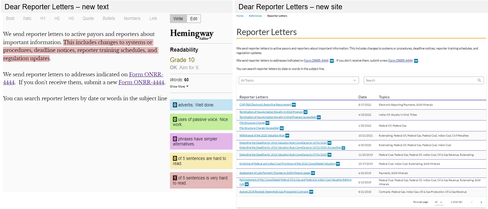
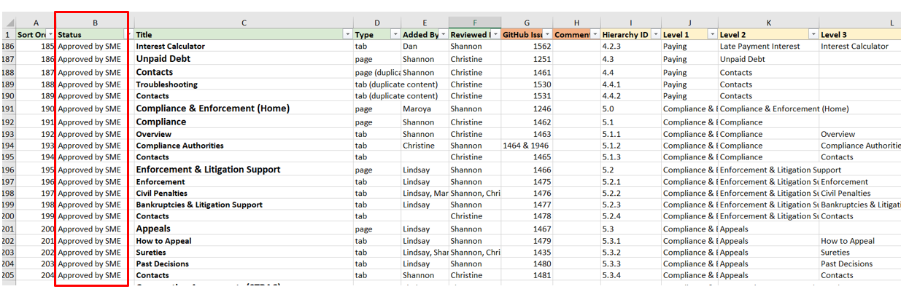
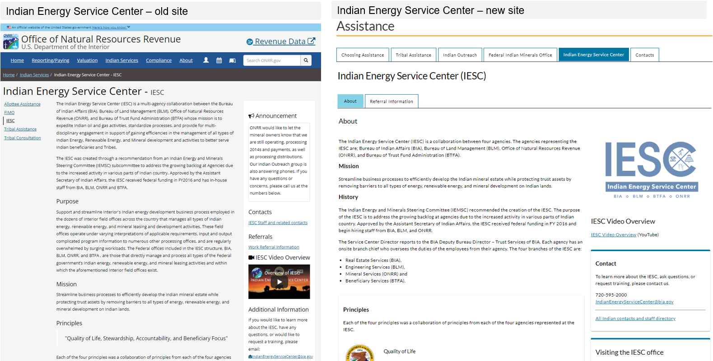
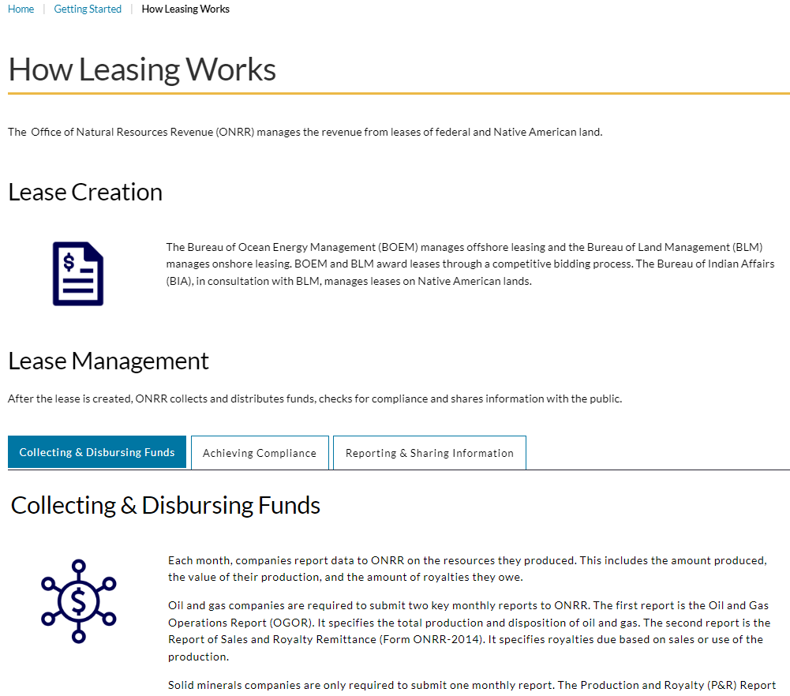

If you are a regular reader of our blog, you might already know that we recently completed a redesign of <a href="https://onrr.gov/" target="_blank">onrr.gov</a>. This redesign included an update of the user interface. In addition, we focused on writing <a href="https://blog-nrrd.doi.gov/four-part-hybrid-testing/" target="_blank">accessible</a> content in accordance to the <a href="https://www.plainlanguage.gov/law/" target="_blank">Plain Writing Act of 2010</a>. This blog post outlines the efforts we took to rewrite <a href="https://onrr.gov/" target="_blank">onrr.gov</a> in plain language, as well as how we coordinated with content owners. We hope that other agencies can apply our strategies and lessons learned to their own websites.

## Recieving a new product

In 2020, our Open Data, Design, and Development (ODDD) team started with managing and redesigning <a href="https://onrr.gov/" target="_blank">onrr.gov</a>. We are a <a href="https://github.com/ONRR/nrrd/wiki/Joining-the-Open-Data,-Design,-and-Development-(ODDD)-project-team#project-team" target="_blank">small team</a>, and taking on a new website in addition to maintaining and innovating on our Natural Resources Revenue Data (NRRD) <a href="https://revenuedata.doi.gov/" target="_blank">site</a> was a daunting task. We wrote about how we adjusted to adding a product to our portfolio in a <a href="https://blog-nrrd.doi.gov/adding-a-product/" target="_blank">previous blog post</a>. Early user research and user-centered design techniques like <a href="https://blog-nrrd.doi.gov/card-sort/" target="_blank">card sorting</a> and <a href="https://blog-nrrd.doi.gov/treetest/" target="_blank">tree testing</a> helped us get <a href="https://blog-nrrd.doi.gov/stakeholders/" target="_blank">stakeholder buy-in</a>. This initial work allowed us to dive into rewriting content in plain language. 

### A note on getting buy-in

Our stakeholders already had experience working with us through our <a href="https://blog-nrrd.doi.gov/accessibility/" target="_blank">508 compliance project</a> and participating in user research about <a href="https://blog-nrrd.doi.gov/508-Study/" target="_blank">accessibility</a>. These previous projects allowed our stakeholders to get to know our team, and we were able to build a rapport with them. Because of this, it was easy for us to get them on board with plain language concepts. It is also important to note that we have vocal support from our upper leadership to make accessibility a priority. Having buy-in from the top of our organization helps drive our team's projects. This support also helped our stakeholders understand that these changes align with our agency’s goals and values.

## Prototype

Our ODDD team does not own, and is not responsible for, the content on the website. During the initial prototype process, we worked with the content owners, or subject matter experts (SMEs), to reduce reading levels on their respective webpages. Instead of asking the SMEs to rewrite content themselves, our team did all the initial rewrites for every webpage. It was much easier to get SME participation by asking them to review and revise rather than asking them to start from scratch!

We proposed rewritten content that had lowered reading levels, with our goal being <a href="https://github.com/DOI-ONRR/nrrd/wiki/Content-style-guide#plain-language" target="_blank">grade 10</a>. Within this rewritten content, we incorporated <a href="https://www.plainlanguage.gov/guidelines/" target="_blank">plain language guidelines</a> like: 

- Add useful headings
- Incorporate lists
- Incorporate tables and other visuals
- Write in simple words and phrases
- Write in short sentences and paragraphs
- Write in active voice and present tense
- Avoid jargon and abbreviations

After we sent the SMEs our proposed rewrites, they would review and revise. This became an iterative process, because the SME revisions would usually be over a grade 10 reading level and incorporate difficult language or jargon that we would need to edit again. 
In order to help the SMEs understand why we were rewriting in plain language, we used the free online version of <a href="https://hemingwayapp.com/" target="_blank">Hemingway Editor</a>. At the time of this project, our agency’s Microsoft products did not include the <a href="https://support.microsoft.com/en-us/office/microsoft-editor-checks-grammar-and-more-in-documents-mail-and-the-web-91ecbe1b-d021-4e9e-a82e-abc4cd7163d7" target="_blank">Editor function</a>. We recently got access and plan on also using this function in future work. Regardless of which function you have access to, using an unbiased software to evaluate the text helped us illustrate the readability issues that we wanted to resolve. Once the SMEs saw the Hemingway results, they were more willing to negotiate with us and work with our proposed changes. 

Through this iterative process, we were able to reduce reading levels on all webpages compared to the old site. Because some of the content on the website is technical and not meant for the general public, not all pages got down to grade 10, but were still reduced. When we couldn’t get the reading levels down to grade 10, we made sure the page contained other plain language concepts listed above.

## Hemingway example: late payment interest

On the <a href="https://onrr.gov/paying/interest" target="_blank">late payment interest page</a>, the text on the old website was at a grade 14 reading level. The text consisted of two long paragraphs with complex sentences as well as passive voice. On the right side of the webpage, there was a green pop-up button that opened additional content. There was even more content lower on the page that required a significant amount of scrolling.

The revised text on our live site now has a grade 9 reading level, even though the required regulatory information is still present. We broke up the two complex paragraphs into smaller paragraphs. We also incorporated headings to make the contents easier to navigate. We eliminated the passive voice and created shorter, less complicated sentences. The additional information is now organized into separate tabs to reduce scrolling and remove confusing pop-up buttons.

### Hemingway example: dear reporter letters

The <a href="https://onrr.gov/references/reporter-letters" target="_blank">dear reporter letters</a> is one of our most frequently used webpages. On the old site, the introductory text to this page was at a grade 14 reading level. Almost every sentence was complicated to read and contained difficult vocabulary. The focus of the page is a table containing the downloadable documents. The table had no way to sort or filter information. There was also no pagination, so the user had to scroll through a very long table.

On the new site, we simplified the introductory text to a grade 10 reading level. We made most sentences shorter with simpler vocabulary, while still incorporating the necessary technical information. The table includes search and filter functions. A new topics column helps the user better understand what each letter is about, and these topics are also incorporated into the filter function. The table now also has pagination, so the amount of scrolling decreased. 

## Final design

After the iterative writing process with the SMEs was complete, they gave their approval on the finalized prototype of the website. We then developed the site using this finalized design and content. After we built the development site, our team requested an additional round of review by the SMEs. We made sure we had SME approval before finalizing a webpage, and we used a content tracking spreadsheet (pictured below, with the SME approval status column highlighted by a red box) to keep these approvals organized.

The main challenge we encountered during this final design process was making sure the SMEs were communicating with each other. For most webpages, there was usually more than one SME reviewing and approving the content. We had to facilitate communication and coordination to make sure all SMEs involved in the process agreed with a decision.

### An example of good coordination

We had one team who assigned one SME to be the point of contact/liaison with us. This SME would coordinate with everyone on their team and present all their asks to us as one unified voice. The SME would only contact us if there was a group question or when they had made a decision. This decreased the amount of time we needed to spend coordinating with the team and gave us more time to improve and innovate on their webpages.

### What we learned from poor coordination

We thought another team had done something like this good example described above. Multiple SMEs from a team were invited to all the coordination meetings, but only one SME would attend, communicate with us, and recommend edits. At the final design stage, other SMEs decided they wanted more changes. As a result, major revisions took place at this final stage. This challenge lengthened the amount of time it took to finalize the language on the respective webpages. We assumed that since one SME took over, the other SMEs were in agreement. We learned that we should clearly ask each team if there are any other SMEs that should be contributing, and to not make any assumptions!

## Before and after

Redesigning onrr.gov and making sure its content was accessible and written in plain language was a huge task! We are excited to share some of our favorite “before-and-afters” from this process.

### Homepage

The old homepage required a significant amount of scrolling. It was extremely unclear what was important. The announcements took up the entire screen and scrolling was required to find other content.

On the new homepage, content is sorted into cards. The cards are also sorted by the level of use and importance. Using this card format breaks up the information into readable sections and reduces the amount of scrolling needed. Within the cards, content is organized using bulleted lists. Heading levels are also used to help with screen readers. The announcements are now on the right side of the page, so they don’t take up the entire screen.

### Contacts 

On the old site, there was no single location to find all contacts. The user had to look through individual PDF, Word, and Excel documents that were all housed on different webpages. While we made sure that these contact documents were 508-compliant, finding them was still complicated.

For the redesign, we created a database to house all contact information. Incorporating all contacts into one location allowed us to redesign the <a href="https://onrr.gov/about/contact" target="_blank">contact us webpage</a> into a functional, searchable database. Within the main contacts webpage, the user can search all contacts within our agency. This main page is also organized by topic using the same card format seen throughout the site. Users can click the hyperlink within a topic card to navigate to an individual topic page. The individual topic pages have their own constrained search feature, where searches will only yield results relevant to that topic. The contact cards are organized with headings, which helps break down individual contact information.

### Indian Energy Service Center

Indian resources are also frequently visited webpages. The <a href="https://onrr.gov/indian/assistance?tabs=indian-energy-service-center,about" target="_blank">Indian Energy Service Center</a> is one of these resource pages and is a very important page for stakeholders. On the old site, the text has a post-graduate reading level; the text was complicated with lot of acronyms. The right side of the webpage was confusing with several types of information jumbled together. The old page also required scrolling to find information.

On the new site, this page is organized within a tab series that includes all options for assistance. Within the Indian Energy Service Center tab, the text is now at a grade 11 reading level. The amount and frequency of agency names required in the text kept this reading level higher than we would like. To offset this, we organized the text with headings and bulleted lists, and incorporated simpler vocabulary whenever possible. We also divided information into tabs, with a separate tab for referral information. The right side is organized into more readable card styles with appropriate headings.

### How leasing works

We also added new webpages to the site that were not on our old site. Most of the new content focuses on educating the user to help them find what they need, understand what they find, and use what they find to meet their needs. A good example of this is the new <a href="https://onrr.gov/getting-started/how-leasing-works" target="_blank">how leasing works webpage</a>. This page walks a new user through the leasing process. The text is written at a grade 10 reading level. We incorporated images, headings, and tabs to organize information. We kept the text entries to short sentences and paragraphs.

## Conclusion

Incorporating plain language guidelines within a website can be a difficult task, especially if you are not the content owner. Do not ask the content owner to make the first rewrite attempt. Instead, do that initial rewrite yourself and provide them with a draft to review. Using unbiased websites like Hemingway Editor is a great way to help SMEs understand how and why their text needs revision. This writing process can become iterative. Clear communication and coordination are needed to make it successful. Making sure there is buy-in at the beginning of a project will help this process.

When rewriting, we focused on lowering reading levels. Most of the old text was between grade 13 and postgraduate reading levels. Even though our site is not for the general public, the overall reading level was too high. Incorporating plain language guidelines helped us bring the reading levels down to grade 10 on most webpages. 

Plain language encompasses not just the text within a webpage, but also the overall design. Including headings, tabs, bulleted lists, tables, and images are great ways to incorporate plain language concepts when it is necessary to keep technical text. Whenever we could not get reading levels down to grade 10, we made sure to incorporate other design concepts to ensure the webpage was easy to understand and navigate.

Our future content audits will include analysis of reading level and incorporation of plain language guidelines. We will continue to improve and strive to keep onrr.gov up to date with accessibility requirements.
