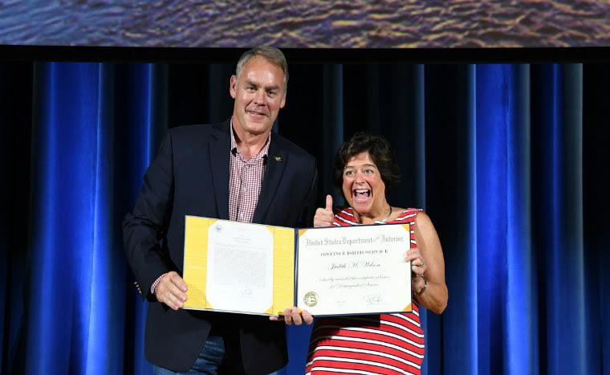

Every product needs a champion. We are fortunate to have had one of the best product champions on board for the last 5 years. Judy Wilson was the champion of our website from the time she came over to the Office of Natural Resources Revenue (ONRR) on a short-term assignment to work on the U.S. Extractive Industries Transparency Initiative (USEITI) in 2014. That detail turned into her taking on the role of Program Manager for the USEITI in 2015 and then moving up to be the Program Manager of Information and Data Management (a team in charge of data at ONRR).

Judy recently moved on because she was selected for a Senior Executive Service (SES) position in the Assistant Secretary, Indian Affairs Office of the Deputy Assistant Secretary, Management as the Director, Office of Facilities, Property and Safety. She was the first product owner of the website and did everything in her power to build our team to the point we’re at today.

Judy was an excellent product champion, and we’ve done some reflecting on what makes a good champion in the hopes that it will help people in other agencies replicate some of the magic Judy brought to the Office of Natural Resources Revenue.

## Serve with passion

Judy does everything with passion. She cares deeply about her work, the people she works with, and the American people she serves. The U.S. had already committed to and been accepted by the EITI when she started. The EITI required transparency into extractive industries data, but Judy wanted more. She wanted the U.S. to be the international standard for natural resources extraction data transparency. Instead of submitting a more traditional PDF report, Judy pushed for an online, interactive website that could truly engage the public. She also led the effort to open source the site’s code so other countries could use it as a model to launch their own data sites.

## Bring in the experts

In order to make our website open and usable, Judy knew that she needed people who knew about creating open source websites with users. She engaged a Presidential Innovation Fellow, Michelle Hertzfeld, to help her start the site with users in mind from the beginning.

Judy worked to transition existing staff into digital roles – training a new product owner and program analyst – and hiring an innovation design team. Judy did this all while taking on a higher level role and additional teams at ONRR.

## Work within constraints

During the EITI years, she leveraged several policies like the [OMB Open Data Policy](https://digital.gov/open-data-policy-m-13-13/), which requires government agencies to make datasets open and available to the public and engage with customers, to make the case for user-centered design when creating the annual reports.

Around the same time the team was transitioning from 18F to a team internal to ONRR, the U.S. decided to withdraw from the EITI because U.S. laws restricted disclosure of some payments, making it impossible to fully comply with the EITI standards. This change put the future of the site into question. Judy continued to push to keep the website as a way of being transparent with the public about extraction on publicly owned lands, citing the OMB Open Data Policy and the new [President’s Management Agenda Cross-Agency Priority (CAP) goals](https://trumpadministration.archives.performance.gov/CAP/overview/) that requires improving customer experience and using data as an asset. This commitment to transparency was reflected in the [withdrawal letter](https://eiti.org/sites/default/files/attachments/signed_eiti_withdraw_11-17.pdf), and the U.S. continued to support EITI even though we weren’t officially implementing it any more. Judy continued to garner support for our website – as an exemplar of the new [OPEN Government Data Act](https://www.congress.gov/bill/115th-congress/house-bill/4174/text) and the [21st Century Integrated Digital Experience Act (IDEA)](https://www.congress.gov/bill/115th-congress/house-bill/5759/text) – both within ONRR and the Department of the Interior.

Judy successfully worked within constraints to hire our innovation design team. There were barriers to hiring technical people full-time at the time she needed to hire. To get qualified people in the door, she involved 18F in the hiring process, and the roles were set up as term-limited positions in the 18F model. This, and the agency’s remote-friendliness, enabled the team to find highly qualified people to come in and set up the site for future success.

## Facilitate growth

Judy always worked to facilitate the growth of both the website and her team. She fostered a culture of growth for both the website and the team working on the site.

She took a step up to manage several teams at ONRR and worked with 18F to train her successor as [product owner](https://revenuedata.doi.gov/blog/becoming-a-product-manager/), Jennifer Malcolm. She is constantly advocating for her people to help them stand out in the organization and grow to their full potential, while helping the agency as a whole. Part of the charge of the innovation design team is to train both our career employee teammates in digital skills and to bring some digital best practices to other areas of the agency. This includes participating in strategic planning at the agency level and conducting training on things like writing for the web and accessibility.

She also constantly fought to increase the amount of data we’re able to provide on the site and to improve the usability of the way we’re presenting the data. She took a big step, once she had a foothold with the USEITI site, to ensure that ONRR decomission a separate, legacy site that was developed by and proprietary to a vendor that showed the same data.  This step eliminated redundancy and opened up the codebase, so that there was one true, public source of the data. This greatly increased the usage of our website and brought all of the users of our data to one place, ensuring they’re all getting the same numbers.

She was also super supportive of our outreach efforts (including this blog) to increase the awareness of the website, which has resulted in more than double the number of users on the site between 2018 and 2019.  

## Manage up

Judy was great at managing up. From the beginning, she had the support of the director of the agency, Greg Gould (who will also be leaving us soon when he retires in January). The two of them worked with the people above them and their peers to highlight the value of the site and the work we’ve done to change the culture at our agency and to continue to make the case for the work we do. They’ve both been effective at channeling requests from above in productive ways and knew the right time to bring information to the team while removing roadblocks to keep the rest of us working on the site without too many disruptions.

Judy was able to make the transition between two administrations feel seamless. She never cared who was in office and continues to work to serve the American public, no matter what. She adjusted some of the messaging to her audience by citing different laws that were enacted by each administration as reasons why the site needed to continue to exist, and as a result, the team and website weren’t affected much by the transition.

## Positioned for success

We already miss Judy and her leadership, but we feel good about the position in which she’s left us. She succeeded in making the USEITI website and its successor, the Natural Resources Revenue Data (NRRD) portal the international standard for natural resource extraction data, and we have the tools we need to continue that work in her absence. We look forward to seeing what lies ahead and continuing to think about what Judy would do in any situation.
