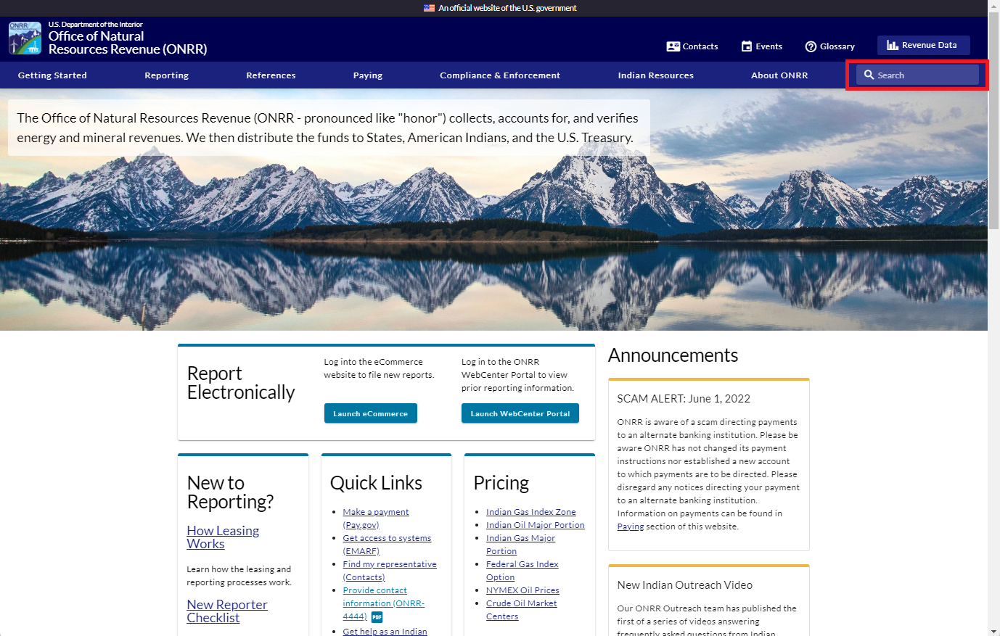

The Open Data, Design, and Development (ODDD) team [redesigned onrr.gov based on user needs](https://blog-nrrd.doi.gov/modernize-government-website/) and implemented a search engine as part of the redesign. The decision to include a site search function in the redesign was informed by user research. Users expect the search results to include the most updated information and documents. [Onrr.gov](https://www.onrr.gov/) hosts thousands of documents and users indicated that a robust search function makes them easier to find.

In addition to meeting user needs, a search functionality is a requirement for websites according to [Section 508 Law](https://www.section508.gov/manage/laws-and-policies/) and the [21st Century Integrated Digital Experience Act (IDEA)](https://www.congress.gov/bill/115th-congress/house-bill/5759/text). In accordance with Section 508, a search function ensures we meet Web Content Accessibility Guidelines (WCAG) Success Criterion 2.4.5: [Multiple Ways](https://www.w3.org/WAI/WCAG21/Understanding/multiple-ways.html). Multiple Ways requires sites to provide access to all website pages and content in more than a single method. All of onrr.gov’s pages and documents can be found by browsing the site, which is one way. Since not all of onrr.gov’s pages and documents have multiple entrance points via the site navigation, the search function ensures we are providing an additional technique for accessing content, pages, and document downloads. The IDEA Act lists eight requirements for public-facing websites, one of which is that sites must be “searchable” (contain a search function).

In this blog, we walk you through our planning and implementation process for Search.gov. We share lessons learned, as well as resources we found useful.

##Choosing a search engine: Search.gov

The ODDD team chose to utilize [Search.gov](https://search.gov/) as the search engine for the redesigned onrr.gov. Search.gov is a product of the U.S General Services Administration’s Technology Transformation Services. We choose Search.gov for our search engine for the following reasons:

* The product is free for all federal agencies.
* It is a modern and a highly configurable search engine.
* The product includes excellent hands-on customer service.

##Planning for search engine before launch

About six months prior to the launch of the redesigned website, we initiated an email to the Search.gov team inquiring about the use of their search engine. At this time, we had our redesigned development website fully functioning. The Search.gov team was very responsive and set up a zoom meeting with us. At this initial meeting, we learned two important things we need to do before launching the new website:
1.	Plan for redirecting links from the old site’s webpages to the appropriate new pages to avoid users getting 404 errors.
2.	Prepare an XML sitemap and Search Engine Optimization (SEO) elements.

We followed Search.gov’s advice and used an excel sheet to document where all the old URL links should be redirected to in the new website. Our developer at the time used this spreadsheet to upload the redirect links to our Content Management System (CMS) which integrates with our database.

Sitemaps help inform search engines of changes to your URLs and architecture. Prior to the launch, we manually created an XML sitemap of the development website and tested uploading it in GitHub. While many CMS’ create an XML sitemap by default, ours does not. This is a function we plan to explore in the future.

To create the SEO elements, we created an excel sheet with all the new URLs and added meta descriptions for each URL as well as identified the page IDs that the CMS assigns to each URL. Our developer then created an SEO component by associating the CMS page IDs with the new URLs in the database.

To test out if the search engine was functioning, we worked with Search.gov to activate the search engine for our beta site domain.  

## Activating the Search.gov engine after launch 

Search.gov instructed us to notify them when we launched the new website so they could replace the beta site domain with the new live site domain. Search.gov activated the new domain and the search engine went live on the new website. 

###XML sitemap submissions to Bing and Google

As mentioned earlier in the blog, we tested uploading the XML sitemap to GitHub in our development environment. Google and Bing require that sitemaps live directly within the root URL. We added the XML sitemap to our production environment and submitted the [sitemap URL]( https://onrr.gov/sitemap.xml) to Google and Bing.

We initially thought that by adding as many of our URLs to the XML sitemap as possible, we would have a robust and complete sitemap that would create an accurate search experience. However, we found that [Bing Webmaster Tools](https://www.bing.com/webmasters/about) and [Google Search Console](https://search.google.com/search-console/about) wouldn’t accept our first iteration of the sitemap. Using a free, online XML sitemap verifying tool, we refined the sitemap a few times. Changes we made for it to be accepted  include taking out “www” from the URLs and deleting URLs that contain a question mark from the XML file.

###Robots and redirects 

Once Bing and Google accepted our new sitemaps, we waited patiently for a few weeks while both search engines indexed the new site. Both search engines continued to give top results that all pointed to the URLs for the old website, so we kept looking for anything we could do to expedite these search engines prioritizing our new URLs. This problem was amplified by reports of redirects giving a 404 error. Had all of our redirects worked as expected, we might have been more patient in waiting for Google and Bing to recognize the new URLs.

In researching how we could improve the accuracy of crawlers indexing our site, we learned about the robots.txt file. The robots.txt file tells search engine crawlers which URLs they can and cannot access. We use the [robots.txt file](https://onrr.gov/robots.txt) to direct crawlers to our sitemap, and to prevent our beta site from being crawled and showing up in results.

An unexpected problem we discovered post-launch is that our new URLs are case-sensitive, whereas our previous URLs were not. ODDD spent a lot of time thoughtfully mapping and entering redirects for all the old URLs so that users would have a seamless experience post-launch. As the reports of broken and non-redirecting URLs kept coming in after launch, we found that users had as many as 6 different variations of capitalization for the same URL – each one with different words capitalized. We would have to know all variations of the URLs and enter each one into our CMS in order for the redirects to work, which seemed like a daunting task. Fortunately, we were able to use the page indexing reports in Google Search Console to export a list of URLs that caused hard and soft 404 errors.  Hard 404 errors indicate the page at that URL does not exist. Soft 404 errors can indicate problems with loading, expired pages, or duplicate pages. Working in a spreadsheet, our team members were able to identify and add over 1,700 redirects to the CMS, reducing the hard and soft 404 errors.

We still find some old URLs show up in search results, but they now redirect as expected. Our next goal is to indicate the new URLs as canonical, since we noticed that when choosing between an old and new URL, Google lists the old URL as canonical. When Google recognizes duplicates of a page, it will prioritize the page marked as coninical in the results list. This is another aspect of crawling and indexing that is new to us and we’re learning as we go.

##Testing the search engine for accessibility 

After the launch, the team wanted to evaluate the accessibility of the site’s search engine. We set out to learn more about accessibility requirements and best practices for search engines, and what we could to do make improvements. First, the team reviewed [WCAG 2.1](https://www.w3.org/WAI/WCAG21/quickref/?showtechniques=111#captions-live) to understand how to make web content more accessible to people with disabilities. While these guidelines do not contain specific search engine accessibility elements, this guidance provides criteria to be compliant with website accessibility, using four pillars: Perceivable, Operable, Understandable, and Robust.
 
We used UX blogs and articles, such as the [Agolia Web content accessibility guidelines (WCAG): how to make site search work for people with disabilities](https://www.algolia.com/blog/ux/web-content-accessibility-guidelines-wcag-how-to-make-site-search-work-for-people-with-disabilities/), to compile a list of different search engine accessibility elements and matched each element with a WCAG 2.1 success criterion. Four of these elements are exemplified in the bulleted points below. A more complete list can be found on our [wiki]( https://github.com/DOI-ONRR/research/blob/main/onnr-dot-gov-research/ONRR.gov-Search-Engine-Accessibility-Elements.docx). 

* Search bar should be positioned where people would expect to find it, which is typically in the upper right corner of the screen. This aligns with the WCAG Success Criterion 3.2.4: [Consistent Identification](https://www.w3.org/WAI/WCAG22/Understanding/consistent-identification).
* All filters and facets should be accessible and operable from the keyboard with aria-label descriptions. This aligns with the WCAG Success Criterion 1.1.1: [Non-text Content](https://www.w3.org/WAI/WCAG22/Understanding/non-text-content).
* When presented with the search results, users should be able to bypass blocks of content that are repeated on multiple Web pages. This aligns with the WCAG Success Criterion 2.4.1: [Bypass Blocks](https://www.w3.org/WAI/WCAG22/Understanding/bypass-blocks).
* Search bar should have a visible label of “search”; in the code, you can see the aria-label description “Search through the site content”. This aligns with the WCAG Success Criterion 1.1.1: [Non-text Content](https://www.w3.org/WAI/WCAG22/Understanding/non-text-content). 

Using [the table we made to track these requirements]( https://github.com/DOI-ONRR/research/blob/main/onnr-dot-gov-research/ONRR.gov-Search-Engine-Accessibility-Elements.docx), the team identified specific elements that could be improved and created issues that have been or will be addressed on the onrr.gov website. For example, the team found that the search bar and text did not have the minimum color contrast for visually impaired users, so a [GitHub issue](https://github.com/DOI-ONRR/onrr.gov-site/issues/2463) was created to increase the color contrast between the text and the background.

Some of these elements led to more questions and the team decided to meet with Search.gov again. A few months had passed between the last correspondence with the Search.gov team, so we reached out and scheduled a meeting with Search.gov’s team lead and one of the team members.

##Second meeting with Search.gov 

Our questions for the Search.gov team fell into three categories: Search.gov’s standards for accessibility, aligning the needs of onrr.gov with Search.gov’s product, and updates from Search.gov. Here’s what we learned:

###Search.gov's Standards for accessibility

Search.gov uses the [U.S. Web Design System (USWDS) standards]( https://designsystem.digital.gov/documentation/accessibility/#:~:text=Section%20508%20incorporates%20by%20reference,to%20perceive%20the%20information%20presented.) for 508 compliance. USWDS and Search.gov work together to ensure that their products follow their accessibility and 508 standards, which go beyond the typical 508 standards.

###Aligning the needs of onrr.gov with Search.gov’s product

At the time of our meeting, Search.gov had recently launched their in-house developed search engine, giving clients the option to continue to use Bing or switch to the new product. Search.gov was also preparing to launch their new interface, which allows for easy faceting. Facets are a commonly used filtering tool that allow users to narrow results after a search has been done. 

Still in the post-launch process of working to improve how our site indexes in Bing, we were very happy to hear about the new options and had Search.gov make the switch to our site immediately. We instantly found searches on our site produced results more in line with what our users expect. However, some expected pages were still consistently missing from results.

The simple solution would be to wait for the new interface options to be launched, and we could use metadata tags to provide Search.gov with the facets we want to include on our results page. Search.gov accepts [OpenGraph](https://www.opengraph.xyz/) and [Dublin Core](https://www.dublincore.org/), metadata schemas, which are rules that standardize the syntax and structure of metadata. This seemed promising at first, given that we use OpenGraph fields. These fields, found in the html header for a given page, are recognizable by the “og” or “article” at the start of the metadata tag, followed by a colon and a specified field name that describes the field’s use. Further investigation found that even though our pages have og:title and the capacity for og:description, we don’t have the ability to add tags to our pages. Search.gov would need our tags embedded on the page using the OpenGraph article:tag field, which isn’t an option. Due to these limitations, we’re not currently using Search.gov faceting. Expanding the metadata so that we can use faceting is something we might consider in the future.

During the meeting, our team also discussed the possibility of tailoring Search.gov’s results page to onrr.gov’s needs. Search.gov told us that the site has a standard template that all clients can use, which has some options for customization. Clients with needs for a large amount of customization can use Search.gov’s API, but this requires a lot of developer knowledge and effort. For this reason, our team will not pursue customization using the API at this time.

When we had the meeting, Search.gov was currently in the process of rebuilding and redesigning their search results site. The backend was developed; the interface was still in design. Among other improvements, many of the new features aimed to improve accessibility and results filtering.  To learn more about Search.gov's recent features of their rebuild, check out [Search.gov's release notes](https://search.gov/about/updates/releases/).

##Indexing tabs using meta description 

Since we’re not able to use metadata tags to fine tune our indexing, we looked for another solution to the pages that were missing from results. To define the scope of the problem, we ran test queries for narrow terms that we expected to produce results for specific pages, such as “Crude Oil Market Centers,” and “Initial Reporting for Processed Gas in Non-Index Zone (Major Portion) Areas.” Through this testing we found that the labels for tabs were not being indexed. Our website has a lot of tabbed pages (including some of the most heavily visited pages on the site) so it's important that a search for these terms gets users to the content they need. The team at Search.gov helped us determine these labels weren’t indexing due to the way they’re tagged in the code.  

After our previous conversations with Search.gov, we’d been thinking about how we could produce better metadata for our pages. The combined limits of what our CMS offers for customizing metadata output and the schemas and fields that Search.gov crawls didn’t leave us with many options. However, we knew that description is a field Search.gov will index. We happened to have a meta description field in our CMS and weren’t using it. We wrote a meta description for the most used page on the website, making sure to include the tab labels in the text. We then waited patiently until it was time for our monthly indexing by Search.gov… it worked! A search for the tab labels brought back the expected results now that the labels were in the meta description. 

We’re now in the process of adding meta descriptions to all our pages with tabs.

## Lessons Learned

Collaborating with the Search.gov team has been a great learning experience for our entire team.  Below is a list of what we learned in the process of implementing a search engine that we hope can help other agencies.

* Plan ahead for redirecting old URL links to the new URL links.
* Plan for Search Engine Optimization (SEO) elements.
* Build and validate your XML sitemap before launch.
* Develop a Robots.txt file.
* Keep accessibility elements in mind.
* Use Search.gov’s [checklist for website redesign](https://search.gov/indexing/redesign.html).
