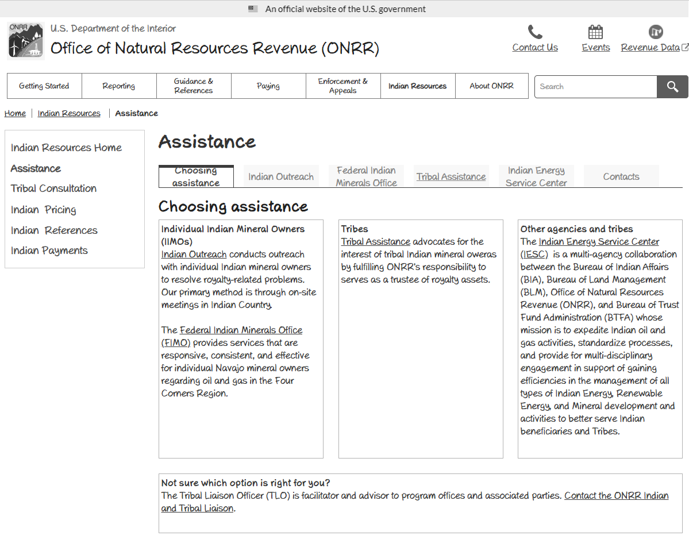

## Framing the problem

For the [Natural Resources Revenue Data (NRRD) website](https://revenuedata.doi.gov/), we often start a project with a [design studio]( https://blog-nrrd.doi.gov/remote-design-studio/). We start here to solve a problem we’ve identified through user research.  

We took a different approach to redesign the Office of Natural Resources Revenue’s (ONRR) primary website, [ONRR.gov]( https://www.onrr.gov/). ONRR.gov's primary goal is to communicate about the agency and reporting requirements. To reach this goal, we needed to partner with internal stakeholders from all areas of ONRR. This enabled us to learn about the domain before we could begin to better explain things to users. Our approach was to iteratively review [wireframes](https://qmcq5k.axshare.com/) with each team at ONRR.  

Learning how all the pieces fit together was not an easy task because nobody had documented it. For example, when I first started at ONRR, I missed the first half day of new employee training because of flight delays. When I walked in, each team presented about what they do, but I felt like I was missing something. When we got to a break, I asked if I missed a slide showing how all the groups fit together. The response was that there wasn't one.

Shortly after that, I created [journey maps](https://blog-nrrd.doi.gov/journey-mapping/) to understand how the whole process works. I created the map after interviewing ONRR employees as potential users of a future lease level dataset for the NRRD website. This helped me to understand how the process fits together to some extent, but not at the level needed for ONRR.gov.

When [we started working on ONRR.gov](https://blog-nrrd.doi.gov/adding-a-product/), we interviewed industry and internal users about how they use the site. This gave us an understanding of the tasks users complete with the site and some of the pain points with the process. It also allowed us to solidify our [product statement](https://github.com/ONRR/onrr.gov-site/wiki/Product-framing#problem-statement), [vision](https://github.com/ONRR/onrr.gov-site/wiki/Product-framing#our-vision), and [user types](https://github.com/ONRR/onrr.gov-site/wiki/Product-framing#user-types-and-scenarios).

### ONRR.gov problem statement

> Companies pay to produce natural resources on federal lands, Indian lands, and the Outer Continental Shelf. They need to access timely and accurate information to meet complex regulatory requirements. These requirements include reporting production and paying the required royalties and other revenues.  The Office of Natural Resources Revenue collects, verifies, and disburses those revenues.  

> Native Americans and the public need to understand their revenues and ensure we meet our trust responsibilities. ONRR should provide access to resources and clear communication to help this understanding.

### Vision

> We communicate the role of the Office of Natural Resources Revenue. We deliver trusted and easy to use information and customer service. This enables companies who lease federal and Indian lands to accurately report production and pay revenue due.​

### User types

New production and revenue reporter​s use the site to request access to reporting systems. They also learn about production and royalty reporting and payment requirements.

Existing reporters and payors use the site monthly to access ONRR’s reporting portal. They have to submit reports for their oil, gas, geothermal, or solid minerals production and revenue. These users look on ONRR.gov for handbooks, pricing information, and lease numbers or codes to put on their reports. They also use information about submitting payment of the amount they owe ONRR. Some may look for information about compliance if they get a letter about enforcement.

ONRR customer service rep​s are internal users who use the site to provide information to reporters and payors.

Inquisitor​s are people like job seekers or journalists who use the site to learn about ONRR.

Resource owners are tribal representatives or Individual Indian Mineral Owners (IIMOs) who own mineral rights. They use the site to get information about ONRR’s trust responsibilities and their leases.

## Organizing the site

To understand the universe of content, I revisited the content inventory [one of last year's interns started](https://blog-nrrd.doi.gov/intern-experience/). I updated it to the current state of the site and tracked all the locations where each piece of content lived. We then created cards that were representative of the content and conducted [card sorting](https://blog-nrrd.doi.gov/card-sort/) and [tree testing](https://blog-nrrd.doi.gov/treetest/) with users. We also showed early wireframes to the users who participated in these studies.

Initial homepage wireframe:

We created a taxonomy based on the card sort and tree test findings. Then I went through our content inventory and made sure we had a home in the new organization for every piece of content. I also tweaked the categories, as needed.

We also started going through the 3,000 documents on ONRR.gov to make them accessible. We’ll write more about how we did that later. While the teams who owned the documents were doing this, we had them think about what content was necessary to keep on the site. Thinking about what was necessary while updating content for accessibility helped to pare down the content.

## Redesigning pages

Then it came time to start redesigning pages. I had an assumption that I would have to negotiate many changes because of regulatory requirements. As a result, I started with screenshots of the current site placed into the structure that came out of card sorting and tree testing.  

Wireframe using a screenshot of the current site:

As I started to review pages with stakeholders, it became clear that most of the content on the site wasn't designed intentionally. The people I talked with generally didn't know why the site was the way it was before the redesign. That gave me leeway to design based on best practices and what we learned from the early user interviews.

I laid out pages with better chunking and started simplifying the reading level. Some skeptical stakeholders didn't think we could simplify the content without sacrificing meaning. But seeing the rewritten content convinced them. It retained the meaning while being easier for users to comprehend.

Wireframe with rewritten content:

I created process diagrams for many sections to explain concepts to new reporters. These often started with "we have a slide to explain that" conversations. I took what was in the slide and simplified it. Then reviewed it with the team and iterated.  

Process wireframe:

Having an artifact, like a [wireframe](https://qmcq5k.axshare.com/), helped to start these discussions. I made them sketchy to start the conversations and keep people from getting hung up on look and feel. Wireframes make it easy for people to point to something and ask about it. They also prompt them to tell you about problems they have with the current state. They give a visual aide for the conversation and give people something to react to. I also invited feedback. I showed the stakeholders how to put comments in our prototyping tool. This allowed them to comment more offline after they had a chance to let the changes sink in.

Stakeholder comment:

## Conclusion

I now know more about how the teams within ONRR work than when I started with the agency. All it took was putting wireframes in front of people from each team and having them tell me about their work and how it fits into ONRR.gov.  

The teams also now enjoy working with our team and are bought into the user-centered design process. Now that we have most of the site redesigned to stakeholder satisfaction, we will test it again with users. This will be the real test to find out whether we've moved closer to achieving our product vision.  
