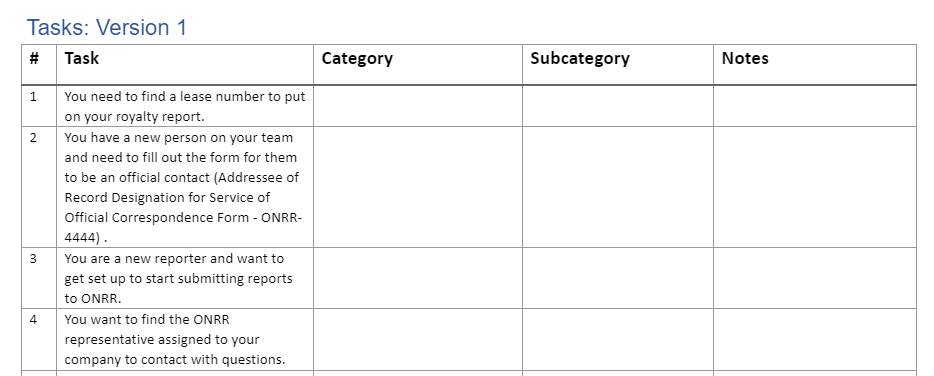

As we’ve approached the redesign of onrr.gov, we’ve done several rounds of user testing, including open and closed card sorting ). The card sorting helped us determine the categories and subcategories that users would want to see on the home page. We wanted to further confirm that we were placing the subcategories into the correct main categories and that users would be able to find the needed information, so we turned to tree testing. Tree testing was a new type of user research to our program analysts so we read a few [articles](https://www.optimalworkshop.com/learn/101s/tree-testing/ ) to get up to speed with our UX expert.

## Getting started
Our first step in the process was to figure out how to use our existing or free software to conduct the tree testing. After some investigation, our UX expert determined that a [clickable prototype](https://wkvlqa.axshare.com/) would serve our needs. We used the software that our expert already uses for prototyping so she could quickly create the testing materials. You could use any software that allows clickable interfaces to do the same thing.

## [Planning the study](https://github.com/ONRR/research/blob/master/onnr-dot-gov-research/06_tree_test/plan.md)
Our goals were to validate the structure that came out of tree testing, determine whether users could find items that were hard to categorize in the card sort, and determine if we needed to change any category labels. We wanted to have common tasks that would direct users to each main category so we could really get a feel for how users search for information on our site and limited it to 10 tasks, since users learn the categories quickly in tree testing. We dug into past research to help us determine the user tasks and had our teammates peer review to make sure that our tasks were realistic and encompassed common user needs. Our UX expert also created 3 different versions of the prototype with the tasks randomly organized in a different order to remove some bias in the task order.

[Version 1 of the clickable prototype](https://wkvlqa.axshare.com/version_1.html)

We also decided to show a [wireframe](https://wkvlqa.axshare.com/#g=1&p=homepage) of the homepage using the categories after the tree test tasks, so users could see where we were headed with the site using the categories and get some feedback on the categories in context.

While we were planning the study, we were concurrently recruiting as many external (capped at 9) and industry users as possible to survey a wide user audience.

## Conducting the study
We scheduled 30-minute moderated virtual interview sessions with all 11 participants – 4 external and 7 internal. We had one moderator and tried to have two notetakers since this was a new way of doing user research for our team. After the initial explanation we had them work through all tasks and talk through their category decisions.

We initially tried to record their responses right in our spreadsheet to make it easier to analyze our findings, but in the first interview we found that it was too difficult to work quickly within the spreadsheet and we decided to go back to a word document to take our notes. Despite it being our first time conducting tree testing using this process, we were able to easily communicate the instructions to the participants.

Spreadsheet notes

Word notes

## Analysis
After [summarizing the findings](https://github.com/ONRR/research/blob/master/onnr-dot-gov-research/06_tree_test/Tree%20Test%20Findings.pptx), we used [Sankey diagrams]( http://sankeymatic.com/build/) to show how users navigated from the task to the subcategory. The visualization really helped to illustrate which tasks were straightforward and which ones proved to be confusing. We had several tasks that made us feel confident that we had the right structure in place, including leading participants to report production, find contacts, file appeals, and make rent payments. The Sankey diagram below illustrates how all participants agreed on where to report production.

Then we had several tasks where participant responses diverged significantly. These tasks included how to set up a new team member, how to find information on the site, and how to find help with ONRR reporting and paying systems. The Sankey diagram below shows that participants were divided on whether to go to the Getting Started category or Reporting Resources main categories to add a new team member as a contact. The responses further diverged within the subcategories as some participants were looking for a specific form and some thought it would be in Getting Started. Our solution to this and similar issues will be to include the needed resource in more than one category.

We also found that participants had to think about where to look for the regulation/valuation task and thought that valuation should be a separate category when asked for more detail. Participants unfamiliar with Indian reporting would navigate to the Indian Resources category for anything Indian related so we will cross post Indian pricing, regulations, and codes to the Indian Resources category. Participants were also divided on whether to look for similar information in the Reporting or Reporting Resources category. We determined that it would be better to use only the Reporting category and add the Reporting Resources as a sub-category to each type of reporting Overall, participants wanted more information about how the entire reporting and paying process works, especially those that are newer to their positions or need information on how to report and pay on more complex leases and agreements. People from within our agency who field contacts from industry also expressed this need, so we will be creating a visual showing the process.

To better illustrate the changes to the main and subcategories that we are proposing, the first table below shows the original tested categories and the second table shows the new proposed categories.

|     Getting Started             |     Reporting          |     Reporting Resources          |     Paying                    |     Enforcement & Appeals          |     Indian Resources                   |     About ONRR                            |
|---------------------------------|------------------------|----------------------------------|-------------------------------|------------------------------------|----------------------------------------|-------------------------------------------|
|     Getting Started Home        |     Reporting Home     |     Reporting Resources Home     |     Paying Home               |     Enforcement & Appeals Home     |     Indian Resources Home              |     About ONRR Home                       |
|     New Reporter Checklists     |     Production         |     Reference Lists & Codes      |     Rental Payments           |     Compliance Authorities         |     Cooperative Agreements             |     Press Releases                        |
|     System Access               |     Royalty            |     Reporting Contacts           |     Royalty Payments          |     Appeals                        |     Allottee Assistance                |     Leadership                            |
|                                 |     Solid Minerals     |     Handbooks                    |     Late Payment Interest     |     Bankruptcies                   |     Federal Indian Minerals Office     |     Office Locations                      |
|                                 |     Geothermal         |     Forms                        |     Treasury Referrals        |     Civil Penalties                |     Indian Energy Service Center       |     Employment                            |
|                                 |                        |     Pricing                      |                               |                                    |     Tribal Assistance                  |     Committees                            |
|                                 |                        |     Unbundling                   |                               |                                    |     Tribal Consultation                |     Testimony                             |
|                                 |                        |     Reporter Letters             |                               |                                    |                                        |     Freedom of Information Act (FOIA)     |
|                                 |                        |     Regulations                  |                               |                                    |                                        |     Anti-Harassment Program               |
|                                 |                        |     Training Videos              |                               |                                    |                                        |     Contact Us                            |

| Getting Started    | Reporting            | Guidance & References   | Paying                       | Enforcement & Appeals  | Indian Resources             | About ONRR                 |
|--------------------|----------------------|-------------------------|------------------------------|------------------------|------------------------------|----------------------------|
| How Leasing Works  | Oil & Gas Production | Valuation & Pricing     | Payment Options              | Compliance Authorities | Assistance                   | Public Affairs             |
| New Reporter Setup | File Reports         | Reference Lists & Codes | Jointly-Owned Lease Payments | Appeals                | Cooperative Agreements       | Organization & Leadership  |
| System Access      | Forms                | Reporter Training       | Late Payment Interest        | Bankruptcies           | Indian Guidance & References | Office Locations           |
| Reporter Training  | References           | Handbooks               | Unpaid Debt                  | Civil Penalties        | Indian Payments              | Employment                 |
|                    | Reporter Setup       | Forms                   | Contacts                     | Cooperative Agreements |                              | Committees                 |
|                    | Contacts             | Reporter Letters        |                              |                        |                              | Testimony                  |
|                    | Oil & Gas Revenue    | Rules & Regulations     |                              |                        |                              | Freedom of Information Act |
|                    | File Reports         |                         |                              |                        |                              | Anti-Harassment Program    |
|                    | Forms                |                         |                              |                        |                              | Contact Us                 |
|                    | References           |                         |                              |                        |                              |                            |
|                    | Reporter Setup       |                         |                              |                        |                              |                            |
|                    | Contacts             |                         |                              |                        |                              |                            |
|                    | Solid minerals       |                         |                              |                        |                              |                            |
|                    | File Reports         |                         |                              |                        |                              |                            |
|                    | Forms                |                         |                              |                        |                              |                            |
|                    | References           |                         |                              |                        |                              |                            |
|                    | Reporter Setup       |                         |                              |                        |                              |                            |
|                    | Contacts             |                         |                              |                        |                              |                            |
|                    | Geothermal           |                         |                              |                        |                              |                            |
|                    | File Reports         |                         |                              |                        |                              |                            |
|                    | Forms                |                         |                              |                        |                              |                            |
|                    | References           |                         |                              |                        |                              |                            |
|                    | Reporter Setup       |                         |                              |                        |                              |                            |
|                    | Contacts             |                         |                              |                        |                              |                            |
## Lessons learned
The tree test was a very valuable way to further dig into our site reorganization and test our hypotheses and assumptions. We tried again to take notes in a spreadsheet rather than a word document and it didn’t work out very well. We tried this about a year ago with the same result so we should avoid doing that in the future to save ourselves from having to duplicate the notes sheet. We also found it was very helpful to have more than one person observe and take notes because participants moved through the tasks very quickly and it was sometimes hard to record their responses. The moderator learned to ask questions and slow them down to the give the note takers more time.

We also learned how quickly participants move through a tree study and learn the categories.  I had never observed one live because I had always used remote tools before and it really underscored the importance of having few tasks and randomizing the order.  Some of our sessions only lasted 15 minutes even after troubleshooting technical issues getting started.

We also learned how to simplify some of our main categories in our site organization and to reorganize some of the sections where we needed more feedback.

Our next step is to use the content audit to place everything into the new categories, and refine the current subcategories to match the website content. We are also wireframing to make sure that we have content where we want it. Finally, we will run another round of user interviews after we finish refining the subcategories to confirm that we’ve properly organized the content.
