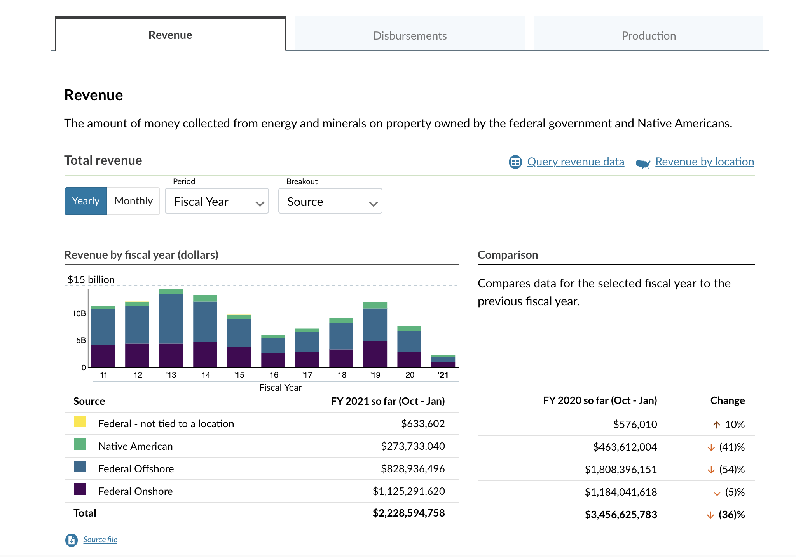

## The design challenge

In previous research and testing done by the Office of Natural Resources Revenue (ONRR), they’d uncovered that users were confused by the trends section on the current landing page of https://revenuedata.doi.gov/ .

Additionally, it seemed to make sense that the Production tab also show relevant trends as was the case for the two other tabs—Revenue and Disbursements.

## Your mission, should you choose to accept it…

…is to create a plan to solve the trends design challenge.  As an intrepid intern, I chose to accept.

With plenty of guidance from our User Experience Design mentor, Shannon, we wrote up a plan based on Basecamp’s product development framework, written by Ryan Singer—[Shape Up: Stop Running in Circles and Ship Work that Matters]( https://basecamp.com/shapeup).

Shannon provided previous research on the problem and a skeleton of a slide deck used from an earlier design studio.   

With all of that in tow, I began to wrap my head around what needed to be done, taking into account the information my intern colleagues should know about the challenge along with Basecamp’s framework.

The design studio was spread out over three consecutive weeks, for a total of three one-hour sessions which occurred every Thursday.  

The brevity of the group sessions—only 60 minutes long—meant that they needed to be well thought out to ensure the time was used efficiently and productively. In other words, a good plan was necessary.

So, here’s what we came up with:

* Session 1: Background Info Review (understanding the problem, determine appetite).

* Offline work after Session 1: Sketching.  

* Session 2: Sketch Review & Hole Poking.   

* Offline work after Session 2: hole poking.

* Session 3: Review Hole Poking

## Takeaways from planning

Here are some of my learnings from the planning process using Shape Up that I found particularly interesting as a UX apprentice:

The Fat Marker Sketch.  The Fat Marker sketch is a way to quickly concept or ideate a solution without getting unnecessarily caught in the details at too early of a stage in designing.

Appetite.  "We use the appetite as a creative constraint on the design process,” says Singer.  Design can go and on and on; we need constraints and a scope that fits the challenge at hand.  For our challenge, we’d determined it a proper scope would three one-week sprints worth of effort.

Hole-poking.  Our hole-poking was based off of “Chapter 5: Risks and Rabbit Holes” from Shape Up.  As a group, we looked for rabbit holes and de-risked our solution by coming up with patches for those risks.

## The Process

### Problem Statement

In Session 1, after reviewing background information and research, we came to agreement on the problem statement:

“Domain Learners and Storytellers want to see trends over time. We know that the current trends on the homepage are confusing because they combine both monthly and yearly data.  We also don’t have trends available for production.”

### Sketching solutions

After Session 1, we were given the assignment to sketch out solutions.

<!-- sketches.png goes here -->

This part of the process was done independently which I thought was smart.  Though collaboration is important, time alone to think through ideas gives us the room and space we need to provide meaningful solutions.  We reviewed each of the solutions in Session 2.

### Feature voting

Interestingly, with all of the tools available out there that help design and development teams conduct surveys, polls, etc. ONRR elected to use a simple platform: a document which listed out the individual features of our solutions.

<!-- feature-voting.png goes here -->
   

After creating this list, all of us synchronously jumped on the document to put a plus symbol next to the features we thought were important for the solution.  The features with the most plus symbols were kept.

It was a simple and democratic process.

### Hole-poking

For hole-poking, we were given a matrix—a simple spreadsheet—which we added our thoughts into.  This was the independent work we were assigned to in Session 2.  We then convened later in Session 3 as a group to review the matrix.

<!-- hole-poking-matrix.png goes here -->

On the Y-axis were the most popular features selected from the previous stage of voting.  On the X-axis were the hole-poking questions which referred to each of those specific features.  For example, for the feature of “Removing Categories from the chart” we could ask the hole-poking question, “What else do we need to learn?”

### Design mission outcome

With the sum of individual and cooperative efforts from the design studios, Shannon was able to create an initial wireframe.  It was then iterated on from the team’s feedback.

<!-- homepage-trends.png goes here -->

## Conclusion

The design studio process was satisfying in its organization, rationale, and capacity to have all our voices heard whether or not we were designers.  

And remarkable was the ease in which it was done remotely and collaboratively, using simple platforms.

And, of course, we accomplished our goal: to create a prototype aimed at helping users better understand the trends section.

Our next step is to test this design with users.
