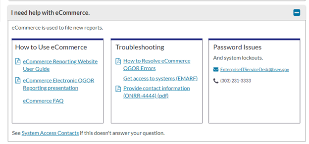

**Cody:** During my rotation with the Open Data, Design, and Development team, I participated in a study on improvements to the [Contacts page](https://www.onrr.gov/about/contact.htm) on the onrr.gov site. I use this page many times a week so I had strong opinions about how it should look. I also recommended an addition of a troubleshooting guide.

## How did this come about?
**Shannon:** When people in industry (people who represent companies with oil, gas, or mineral leases on federal or Native American lands) need to ask somebody at ONRR a question, they often resort to calling the last person they contacted. ONRR representatives are very specialized, and the last person you talked to often isn’t the right person for your new issue. The last person you contacted may not even know who the right person to contact is.

You may have read our [previous post]( https://blog-nrrd.doi.gov/contacts/) about improving contact information on onrr.gov. That was our first attempt at solving the problem of making contact information easier for industry users to find and search.

To start, we had one of our interns improve the contact information on onrr.gov and  [tested that design with 13 users]( https://github.com/ONRR/research/tree/master/onnr-dot-gov-research/08_WireframeStudy) (6 from industry and 7 from ONRR). The design replaced the 9 contact information files we had (we’ve since reduced it to 7) with a searchable interface.

Image: Current contact page.

Image: Current contact file.
![Screenshot of a current contact information file for the onshore production reporting topic. Includes columns for the alphabetic grouping or company name, primary contact (which includes name, team number and email address), phone extension, back-up contacts contact (which includes name, team number and email address), and back-up phone extension. The first part of the phone number is displayed above the table, so users have to look there before looking at the contact extension. The team numbers are used to identify the supervisor at the bottom of the page.](./ContactFile.png)

The interface performed okay, but it only scratched the surface of solving the problem. We learned that there were several people who preferred the  format of the current files and wanted to print out the list of contacts. We also learned that searchability wasn’t enough to help get users to the right person. We needed to bring in a larger group of stakeholders to solve this tough problem.

Image: First pass contact page design.

## What did the larger group of stakeholders have to say?
**Cody:** I work on the Reference and Reporting Management (RRM) team. We are on the frontlines—many times a day we interact with internal and external customers looking for help with leases and agreements. Usually, we can answer the customer’s question on the spot. However, there are times when the question should be directed to a different group or person. For example, I am not confident answering an operator’s question about royalty rates on geothermal leases. Additionally, many of my colleagues may not be comfortable answering questions about injection fees on gas storage agreements—but I am happy to answer those questions.

The revamp of the Contacts page will provide internal and external customers a quick way to find the expert they need. We’ve decided to take it a step further with the Troubleshooting Guide. After surveying RRM and Accounts Receivable (another group that interacts with customers daily), we produced a list of common issues that can be easily remedied. If the customer can find the answer to their question online, we can save them (and ourselves) valuable time.

## How did you decide how to fix the problems uncovered in the first study?
**Shannon:** After the first round of user interviews, we conducted a design studio to brainstorm ways to provide more guardrails to get users to the right place.
The first design studio session was spent agreeing on the problems we needed to solve. We reviewed information from previous user research along with our product vision and goals and landed on this as the problem we wanted to solve:
> “Industry and ONRR employees are unable to find the correct ONRR contact needed to assist with essential tasks. Current problems include routing through multiple ONRR contacts, frequent changes to contact info, not knowing who can solve a specific problem, difficulty navigating the current contact info, and not knowing who to contact when the primary contact isn’t available. Things that are currently working are being able to download or print a physical list and being able to search by company to get a view of all the contacts for your company in the current prototype.”

We also talked about how much time and effort, or appetite, we were willing to devote to a solution. We decided we were willing to put in a large amount of effort, since this is one of the biggest problems users have with onrr.gov and had the potential to save industry users and ONRR employees a lot of time.

After defining the problem and agreeing on the appetite, we sketched solutions offline for review the next week.

Images: Three sketches from the design studio. They all feature some sort of help by topic or frequently asked questions before displaying contact information.

![Sketch of contact section structure. Includes boxes across the top for primary categories: Royalty, Production, Billing, Reference, Troubleshooting, and Billing. Shows the breakout for Troubleshooting: Rent, Can’t Login, Royalty Errors, OGOR and the breakout for Billing: Invoice. Under troubleshooting there is a breakout for Rent: Federal, Indian, Offshore. Under Troubleshooting, there is a breakout for Can’t Login: EMARF, IT. Under Troubleshooting, there is a breakout for Royalty Errors: “Producing”, Royalty Contacts. Under “Producing”, there is a breakout: Onshore > States, Offshore.](./Sketch2.jpg)

As you can see, many of the ideas centered on having help with common issues. Thus, was born the idea of creating a troubleshooting guide alongside contact information.

**Cody:** The design studio was awesome. I was able to illustrate (albeit poorly) how I wanted the troubleshooting page to look and flow. When everyone showed their illustrations, we incorporated the best parts and it got us moving in the right direction.

## How did you decide what to add to the troubleshooting guide?
**Shannon:** We then conducted a survey of ONRR employees on both the Reference and Reporting Management (RRM) and Financial Management (FM) teams who are contacted by industry. We wanted to find out what questions they reroute the most. We took the results from that, categorized the questions, and turned them into lists of questions and answers.
We got responses from [20 people from RRM]( https://github.com/ONRR/research/blob/master/onnr-dot-gov-research/10_contacts_survey/10_contacts_survey_1_survey_results.xlsx?raw=true) and [27 from FM]( https://github.com/ONRR/research/blob/master/onnr-dot-gov-research/10_contacts_survey/10_contacts_survey_2_survey_results%20.xlsx?raw=true).

We surveyed people from a wide range of specialties.

|**Team**|**Specialty**|**Participants**|
|:-----:|:-----:|:-----:|
|Financial Management|Federal AR and Billing|14|
|Financial Management|Indian AR and Billing|6|
|Financial Management|Debt Collection|4|
|Financial Management|Staff Accountant|2|
|Financial Management|Solids AR and Billing|1|
|Revenue and Reporting Management|Reference|8|
|Revenue and Reporting Management|Production|6|
|Revenue and Reporting Management|Royalty|4|
|Revenue and Reporting Management|Solids|2|

Participants redirect contacts frequently.

|**Frequency**|**Participants**|**Percentage**|
|:-----:|:-----:|:-----:|
|Never|1|2%|
|Daily|13|28%|
|Weekly|18|38%|
|Monthly|11|23%|
|Seasonal|4|9%|

91% of respondents said having a troubleshooting guide was a good idea.

The most redirected questions that we learned about in the survey were in 10 categories:
* Getting started
* System access
* Leases, agreements & contracts
* Oil & gas production reporting
* Oil & gas royalty reporting
* Oil & gas rent
* Solid minerals
* Geothermal
* Payments & debt collection
* Updating contact info (Form 4444)

We grouped all the questions into categories and ordered them by frequency. Here’s a sample of the detailed questions/topics in the leases, agreements, and contracts category.

Leases, agreements, & contracts
* Cross-referenced lease and agreement numbers
* How to find lease/agreement info
* Operator changes
* Unable to report or pay on lease

After we compiled all the questions into categories, we tracked down the correct answer to each question and compiled them into a troubleshooting guide.

## What did the guide look like?
**Shannon:** We took what we learned from the first round of contacts testing along with the research on the troubleshooting guide and turned it into a prototype to test with users.

Image: Contact Us page with troubleshooting guide.
![Prototype of Contact Us page with sections for Search Contacts, Reporting & Paying Troubleshooting, and Other Contacts. The Troubleshooting section has cards for Getting Started, System Access, Leases & Agreements, Oil & Gas Production, Oil & Gas Royalty, Oil & Gas Rent, Solid Minerals, Geothermal, Payments & Debt Collection, and Updating Contact Info. The Other Contacts section has cards for Valuation & Pricing, Compliance & Enforcement, Indian Services, Company Contacts, and Additional Contacts. The Additional Contacts card has links for Information Requests and Website Feedback.](./GuideFirstPass.png)

Image: Troubleshooting tab for one of the guide pages.

Image: Open accordion for “I need help with eCommerce.”

## What did you learn about the troubleshooting guide in user research?
**Shannon:** After designing the troubleshooting guide and iterating on the contacts design, we tested a prototype with users. We [interviewed](  https://github.com/ONRR/research/tree/master/onnr-dot-gov-research/11_troubleshooting_study) 18 people, 5 from industry, 9 from ONRR, and 4 from other federal agencies who work with industry.

While people liked having the troubleshooting guide and thought it would be useful, several participants were confused at being dropped onto a page with troubleshooting as the first tab. They had expected contact information to be presented when they got on the page because they had clicked on a contact link.

To address this issue, we added the word “Contacts” to the page title and added a line of copy informing users to browse the questions or contact us. We also added a link to the informational section of the site related to the same category to help with users who thought they were looking at the whole site once they got into the troubleshooting guide.

Image: Iterated guide page to make it clearer you’re still on a contact page.

You can view the [full prototype  ](https://qmcq5k.axshare.com/#id=079wgt&p=contact_us&dp=0) that we’ve iterated to after testing.

## Will you be able to change or make additions to the troubleshooting guide?
**Cody:** Rules and regulations are constantly changing. Additionally, systems are modernized and replaced. We will make updates as necessary. We highly encourage all users to [submit   ideas](mailto: onrrweb@onrr.gov) for improvement.

## What have you learned from this experience?
**Shannon:** We learned the value of working across silos. If we had not had Cody cross training on our team, we wouldn't have ended up with as robust a solution to this problem. Now that we have contact with Cody and other people on his team, it has opened the door to future collaboration. This collaboration will make the website more usable for ONRR employees, enabling them to better serve our collective industry customers.

I learned that we need to rethink our user types for onrr.gov. We had organized industry users by what they report and had one internal user type. We've found that industry users have the same needs regardless of what they report. The internal users are more nuanced than just one type. There are also users from other federal agencies, like the Bureau of Land Management, that use the contact information in similar ways to our internal users. We will be conducting an exercise to fine tune our user types for onrr.gov based on what we learned in this study.

We also learned that the troubleshooting guide will be used as often, if not more so, by internal folks than by industry. It is useful  to help with redirecting contacts.

**Cody:** I learned a lot about the [User Centered Design Process](https://github.com/ONRR/nrrd/wiki/User-Centered-Design-Process) and how to properly conduct user interviews. I also became more familiar with some of the needs of my colleagues which will help me assist them more efficiently in the future. This was a highlight of my rotation with the Open Data, Design, and Development team. It was a lot of fun to collaborate with Shannon and the rest of the team. I strongly believe in [ONRR’s Mission](https://onrr.gov/about/index.htm) and this project will enhance our ability to serve the public.
