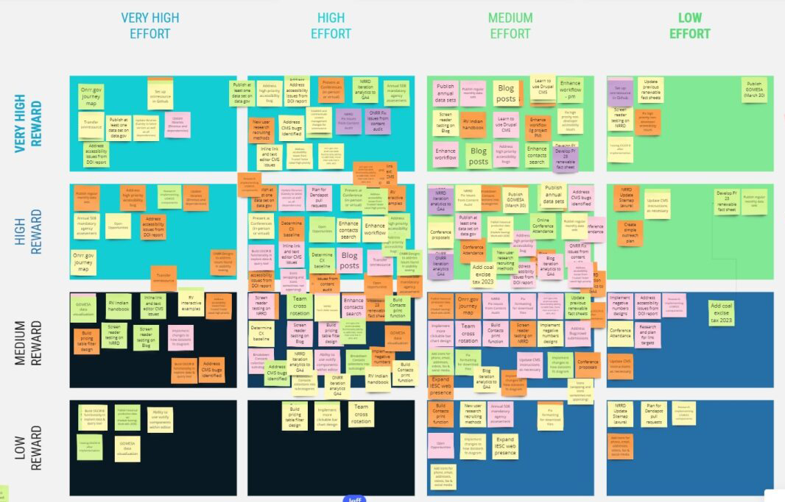
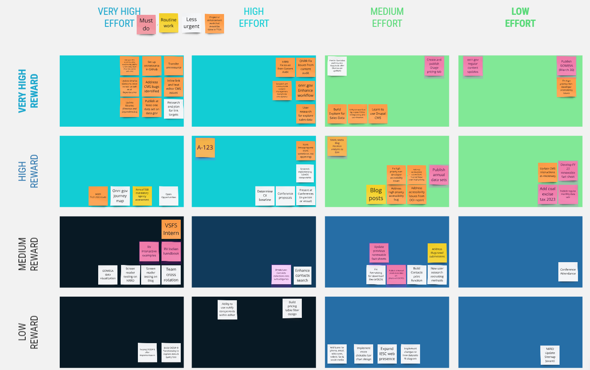
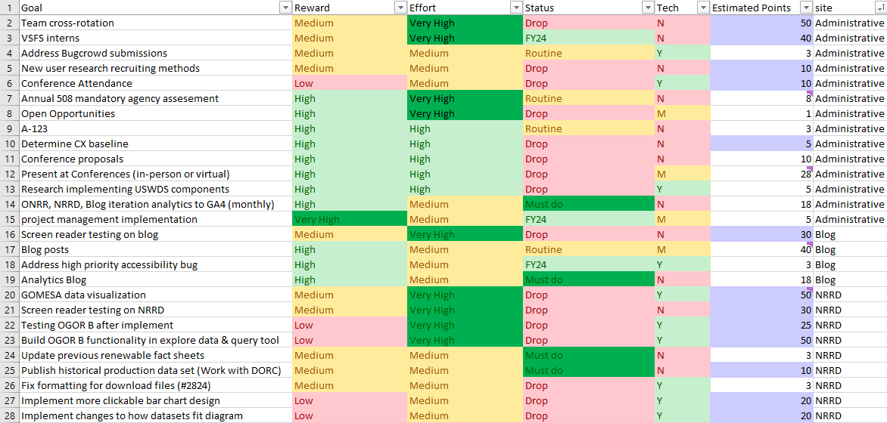
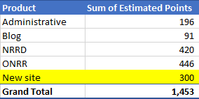
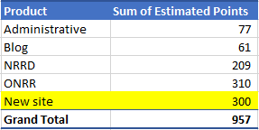

---
title: "Reassessing priorities: adapting to additional work without additional resources"
authors:
- Erin Elzi
- Lindsay Goldstein
excerpt: "Our 5-person team is taking on a fourth website despite being short-staffed, so we've revisited and reprioritized our goals for the year to accommodate the new site while producing an impact assessment to justify the shift in priorities."
tags:
- governance
- product management
- best practices

date: "2024-07-23"
--- 

The Open Data, Design, and Development team (ODDD) recently learned that an additional, already existing website will be added to our product portfolio. We’ll acquire the remaining hours contracted for one additional developer to work on this site for the rest of FY24, but the work of transferring the site to our team, implementing our method of site management, and incorporating content updates and routine maintenance into our workload is up to our existing 5-person team. Did we mention our team has been short-staffed throughout this process?

To accommodate the work that the additional site requires, we revisited our goals for the year to see what could be reprioritized. This post covers the methods we used to reprioritize as a team, incorporate the additional site into our high-level goals and everyday workload, and produce an impact assessment that justifies the shift in our FY24 priorities.  

## How we plan our work for the year

When ODDD was told we are taking on the additional site, our immediate response was yes – we can do this. But that very quickly became a “yes…but” situation. In addition to establishing a detailed project management plan for moving the site to our team, we wanted to make sure we were considering the workload of adding a 4th site to our team’s portfolio.

At the beginning of FY24, we identified [high-level goals](https://github.com/DOI-ONRR/nrrd/wiki/Goals-and-metrics#what-does-success-look-like-for-nrrd) for the year and aligned them to metrics.  These goals did not include assuming ownership of an additional website. We had to reassess our workload for FY24 Q3/Q4 to accommodate the planning and tasks associated with taking on another product.

The reassessment required pre-work because we plan our FY high level goals but not our projects in the detail that we needed to assess our workload. This allows us to plan as we go, and pivot as needed. Having mapped out our goals for the year this far, we knew we couldn’t accommodate more work without removing other work from the remaining goals. Being the evidence-driven team that we are – we needed proof and we needed to decide what work we would prioritize for Q3/Q4. We also wanted to share this information with our leadership. We knew it would be valuable to justify our workload and ask for more resources.

## Impossible to complete – what to do? 

To make sure we were all on the same page as a team, and that the new site would be incorporated successfully into our workloads, we started with a priorities matrix.

### The priorities matrix – realignment as a team

A prioritization matrix is a project or task management technique where projects or tasks are laid out in a matrix and placed according to set variables. For this priorities matrix, we took all our remaining FY24 goals and made a set of online “stickies” for each ODDD team member. For the matrix we choose mapping variables of reward and effort. Effort is how much time it would take to complete the goal and reward is how much positive impact completion of the goal would have on our team, our users, or ONRR. Instead of quadrants, we broke it down so each variable had 4 levels of effort or reward (very high, high, medium, low). We later decided to add stickies for our routine work – this way we could use the results of the board to help measure workload.

The team started by placing the stickies wherever they personally felt it belonged in terms of effort and reward. 

*First round matrix*

Then we talked through the results and came to a consensus on the placement of each sticky. We cleaned up the board so there was only a single sticky for each task or goal, instead of 5 (one for each ODDD team member). This prioritization took approximately 3 hours, over the course of two sessions. One of our team members was experienced in this method, so they did some additional board clean-up work in between sessions to help move the process along. Overall, this was a great exercise – allowing everyone to talk through any discrepancies we had in which goals should be higher priority and which ones would be moved to next year. In hearing the reasons for placement on the effort scale, we also learned more about what goes into tasks that are specific to the role of one or two people on our team.

*Final matrix*

The priorities matrix is an exercise, but not a final product. It’s meant to be a little messy. To complete the workload analysis, and to communicate the results with leadership, we put it into spreadsheet and report form. We included images of the priorities matrix in the report to demonstrate our process.

## The spreadsheet (of course)

Transferring our goals from the priorities matrix into a spreadsheet allowed us to quantify our work and complete a more detailed workload analysis.

### Initial columns:

The first columns in the sheet directly corresponded to the categories from our priorities matrix.

* **Goals** – each goal from the sticky note
* **Reward** – low, medium, high, very high
* **Effort** – low, medium, high, very high
* **Status** - routine, must do, FY24, drop
   * This column requires further explanation. “routine” and “must do” are tasks/goals that we can’t remove from our workload. “FY24” signifies work that we planned to complete. “drop” signifies items that we can postpone until we have greater team capacity.

### Additional columns:

We added additional columns to help with analysis.
* **Tech** – yes/no – if we need developer help to complete. 
* **Estimated points**  - how many points a goal will take to complete. Points signify amount of work.
* **Site** – NRRD, onrr.gov, blog, administrative (not related to a site)

Many of our goals already had estimated workload points assigned to them which made this task easier. Each team member went through the remaining goals and added estimated points to those goals most relevant to their own work. We worked together to assign points to goals that require more group collaboration, such as creating a new webpage with design and programming requirements.

*Analysis spreadsheet*

Simultaneously, we were working on a transition plan for the new site. We divided this project into phases and when possible broke down the work into concrete goals. We added these goals into the spreadsheet and estimated points as a team.

## How much work can we do?
We analyzed how much work the team completes on an annual basis to help us determine our baseline. We used our FY23 total points completed as the baseline for what we could achieve in FY24.

Looking at the points already completed in FY24 showed us that we were on track to match our FY23 productivity levels. We noted this in our spreadsheet and kept it top of mind as we continued our analysis.

With our spreadsheet complete, we turned to pivot tables to analyze the information.

## Using pivots to pivot

We found that we had already overcommitted ourselves for the rest of the year – even without adding a new site to our workload. This was a good reminder that while it’s great to have goals for the year – we had too much on our plates to realistically accomplish all of those goals. We found that we had over 1,100 points planned to complete versus our goal of 900. This is without the addition of a new site.

For a dose of reality, we looked at a pivot table that would show the work of the additional site without removing any of our work. We estimated an additional 300 points of work related to the new site. We needed to remove around 500 points or 35% from our estimated workload to have an achievable amount of work for the year.

*Total workload pivot table*

Luckily, we all were pragmatic about identifying work we could drop for the rest of the year. We postponed any goal that we identified as low reward. We also used our existing resources as a constraint and postponed some higher reward goals because of team capacity. 50% of postponed goals require more technical capacity than we have available. We also removed outreach related goals. Once we pulled that work from our goals we were left with around 957 points, making for an achievable workload.

*Revised workload pivot table*

## Impact of the Impact Assessment

With the impact assessment complete and transition plan in place, our workload is running smoothly. The team is aligned in our priorities for the remaining three months of FY24. The additional website has not been officially transferred to us yet, but we’re ready for when it is. In the meantime, we know we can revisit those goals that were unprioritized if the new site acquisition gets delayed. Realizing we can also shift priorities within our established workload has allowed us to make space to get some larger projects and tasks done on a shorter than usual timeline.

The obvious benefit of this process is the outcome of the impact assessment and the well-formulated transition plan. Another benefit has been learning to adjust our priorities to accommodate unexpected projects. This process and the outcomes have helped reduce the stress of change and having unrealistic workloads. It also ensures our work still meets our team's high standards.

## Takeaways
* It improved team morale to see how much we had already accomplished for the year. Even though we do quarterly metrics and give each other regular kudos – it’s easy to forget about all we’ve done because we have already moved onto the next project.
* We need to be realistic about what we can accomplish while short-staffed.
* We can’t do it all.
* We only have one developer so that directs how we approach our work planning.
* Involving the entire team in every step of goal-setting and prioritizing builds understanding and empathy among team members.
* Next year, we plan to do workload estimates while we are setting our high-level goals. We are actively working to avoid burnout on our team and don’t want to overestimate what we plan to do for the year. 

